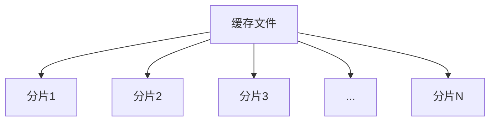

# Nginx 缓存分片

## 介绍

Nginx缓存分片是一种优化缓存性能的技术，通过将缓存数据分割成多个小块（分片），从而提高缓存的读写效率。这种技术特别适用于处理大文件或高并发场景，能够有效减少单个缓存文件的压力，提升整体性能。

在Nginx中，缓存分片通常与代理缓存（proxy cache）结合使用。通过将缓存文件分割成多个分片，Nginx可以更高效地管理和访问这些缓存数据，从而减少磁盘I/O的负担。

## 工作原理

Nginx缓存分片的核心思想是将一个大文件分割成多个小文件（分片），每个分片独立存储。当客户端请求某个资源时，Nginx会根据请求的范围（Range）从相应的分片中读取数据，而不是一次性读取整个文件。

### 分片存储

Nginx缓存分片的存储结构通常如下：



每个分片都是一个独立的文件，存储在Nginx的缓存目录中。Nginx会根据配置的分片大小（例如1MB）将大文件分割成多个小文件。

### 分片读取

当客户端请求某个资源时，Nginx会根据请求的范围（Range）从相应的分片中读取数据。例如，如果客户端请求一个文件的第2MB到第3MB的内容，Nginx会直接从第2个分片中读取数据。

## 配置Nginx缓存分片

要在Nginx中启用缓存分片，需要在配置文件中进行相应的设置。以下是一个简单的配置示例：

```nginx
http {
    proxy_cache_path /var/cache/nginx levels=1:2 keys_zone=my_cache:10m max_size=1g inactive=60m use_temp_path=off;

    server {
        listen 80;
        server_name example.com;

        location / {
            proxy_cache my_cache;
            proxy_cache_valid 200 302 10m;
            proxy_cache_valid 404 1m;
            proxy_cache_use_stale error timeout updating http_500 http_502 http_503 http_504;
            proxy_cache_background_update on;
            proxy_cache_lock on;

            proxy_pass http://backend;
        }
    }
}
```

在这个配置中，`proxy_cache_path`指令定义了缓存路径和分片存储的目录结构。`levels=1:2`表示缓存目录的层级结构，`keys_zone=my_cache:10m`定义了缓存区域的名称和大小。

## 实际应用场景

### 大文件下载

在大文件下载场景中，Nginx缓存分片可以显著提高性能。例如，当用户请求下载一个1GB的文件时，Nginx可以将文件分割成多个1MB的分片，并根据用户的下载进度逐步读取和发送这些分片。这样可以减少服务器的I/O压力，并提高下载速度。

### 视频流媒体

在视频流媒体场景中，Nginx缓存分片也非常有用。视频文件通常较大，用户通常会从视频的某个时间点开始播放。通过缓存分片，Nginx可以快速定位并读取用户请求的视频片段，从而提供流畅的播放体验。

## 总结

Nginx缓存分片是一种优化缓存性能的有效技术，特别适用于处理大文件和高并发场景。通过将缓存数据分割成多个小文件，Nginx可以更高效地管理和访问这些数据，从而提升整体性能。

在实际应用中，Nginx缓存分片可以用于大文件下载、视频流媒体等场景，能够显著提高服务器的响应速度和用户体验。

## 附加资源

- [Nginx官方文档](https://nginx.org/en/docs/)
- [Nginx缓存配置指南](https://www.nginx.com/resources/wiki/start/topics/examples/caching/)

## 练习

1. 在本地环境中配置Nginx缓存分片，并测试其性能。
2. 尝试使用Nginx缓存分片优化一个大文件下载服务，观察其效果。
3. 阅读Nginx官方文档，了解更多关于缓存分片的配置选项和最佳实践。
