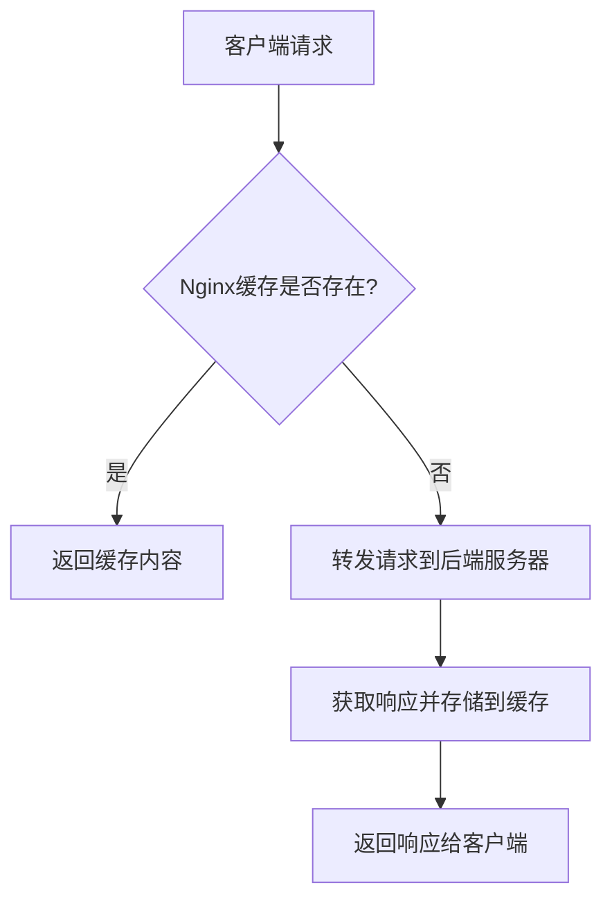

## 什么是Nginx服务器缓存？

Nginx是一个高性能的Web服务器和反向代理服务器，广泛用于加速Web应用的响应速度。Nginx缓存机制是其核心功能之一，它通过将频繁请求的内容存储在内存或磁盘中，减少对后端服务器的请求次数，从而提升性能和用户体验。

缓存可以存储静态资源（如图片、CSS、JavaScript文件）或动态生成的内容（如API响应）。通过合理配置Nginx缓存，可以有效降低服务器负载，减少响应时间。

---

## Nginx 缓存的工作原理

Nginx缓存的工作原理可以分为以下几个步骤：

1. **请求到达Nginx**：当客户端发起请求时，Nginx首先检查缓存中是否存在该请求的响应。
2. **缓存命中**：如果缓存中存在该请求的响应，Nginx会直接返回缓存内容，而无需向后端服务器发送请求。
3. **缓存未命中**：如果缓存中不存在该请求的响应，Nginx会将请求转发给后端服务器，获取响应并将其存储在缓存中，然后返回给客户端。
4. **缓存过期**：缓存内容会有一个过期时间（TTL），过期后Nginx会重新从后端服务器获取最新内容。

以下是一个简单的缓存流程图：



---

## 配置Nginx缓存

要启用Nginx缓存，需要在Nginx配置文件中进行相应的设置。以下是一个基本的缓存配置示例：

```nginx
http {
    # 定义缓存路径和缓存区大小
    proxy_cache_path /var/cache/nginx levels=1:2 keys_zone=my_cache:10m max_size=1g inactive=60m use_temp_path=off;

    server {
        listen 80;
        server_name example.com;

        location / {
            # 启用缓存
            proxy_cache my_cache;
            proxy_cache_valid 200 302 10m;  # 缓存200和302状态码的响应10分钟
            proxy_cache_valid 404 1m;       # 缓存404状态码的响应1分钟
            proxy_cache_use_stale error timeout updating http_500 http_502 http_503 http_504;

            # 转发请求到后端服务器
            proxy_pass http://backend_server;
        }
    }
}
```

### 配置说明：
- `proxy_cache_path`：定义缓存存储路径、缓存区大小和过期时间。
- `proxy_cache`：启用缓存并指定缓存区名称。
- `proxy_cache_valid`：设置不同状态码的缓存时间。
- `proxy_cache_use_stale`：在特定情况下（如后端服务器错误）使用过期的缓存内容。

---

## 实际应用场景

### 场景1：加速静态资源加载
假设你的网站有大量静态资源（如图片、CSS、JavaScript文件），这些资源不经常变化。通过配置Nginx缓存，可以显著减少对这些资源的重复请求，从而提升页面加载速度。

### 场景2：缓存API响应
如果你的Web应用依赖于频繁调用的API，可以通过Nginx缓存API响应，减少对后端服务器的压力。例如，缓存一个返回用户信息的API响应，可以避免每次请求都查询数据库。

---

## 缓存清理与更新

缓存虽然能提升性能，但也可能导致用户看到过期的内容。因此，需要定期清理或更新缓存。以下是两种常见的缓存清理方式：

1. **手动清理**：通过删除缓存目录中的文件来清理缓存。
   ```bash
   rm -rf /var/cache/nginx/*
   ```

2. **自动清理**：通过设置缓存的过期时间（TTL），Nginx会自动清理过期的缓存内容。

---

## 总结

Nginx缓存机制是提升Web服务器性能的重要工具。通过合理配置缓存，可以有效减少后端服务器的负载，提升响应速度，改善用户体验。本文介绍了Nginx缓存的基本原理、配置方法以及实际应用场景，适合初学者快速上手。

---

## 附加资源与练习

### 资源：
- [Nginx官方文档](https://nginx.org/en/docs/)
- [Nginx缓存配置指南](https://www.nginx.com/blog/nginx-caching-guide/)

### 练习：
1. 在你的本地环境中配置Nginx缓存，并测试缓存效果。
2. 尝试为不同的静态资源设置不同的缓存时间，观察性能变化。
3. 模拟后端服务器故障，测试Nginx的`proxy_cache_use_stale`功能。

:::tip
如果你在配置过程中遇到问题，可以参考Nginx的日志文件（通常位于`/var/log/nginx/error.log`）来排查错误。
:::