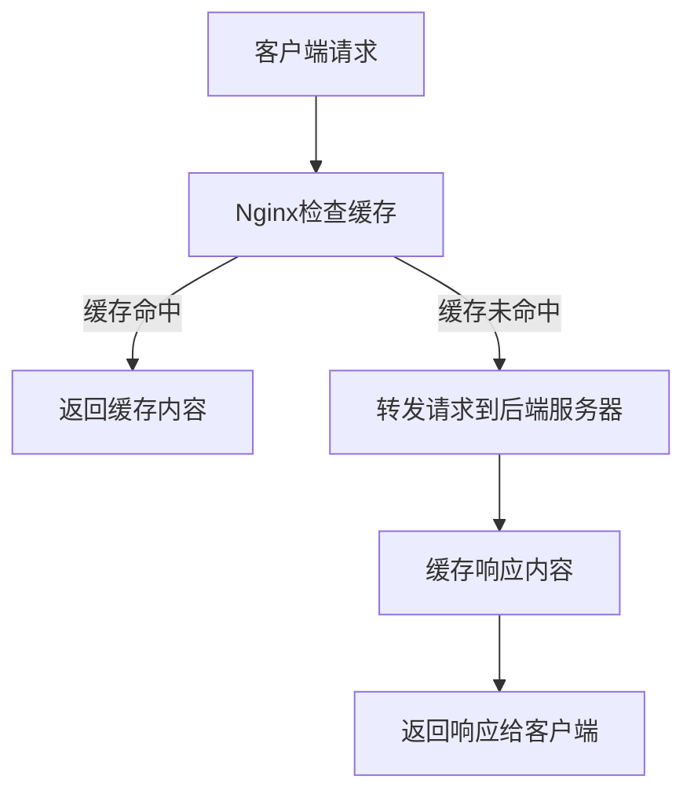

## 介绍

Nginx是一个高性能的HTTP服务器和反向代理服务器，广泛用于负载均衡、静态资源服务和缓存加速。Nginx的代理缓存功能可以帮助减少后端服务器的负载，提升网站的响应速度。通过缓存静态资源或动态内容，Nginx可以快速响应客户端请求，而无需每次都向后端服务器请求数据。

本文将详细介绍Nginx代理缓存的工作原理、配置方法以及实际应用场景。

---

## Nginx 代理缓存的工作原理

Nginx代理缓存的核心思想是将后端服务器的响应内容存储在本地磁盘或内存中。当客户端请求相同的资源时，Nginx可以直接从缓存中返回响应，而不需要再次向后端服务器发送请求。

### 缓存的工作流程

1. **客户端请求**：客户端向Nginx发送请求。
2. **缓存检查**：Nginx检查请求的资源是否已经缓存。
3. **缓存命中**：如果缓存中存在该资源，Nginx直接返回缓存内容。
4. **缓存未命中**：如果缓存中不存在该资源，Nginx将请求转发给后端服务器，并将响应内容缓存起来。
5. **返回响应**：Nginx将响应返回给客户端。



---

## 配置Nginx代理缓存

要启用Nginx代理缓存，需要在Nginx配置文件中进行相应的设置。以下是基本的配置步骤：

### 1. 定义缓存路径

首先，需要在Nginx配置文件中定义一个缓存路径，用于存储缓存文件。

```nginx
http {
    proxy_cache_path /var/cache/nginx levels=1:2 keys_zone=my_cache:10m max_size=1g inactive=60m use_temp_path=off;
}
```

- `proxy_cache_path`：指定缓存文件的存储路径。
- `levels=1:2`：定义缓存目录的层级结构。
- `keys_zone=my_cache:10m`：定义一个共享内存区域，用于存储缓存键和元数据。
- `max_size=1g`：设置缓存的最大大小。
- `inactive=60m`：设置缓存文件在60分钟内未被访问时将被删除。
- `use_temp_path=off`：禁用临时路径，直接写入缓存路径。

### 2. 启用缓存

接下来，在具体的`server`或`location`块中启用缓存。

```nginx
server {
    location / {
        proxy_cache my_cache;
        proxy_pass http://backend_server;
        proxy_cache_valid 200 302 10m;
        proxy_cache_valid 404 1m;
    }
}
```

- `proxy_cache my_cache`：启用缓存，并使用之前定义的`my_cache`缓存区域。
- `proxy_pass http://backend_server`：将请求转发到后端服务器。
- `proxy_cache_valid 200 302 10m`：设置状态码为200和302的响应缓存10分钟。
- `proxy_cache_valid 404 1m`：设置状态码为404的响应缓存1分钟。

---

## 实际应用场景

### 1. 缓存静态资源

静态资源（如图片、CSS、JavaScript文件）通常不会频繁变化，因此非常适合使用Nginx代理缓存。通过缓存这些资源，可以显著减少后端服务器的负载。

```nginx
location /static/ {
    proxy_cache my_cache;
    proxy_pass http://backend_server;
    proxy_cache_valid 200 302 1h;
}
```

### 2. 缓存动态内容

对于某些动态生成的内容（如API响应），如果内容变化不频繁，也可以使用Nginx代理缓存。例如，缓存一个API的响应结果。

```nginx
location /api/ {
    proxy_cache my_cache;
    proxy_pass http://backend_server;
    proxy_cache_valid 200 302 5m;
}
```

---

## 总结

Nginx代理缓存是一个强大的功能，可以显著提升网站的性能和响应速度。通过合理配置缓存路径和缓存规则，可以有效减少后端服务器的负载，提升用户体验。

### 附加资源

- [Nginx官方文档](https://nginx.org/en/docs/)
- [Nginx缓存配置指南](https://www.nginx.com/resources/wiki/start/topics/examples/caching/)

### 练习

1. 在你的Nginx服务器上配置一个简单的代理缓存，缓存静态资源。
2. 尝试为动态API响应配置缓存，并观察缓存的效果。

:::tip
在实际生产环境中，建议根据业务需求调整缓存时间和缓存大小，以达到最佳性能。
:::