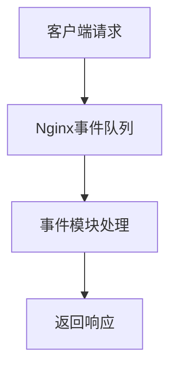

# Nginx 核心模块

Nginx是一个高性能的HTTP和反向代理服务器，广泛用于负载均衡、缓存和Web服务。Nginx的核心模块是其架构的基础，负责处理HTTP请求、配置解析、日志记录等核心功能。本文将带你深入了解Nginx核心模块，并通过实际案例展示其应用。

## 什么是Nginx核心模块？

Nginx核心模块是Nginx服务器的基础组件，负责处理HTTP请求、配置解析、日志记录等核心功能。这些模块是Nginx的核心部分，没有它们，Nginx将无法正常运行。核心模块通常包括以下几个部分：

- **HTTP模块**：处理HTTP请求和响应。
- **事件模块**：管理事件循环和连接处理。
- **配置模块**：解析和管理配置文件。
- **日志模块**：记录日志信息。

## Nginx 核心模块的工作原理

Nginx的核心模块通过事件驱动的方式工作。当客户端发起请求时，Nginx会创建一个事件并将其放入事件队列中。事件模块会从队列中取出事件并处理，然后将结果返回给客户端。



## 核心模块的配置

Nginx的核心模块通过配置文件进行管理。以下是一个简单的Nginx配置文件示例：

```nginx
http {
    server {
        listen 80;
        server_name example.com;

        location / {
            root /var/www/html;
            index index.html;
        }
    }
}
```

在这个配置中，`http`模块定义了HTTP服务器的配置，`server`模块定义了服务器的监听端口和域名，`location`模块定义了请求的处理方式。

## 实际案例：配置静态文件服务器

假设你需要配置一个Nginx服务器来提供静态文件服务。以下是一个完整的配置文件示例：

```nginx
http {
    server {
        listen 80;
        server_name static.example.com;

        location / {
            root /var/www/static;
            index index.html;
        }
    }
}
```

在这个配置中，Nginx会监听80端口，并将所有请求映射到`/var/www/static`目录下的文件。如果请求的路径是`/`，Nginx会返回`index.html`文件。

## 总结

Nginx核心模块是Nginx服务器的基础，负责处理HTTP请求、配置解析、日志记录等核心功能。通过理解这些模块的工作原理和配置方式，你可以更好地管理和优化你的Nginx服务器。

## 附加资源

- [Nginx官方文档](https://nginx.org/en/docs/)
- [Nginx配置指南](https://www.nginx.com/resources/wiki/start/topics/tutorials/config_pitfalls/)

## 练习

1. 尝试配置一个Nginx服务器，使其监听8080端口，并将所有请求映射到`/var/www/myapp`目录下的文件。
2. 修改配置文件，使得当访问`/images`路径时，Nginx会返回`/var/www/images`目录下的文件。

通过以上练习，你将更深入地理解Nginx核心模块的配置和使用。