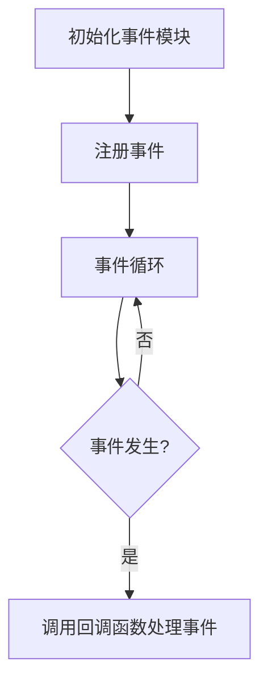

# Nginx 事件模块

Nginx是一个高性能的Web服务器和反向代理服务器，其核心功能之一是高效处理并发连接。Nginx的事件模块（Event Module）是实现这一功能的关键组件。本文将详细介绍Nginx事件模块的工作原理、配置方式以及实际应用场景。

## 什么是Nginx事件模块？

Nginx事件模块负责处理所有与网络事件相关的操作，例如连接的建立、数据的读取和写入等。它通过事件驱动的方式来实现高并发处理能力，避免了传统多线程模型的资源消耗问题。

Nginx支持多种事件模型，包括`select`、`poll`、`epoll`、`kqueue`等。这些模型在不同的操作系统上有不同的表现，Nginx会根据操作系统的特性自动选择最佳的事件模型。

## 事件模块的工作原理

Nginx事件模块的核心思想是**事件驱动**。它通过监听文件描述符（File Descriptor）上的事件（如可读、可写等），并在事件发生时调用相应的回调函数来处理事件。

### 事件循环

Nginx的事件模块通过一个**事件循环**（Event Loop）来监听和处理事件。事件循环的基本流程如下：

1. **初始化事件模块**：Nginx在启动时会初始化事件模块，并选择合适的事件模型。
2. **注册事件**：Nginx会将需要监听的文件描述符和对应的事件类型注册到事件模型中。
3. **事件循环**：Nginx进入事件循环，等待事件的发生。
4. **事件处理**：当事件发生时，Nginx会调用预先注册的回调函数来处理事件。



### 事件模型

Nginx支持多种事件模型，常见的有：

- **select**：一种跨平台的事件模型，但在高并发场景下性能较差。
- **poll**：与`select`类似，但性能稍好。
- **epoll**：Linux特有的高性能事件模型，适用于高并发场景。
- **kqueue**：BSD系统特有的高性能事件模型。

Nginx会根据操作系统的特性自动选择最佳的事件模型。例如，在Linux系统上，Nginx通常会选择`epoll`模型。

## 配置Nginx事件模块

Nginx的事件模块可以通过配置文件进行调优。以下是一些常见的配置项：

```nginx
events {
    worker_connections 1024;  # 每个工作进程的最大连接数
    use epoll;                # 使用epoll事件模型（仅适用于Linux）
    multi_accept on;          # 允许一个工作进程同时接受多个连接
}
```

### 配置项说明

- **worker_connections**：设置每个工作进程可以处理的最大连接数。这个值需要根据服务器的硬件资源和预期的并发量进行调整。
- **use**：指定使用的事件模型。如果不指定，Nginx会自动选择最佳的事件模型。
- **multi_accept**：设置为`on`时，允许一个工作进程同时接受多个连接，可以提高并发处理能力。

## 实际应用场景

Nginx事件模块的高效性使其在高并发场景下表现出色。以下是一些常见的应用场景：

### 1. 高并发Web服务器

Nginx作为Web服务器时，事件模块能够高效处理大量的并发连接。例如，在一个高流量的网站中，Nginx可以同时处理数千个并发请求，而不会出现性能瓶颈。

### 2. 反向代理服务器

Nginx作为反向代理服务器时，事件模块能够高效地转发请求到后端服务器，并将响应返回给客户端。例如，在一个微服务架构中，Nginx可以作为反向代理服务器，将请求分发到不同的服务实例。

### 3. 负载均衡

Nginx的事件模块还可以用于实现负载均衡。通过事件驱动的方式，Nginx能够高效地将请求分发到多个后端服务器，从而实现负载均衡。

## 总结

Nginx事件模块是Nginx高性能的关键组件之一。它通过事件驱动的方式实现了高并发处理能力，避免了传统多线程模型的资源消耗问题。通过合理配置事件模块，可以进一步提升Nginx的性能。

在实际应用中，Nginx事件模块广泛应用于高并发Web服务器、反向代理服务器和负载均衡等场景。掌握Nginx事件模块的工作原理和配置方法，对于优化Nginx性能具有重要意义。

## 附加资源与练习

- **练习**：尝试在自己的服务器上配置Nginx事件模块，并测试不同配置下的性能表现。
- **进一步阅读**：
  - [Nginx官方文档](https://nginx.org/en/docs/)
  - 《Nginx高性能Web服务器详解》

:::tip
如果你对Nginx事件模块有更多疑问，欢迎在评论区留言，我们会尽快为你解答！
:::