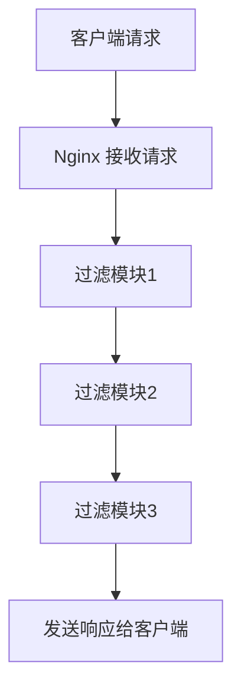

# Nginx 过滤模块

Nginx 是一个高性能的 Web 服务器和反向代理服务器，其模块化架构使其功能非常灵活。过滤模块是 Nginx 模块化架构中的重要组成部分，用于在请求和响应的处理过程中对数据进行修改或过滤。本文将详细介绍 Nginx 过滤模块的概念、工作原理以及如何开发自定义过滤模块。

## 什么是 Nginx 过滤模块？

Nginx 过滤模块是一种特殊的模块，用于在请求或响应的处理过程中对数据进行修改或过滤。它们通常用于处理 HTTP 响应体，例如压缩、解压缩、修改内容或添加自定义头部信息。

过滤模块的工作方式类似于管道（pipeline），多个过滤模块可以串联在一起，依次对数据进行处理。每个过滤模块都可以对数据进行读取、修改或传递到下一个模块。

## 过滤模块的工作原理

Nginx 过滤模块的工作原理可以分为以下几个步骤：

1. **初始化**：在 Nginx 启动时，过滤模块会进行初始化，注册自己的处理函数。
2. **请求处理**：当 Nginx 接收到请求时，过滤模块会根据配置顺序依次处理请求或响应数据。
3. **数据处理**：每个过滤模块可以对数据进行读取、修改或传递到下一个模块。
4. **输出**：最终处理后的数据会被发送给客户端。

以下是一个简单的过滤模块工作流程示意图：



## 开发自定义过滤模块

开发自定义过滤模块需要了解 Nginx 的模块开发框架。以下是一个简单的示例，展示如何开发一个自定义过滤模块，用于在响应体前添加自定义文本。

### 1. 定义模块结构

首先，我们需要定义一个模块结构，并注册过滤函数。

```c
#include <ngx_config.h>
#include <ngx_core.h>
#include <ngx_http.h>

static ngx_int_t ngx_http_my_filter_init(ngx_conf_t *cf);

static ngx_http_module_t ngx_http_my_filter_module_ctx = {
    NULL,                          /* preconfiguration */
    ngx_http_my_filter_init,       /* postconfiguration */
    NULL,                          /* create main configuration */
    NULL,                          /* init main configuration */
    NULL,                          /* create server configuration */
    NULL,                          /* merge server configuration */
    NULL,                          /* create location configuration */
    NULL                           /* merge location configuration */
};

ngx_module_t ngx_http_my_filter_module = {
    NGX_MODULE_V1,
    &ngx_http_my_filter_module_ctx, /* module context */
    NULL,                          /* module directives */
    NGX_HTTP_MODULE,               /* module type */
    NULL,                          /* init master */
    NULL,                          /* init module */
    NULL,                          /* init process */
    NULL,                          /* init thread */
    NULL,                          /* exit thread */
    NULL,                          /* exit process */
    NULL,                          /* exit master */
    NGX_MODULE_V1_PADDING
};
```

### 2. 实现过滤函数

接下来，我们实现过滤函数，用于在响应体前添加自定义文本。

```c
static ngx_int_t ngx_http_my_filter_body_filter(ngx_http_request_t *r, ngx_chain_t *in) {
    ngx_buf_t *b;
    ngx_chain_t *cl;

    /* 创建一个新的缓冲区 */
    b = ngx_calloc_buf(r->pool);
    if (b == NULL) {
        return NGX_ERROR;
    }

    /* 设置缓冲区内容 */
    b->pos = (u_char *) "Hello from my filter!\n";
    b->last = b->pos + sizeof("Hello from my filter!\n") - 1;
    b->memory = 1;  /* 标记为内存中的缓冲区 */

    /* 创建一个新的链节点 */
    cl = ngx_alloc_chain_link(r->pool);
    if (cl == NULL) {
        return NGX_ERROR;
    }

    cl->buf = b;
    cl->next = in;  /* 将原始数据链接到新节点之后 */

    /* 调用下一个过滤模块 */
    return ngx_http_next_body_filter(r, cl);
}
```

### 3. 注册过滤函数

最后，我们需要在模块初始化时注册过滤函数。

```c
static ngx_int_t ngx_http_my_filter_init(ngx_conf_t *cf) {
    ngx_http_next_header_filter = ngx_http_top_header_filter;
    ngx_http_top_header_filter = ngx_http_my_filter_header_filter;

    ngx_http_next_body_filter = ngx_http_top_body_filter;
    ngx_http_top_body_filter = ngx_http_my_filter_body_filter;

    return NGX_OK;
}
```

### 4. 编译和加载模块

将上述代码保存为 `ngx_http_my_filter_module.c`，然后将其编译为动态模块并加载到 Nginx 中。

```bash
./configure --add-dynamic-module=path/to/your/module
make modules
```

在 Nginx 配置文件中加载模块：

```nginx
load_module modules/ngx_http_my_filter_module.so;
```

## 实际应用场景

过滤模块在实际应用中有很多用途，例如：

- **内容压缩**：通过过滤模块实现 Gzip 压缩，减少传输数据量。
- **内容替换**：在响应体中替换特定内容，例如广告替换或敏感信息过滤。
- **自定义头部**：在响应中添加自定义的 HTTP 头部信息。

## 总结

Nginx 过滤模块是 Nginx 模块化架构中的重要组成部分，允许开发者在请求和响应的处理过程中对数据进行修改或过滤。通过本文的介绍，你应该对 Nginx 过滤模块的基本概念、工作原理以及如何开发自定义过滤模块有了初步的了解。

## 附加资源

- [Nginx 官方文档](https://nginx.org/en/docs/)
- [Nginx 模块开发指南](https://www.nginx.com/resources/wiki/extending/)

## 练习

1. 尝试开发一个过滤模块，在响应体后添加自定义文本。
2. 修改现有过滤模块，使其只在特定路径下生效。
