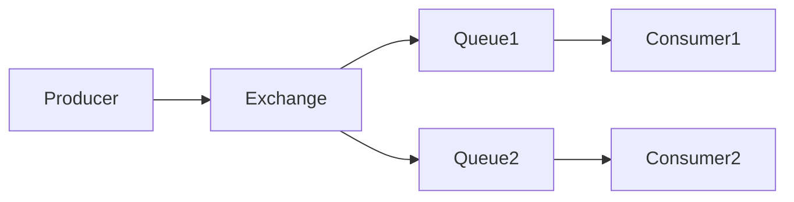

# RabbitMQ 简介

RabbitMQ 是一个开源的消息代理软件，用于在分布式系统中实现消息的异步通信。它基于 AMQP（高级消息队列协议）标准，能够帮助开发者在应用程序之间可靠地传递消息。RabbitMQ 的核心思想是将消息的生产者和消费者解耦，使得系统更加灵活和可扩展。

## 什么是消息队列？

消息队列（Message Queue）是一种在应用程序之间传递消息的机制。它允许一个应用程序将消息发送到队列中，而另一个应用程序可以从队列中读取并处理这些消息。这种机制特别适用于需要异步处理的场景，例如任务调度、日志收集、事件驱动架构等。

## RabbitMQ 的核心概念

在深入了解 RabbitMQ 之前，我们需要先了解一些核心概念：

1. **Producer（生产者）**：负责创建消息并将其发送到队列中。
2. **Consumer（消费者）**：从队列中读取消息并进行处理。
3. **Queue（队列）**：存储消息的缓冲区，消息在队列中等待被消费者处理。
4. **Exchange（交换机）**：接收来自生产者的消息，并根据规则将消息路由到一个或多个队列。
5. **Binding（绑定）**：定义了交换机和队列之间的关系，指定了消息应该如何从交换机路由到队列。

## RabbitMQ 的工作原理

RabbitMQ 的工作流程可以概括为以下几个步骤：

1. **生产者发送消息**：生产者将消息发送到交换机。
2. **交换机路由消息**：交换机根据绑定规则将消息路由到一个或多个队列。
3. **队列存储消息**：消息在队列中等待被消费者处理。
4. **消费者处理消息**：消费者从队列中读取消息并进行处理。



## 实际应用场景

RabbitMQ 在实际应用中有许多用途，以下是一些常见的场景：

1. **任务队列**：将耗时的任务放入队列中，由后台工作进程异步处理。例如，用户上传文件后，系统可以将文件处理任务放入队列，而不需要立即处理。
2. **日志收集**：将应用程序的日志消息发送到队列中，由专门的日志处理服务进行收集和分析。
3. **事件驱动架构**：在微服务架构中，RabbitMQ 可以用于服务之间的异步通信，确保服务之间的解耦和可扩展性。

## 代码示例

以下是一个简单的 Python 示例，展示了如何使用 RabbitMQ 发送和接收消息。

### 生产者代码

```python
import pika

# 连接到 RabbitMQ 服务器
connection = pika.BlockingConnection(pika.ConnectionParameters('localhost'))
channel = connection.channel()

# 声明一个队列
channel.queue_declare(queue='hello')

# 发送消息
channel.basic_publish(exchange='',
                      routing_key='hello',
                      body='Hello, RabbitMQ!')
print(" [x] Sent 'Hello, RabbitMQ!'")

# 关闭连接
connection.close()
```

### 消费者代码

```python
import pika

# 连接到 RabbitMQ 服务器
connection = pika.BlockingConnection(pika.ConnectionParameters('localhost'))
channel = connection.channel()

# 声明一个队列
channel.queue_declare(queue='hello')

# 定义回调函数
def callback(ch, method, properties, body):
    print(f" [x] Received {body}")

# 监听队列
channel.basic_consume(queue='hello',
                      auto_ack=True,
                      on_message_callback=callback)

print(' [*] Waiting for messages. To exit press CTRL+C')
channel.start_consuming()
```

:::note
在实际应用中，你可能需要处理连接失败、消息确认等更复杂的情况。以上代码仅用于演示基本用法。
:::

## 总结

RabbitMQ 是一个功能强大的消息代理工具，能够帮助开发者在分布式系统中实现高效的异步通信。通过理解其核心概念和工作原理，你可以更好地利用 RabbitMQ 来构建可扩展、可靠的应用程序。

## 附加资源

- [RabbitMQ 官方文档](https://www.rabbitmq.com/documentation.html)
- [AMQP 协议详解](https://www.amqp.org/)
- [RabbitMQ 教程](https://www.rabbitmq.com/getstarted.html)

## 练习

1. 尝试修改上面的代码示例，使其能够发送和接收 JSON 格式的消息。
2. 研究 RabbitMQ 的持久化机制，并尝试在代码中实现消息的持久化。
3. 探索 RabbitMQ 的其他高级功能，如消息确认、死信队列等。

:::tip
如果你在练习中遇到问题，可以参考 RabbitMQ 的官方文档或社区论坛，那里有许多有用的资源和讨论。
:::