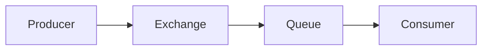
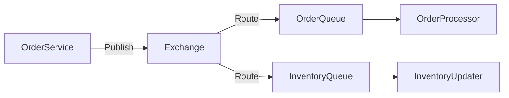

## 介绍

RabbitMQ 是一个开源的消息代理软件，用于在分布式系统中传递消息。它实现了高级消息队列协议（AMQP），并提供了可靠的消息传递机制。在学习 RabbitMQ 时，理解其核心术语是至关重要的。本文将逐步解析 RabbitMQ 中的关键术语，并通过实际案例帮助你更好地理解这些概念。

## 核心术语解析

### 1. 消息（Message）

消息是 RabbitMQ 中传递的基本数据单元。它由两部分组成：**消息头**和**消息体**。消息头包含元数据（如路由键、优先级等），而消息体则是实际要传递的数据。

```python
# 示例：创建一个简单的消息
message = {
    'headers': {
        'priority': 1,
        'routing_key': 'example.key'
    },
    'body': 'Hello, RabbitMQ!'
}
```

### 2. 生产者（Producer）

生产者是发送消息的应用程序。它将消息发布到 RabbitMQ 的交换器中，由交换器根据规则将消息路由到相应的队列。

```python
# 示例：生产者发送消息
channel.basic_publish(exchange='example_exchange',
                      routing_key='example.key',
                      body='Hello, RabbitMQ!')
```

### 3. 消费者（Consumer）

消费者是接收消息的应用程序。它从队列中获取消息并进行处理。

```python
# 示例：消费者接收消息
def callback(ch, method, properties, body):
    print(f"Received {body}")

channel.basic_consume(queue='example_queue',
                      on_message_callback=callback,
                      auto_ack=True)
```

### 4. 队列（Queue）

队列是存储消息的缓冲区。消息在队列中等待被消费者处理。队列是 FIFO（先进先出）的数据结构。



### 5. 交换器（Exchange）

交换器是消息的路由中心。它接收来自生产者的消息，并根据路由规则将消息分发到一个或多个队列。RabbitMQ 支持多种类型的交换器，如直连交换器（Direct）、主题交换器（Topic）、扇出交换器（Fanout）和头交换器（Headers）。

```python
# 示例：声明一个直连交换器
channel.exchange_declare(exchange='example_exchange',
                         exchange_type='direct')
```

### 6. 绑定（Binding）

绑定是交换器和队列之间的连接。它定义了交换器如何将消息路由到队列。绑定通常包含一个路由键（Routing Key），用于匹配消息的路由键。

```python
# 示例：将队列绑定到交换器
channel.queue_bind(exchange='example_exchange',
                   queue='example_queue',
                   routing_key='example.key')
```

### 7. 路由键（Routing Key）

路由键是消息的一个属性，用于决定消息如何被路由到队列。生产者在发送消息时可以指定路由键，交换器会根据路由键将消息分发到相应的队列。

```python
# 示例：发送带有路由键的消息
channel.basic_publish(exchange='example_exchange',
                      routing_key='example.key',
                      body='Hello, RabbitMQ!')
```

### 8. 虚拟主机（Virtual Host）

虚拟主机是 RabbitMQ 中的一个逻辑隔离单元。它允许你在同一个 RabbitMQ 服务器上运行多个独立的消息队列系统。每个虚拟主机都有自己的交换器、队列和绑定。

```python
# 示例：连接到特定的虚拟主机
connection = pika.BlockingConnection(pika.ConnectionParameters(
    host='localhost',
    virtual_host='example_vhost'))
```

## 实际案例

假设你正在开发一个电商平台，需要处理订单和库存更新。你可以使用 RabbitMQ 来实现订单处理和库存更新的解耦。

1. **生产者**：订单服务将新订单消息发送到 RabbitMQ。
2. **交换器**：订单消息被路由到订单队列和库存队列。
3. **消费者**：订单处理服务从订单队列中获取消息并处理订单，库存服务从库存队列中获取消息并更新库存。



## 总结

通过本文，你已经了解了 RabbitMQ 中的核心术语，包括消息、生产者、消费者、队列、交换器、绑定、路由键和虚拟主机。这些概念是理解和使用 RabbitMQ 的基础。希望你能通过实际案例更好地掌握这些概念，并在自己的项目中应用它们。

## 附加资源

- [RabbitMQ 官方文档](https://www.rabbitmq.com/documentation.html)
- [RabbitMQ 教程](https://www.rabbitmq.com/getstarted.html)
- [AMQP 协议详解](https://www.amqp.org/)

## 练习

1. 创建一个简单的 RabbitMQ 生产者，发送一条消息到名为 `test_queue` 的队列。
2. 创建一个消费者，从 `test_queue` 中接收并打印消息。
3. 尝试使用不同类型的交换器（如直连、主题、扇出）并观察消息的路由行为。

通过完成这些练习，你将更深入地理解 RabbitMQ 的工作原理。