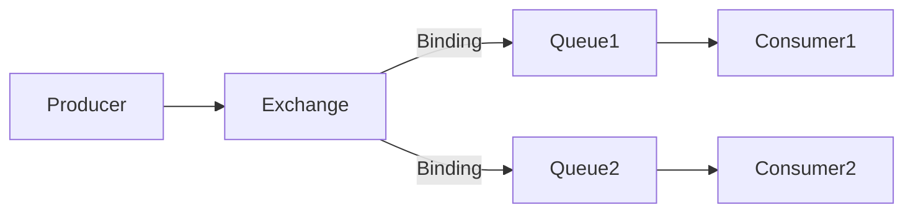

# RabbitMQ 与AMQP协议

## 介绍

RabbitMQ 是一个开源的消息代理软件，它实现了 **AMQP（高级消息队列协议）**，用于在分布式系统中传递消息。AMQP 是一种网络协议，定义了消息的格式和传递规则，使得不同系统之间能够可靠地交换消息。

RabbitMQ 的核心功能是接收、存储和转发消息。它广泛应用于微服务架构、任务队列、事件驱动系统等场景。理解 RabbitMQ 和 AMQP 协议是掌握现代分布式系统开发的重要一步。

---

## AMQP 协议简介

AMQP（Advanced Message Queuing Protocol）是一种开放标准的应用层协议，专为消息中间件设计。它定义了消息的格式、传输方式以及消息队列的行为。AMQP 的核心特点包括：

- **可靠性**：确保消息不会丢失。
- **异步通信**：生产者和消费者不需要同时在线。
- **灵活性**：支持多种消息传递模式，如点对点、发布/订阅等。

AMQP 协议的核心组件包括：
- **生产者（Producer）**：发送消息的应用程序。
- **消费者（Consumer）**：接收消息的应用程序。
- **队列（Queue）**：存储消息的缓冲区。
- **交换机（Exchange）**：接收生产者发送的消息，并根据规则将消息路由到队列。
- **绑定（Binding）**：定义交换机和队列之间的关系。

---

## RabbitMQ 的核心概念

### 1. 消息（Message）
消息是 RabbitMQ 中传递的基本单位。它由 **消息头（Headers）** 和 **消息体（Body）** 组成。消息头包含元数据（如路由键、优先级等），消息体则是实际的数据内容。

### 2. 队列（Queue）
队列是存储消息的地方。消息会被存储在队列中，直到消费者将其取出。队列可以是持久的（Durable）或临时的（Transient），持久队列在 RabbitMQ 重启后仍然存在。

### 3. 交换机（Exchange）
交换机负责接收生产者发送的消息，并根据绑定规则将消息路由到队列。常见的交换机类型包括：
- **Direct Exchange**：根据路由键精确匹配队列。
- **Fanout Exchange**：将消息广播到所有绑定的队列。
- **Topic Exchange**：根据路由键的模式匹配队列。

### 4. 绑定（Binding）
绑定是交换机和队列之间的连接规则。它定义了交换机如何将消息路由到队列。

---

## RabbitMQ 的工作流程

以下是一个典型的工作流程：

1. 生产者将消息发送到交换机。
2. 交换机根据绑定规则将消息路由到一个或多个队列。
3. 消费者从队列中获取消息并处理。



---

## 实际案例：任务队列

假设我们有一个需要处理大量任务的系统。我们可以使用 RabbitMQ 来实现任务队列：

1. **生产者**：生成任务并将其发送到 RabbitMQ。
2. **消费者**：从队列中获取任务并执行。

以下是一个简单的 Python 示例：

```python
# 生产者代码
import pika

connection = pika.BlockingConnection(pika.ConnectionParameters('localhost'))
channel = connection.channel()

channel.queue_declare(queue='task_queue', durable=True)

message = "Task 1"
channel.basic_publish(exchange='',
                      routing_key='task_queue',
                      body=message,
                      properties=pika.BasicProperties(
                         delivery_mode=2,  # 使消息持久化
                      ))
print(f" [x] Sent {message}")
connection.close()
```

```python
# 消费者代码
import pika

def callback(ch, method, properties, body):
    print(f" [x] Received {body}")
    ch.basic_ack(delivery_tag=method.delivery_tag)

connection = pika.BlockingConnection(pika.ConnectionParameters('localhost'))
channel = connection.channel()

channel.queue_declare(queue='task_queue', durable=True)
channel.basic_consume(queue='task_queue', on_message_callback=callback)

print(' [*] Waiting for messages. To exit press CTRL+C')
channel.start_consuming()
```

:::tip
在实际应用中，可以将消费者部署为多个实例，以实现任务的并行处理。
:::

---

## 总结

RabbitMQ 是一个强大的消息代理工具，基于 AMQP 协议实现了可靠的消息传递。通过理解 RabbitMQ 的核心概念（如消息、队列、交换机和绑定），你可以在分布式系统中构建高效、可靠的消息传递机制。

---

## 附加资源与练习

### 资源
- [RabbitMQ 官方文档](https://www.rabbitmq.com/documentation.html)
- [AMQP 协议规范](https://www.amqp.org/)

### 练习
1. 尝试在本地安装 RabbitMQ，并运行上述代码示例。
2. 修改代码，使用不同类型的交换机（如 Fanout 或 Topic）来实现消息的路由。
3. 探索 RabbitMQ 的持久化机制，确保消息在服务器重启后不会丢失。

:::caution
在实际生产环境中，请确保 RabbitMQ 的配置和部署符合高可用性和安全性的要求。
:::