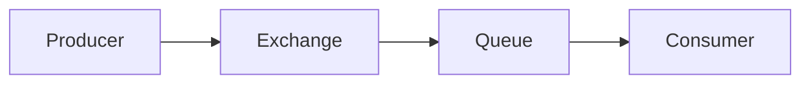
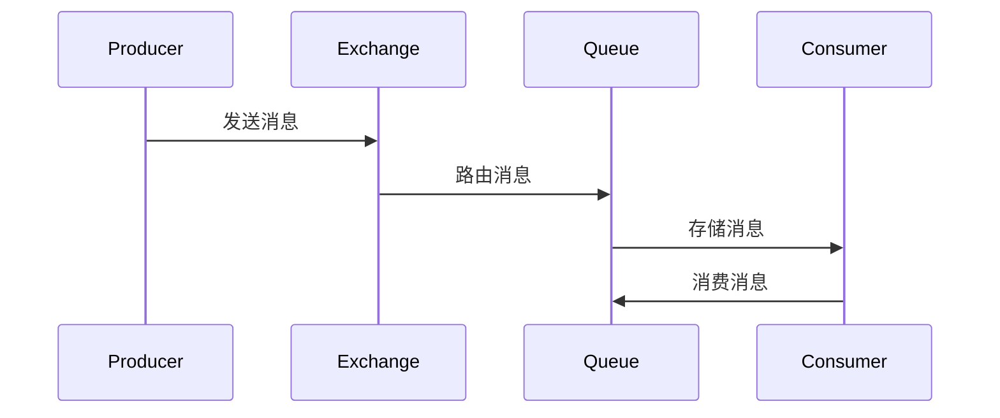

## 介绍

RabbitMQ 是一个开源的消息代理软件，用于在分布式系统中实现消息传递。它基于 AMQP（高级消息队列协议）标准，支持多种消息传递模式，如点对点、发布/订阅等。RabbitMQ 的架构设计使其能够高效地处理消息的传递、路由和存储，是现代分布式系统中不可或缺的组件之一。

在本节中，我们将深入探讨 RabbitMQ 的核心架构，帮助你理解其工作原理以及如何在实际应用中使用它。

## RabbitMQ 的核心组件

RabbitMQ 的架构主要由以下几个核心组件组成：

1. **Producer（生产者）**：负责创建和发送消息到 RabbitMQ 的应用程序。
2. **Exchange（交换机）**：接收来自生产者的消息，并根据特定的规则将消息路由到一个或多个队列。
3. **Queue（队列）**：存储消息的缓冲区，等待消费者来消费。
4. **Consumer（消费者）**：从队列中获取消息并进行处理的应用程序。



### 1. Producer（生产者）

生产者是消息的发送者，它将消息发送到 RabbitMQ 的交换机。生产者不需要知道消息最终会被哪个队列接收，它只需要将消息发送到指定的交换机即可。

```python
import pika

# 连接到 RabbitMQ 服务器
connection = pika.BlockingConnection(pika.ConnectionParameters('localhost'))
channel = connection.channel()

# 发送消息到交换机
channel.basic_publish(exchange='my_exchange',
                      routing_key='my_routing_key',
                      body='Hello, RabbitMQ!')

print(" [x] Sent 'Hello, RabbitMQ!'")
connection.close()
```

### 2. Exchange（交换机）

交换机是 RabbitMQ 的核心组件之一，它负责接收来自生产者的消息，并根据路由键（routing key）将消息分发到一个或多个队列。RabbitMQ 支持多种类型的交换机，包括：

- **Direct Exchange**：直接将消息路由到与路由键完全匹配的队列。
- **Fanout Exchange**：将消息路由到所有绑定到该交换机的队列。
- **Topic Exchange**：根据路由键的模式匹配将消息路由到相应的队列。
- **Headers Exchange**：根据消息的头部属性进行路由。

```python
# 创建一个 Direct Exchange
channel.exchange_declare(exchange='my_exchange', exchange_type='direct')
```

### 3. Queue（队列）

队列是消息的存储区域，它负责保存消息直到消费者将其取走。队列可以配置多种属性，如持久化、消息 TTL（生存时间）等。

```python
# 创建一个队列
channel.queue_declare(queue='my_queue')
```

### 4. Consumer（消费者）

消费者是从队列中获取消息并进行处理的应用程序。消费者可以订阅一个或多个队列，并从这些队列中接收消息。

```python
def callback(ch, method, properties, body):
    print(f" [x] Received {body}")

# 订阅队列
channel.basic_consume(queue='my_queue',
                      on_message_callback=callback,
                      auto_ack=True)

print(' [*] Waiting for messages. To exit press CTRL+C')
channel.start_consuming()
```

## RabbitMQ 的工作原理

RabbitMQ 的工作原理可以概括为以下几个步骤：

1. **生产者发送消息**：生产者将消息发送到指定的交换机，并附带一个路由键。
2. **交换机路由消息**：交换机根据路由键和绑定规则将消息路由到一个或多个队列。
3. **队列存储消息**：消息被存储在队列中，等待消费者来消费。
4. **消费者消费消息**：消费者从队列中获取消息并进行处理。



## 实际应用场景

RabbitMQ 在实际应用中有广泛的使用场景，以下是一些常见的例子：

1. **异步任务处理**：将耗时的任务放入消息队列中，由后台的消费者异步处理，从而提高系统的响应速度。
2. **微服务通信**：在微服务架构中，RabbitMQ 可以作为服务之间的通信桥梁，实现解耦和异步通信。
3. **日志收集**：将系统日志发送到 RabbitMQ，由专门的消费者进行收集和处理。

:::tip
在实际应用中，合理配置交换机和队列的绑定规则，可以大大提高系统的灵活性和可扩展性。
:::

## 总结

RabbitMQ 是一个功能强大的消息代理软件，其核心架构包括生产者、交换机、队列和消费者。通过理解这些组件的工作原理，你可以更好地利用 RabbitMQ 来构建高效、可靠的分布式系统。

在实际应用中，RabbitMQ 可以用于异步任务处理、微服务通信、日志收集等多种场景。通过合理配置交换机和队列的绑定规则，你可以实现灵活的消息路由和处理。

## 附加资源

- [RabbitMQ 官方文档](https://www.rabbitmq.com/documentation.html)
- [RabbitMQ 教程](https://www.rabbitmq.com/getstarted.html)
- [AMQP 协议详解](https://www.amqp.org/)

## 练习

1. 尝试创建一个 Direct Exchange，并发送消息到指定的队列。
2. 编写一个消费者程序，从队列中获取消息并打印出来。
3. 探索 RabbitMQ 的其他交换机类型（如 Fanout、Topic、Headers），并尝试使用它们进行消息路由。

:::caution
在练习过程中，确保你已经正确安装并配置了 RabbitMQ 服务器。
:::