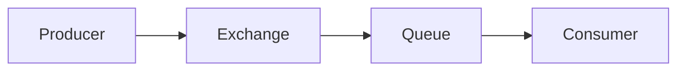
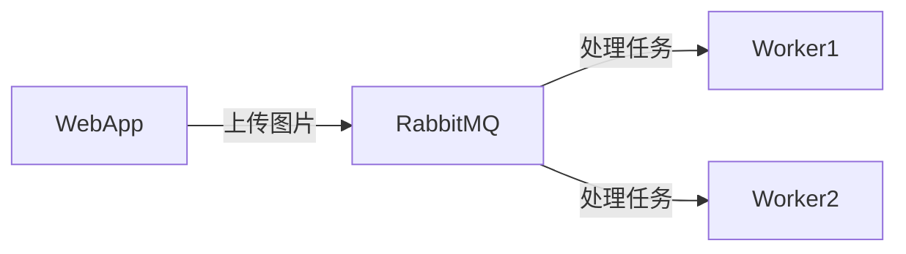

# RabbitMQ 消息模型概述

RabbitMQ 是一个开源的消息代理软件，用于在分布式系统中实现消息的异步传递。它基于 **AMQP（高级消息队列协议）**，提供了一种可靠的方式来处理消息的发送和接收。RabbitMQ 的消息模型是理解其工作原理的核心，本文将带你逐步了解这一模型。

## 什么是消息模型？

消息模型是 RabbitMQ 中用于描述消息如何从生产者传递到消费者的抽象概念。它定义了消息的发送、接收和处理方式。RabbitMQ 的消息模型基于 **生产者-消费者模式**，其中生产者负责发送消息，消费者负责接收和处理消息。

### 核心组件

RabbitMQ 的消息模型由以下几个核心组件组成：

1. **生产者（Producer）**：负责创建和发送消息到队列。
2. **队列（Queue）**：存储消息的缓冲区，消息会在这里等待被消费者处理。
3. **消费者（Consumer）**：从队列中接收并处理消息。
4. **交换机（Exchange）**：接收生产者发送的消息，并根据路由规则将消息分发到相应的队列。



## 消息模型的工作流程

1. **生产者发送消息**：生产者将消息发送到交换机。
2. **交换机路由消息**：交换机根据路由规则将消息分发到一个或多个队列。
3. **队列存储消息**：消息在队列中等待被消费者处理。
4. **消费者接收消息**：消费者从队列中获取消息并进行处理。

### 代码示例

以下是一个简单的 Python 示例，展示了如何使用 RabbitMQ 发送和接收消息。

#### 生产者代码

```python
import pika

# 连接到 RabbitMQ 服务器
connection = pika.BlockingConnection(pika.ConnectionParameters('localhost'))
channel = connection.channel()

# 声明一个队列
channel.queue_declare(queue='hello')

# 发送消息
channel.basic_publish(exchange='',
                      routing_key='hello',
                      body='Hello, RabbitMQ!')
print(" [x] Sent 'Hello, RabbitMQ!'")

# 关闭连接
connection.close()
```

#### 消费者代码

```python
import pika

# 连接到 RabbitMQ 服务器
connection = pika.BlockingConnection(pika.ConnectionParameters('localhost'))
channel = connection.channel()

# 声明一个队列
channel.queue_declare(queue='hello')

# 定义回调函数来处理消息
def callback(ch, method, properties, body):
    print(f" [x] Received {body}")

# 设置消费者
channel.basic_consume(queue='hello',
                      on_message_callback=callback,
                      auto_ack=True)

print(' [*] Waiting for messages. To exit press CTRL+C')
channel.start_consuming()
```

:::note
在生产者代码中，`exchange=''` 表示使用默认的交换机。`routing_key='hello'` 指定了消息将被发送到名为 `hello` 的队列。
:::

## 实际应用场景

RabbitMQ 的消息模型在许多实际场景中都有广泛应用，例如：

1. **任务队列**：将耗时的任务放入队列中，由后台工作进程异步处理。
2. **日志处理**：将日志消息发送到队列中，由多个消费者并行处理。
3. **事件驱动架构**：在微服务架构中，通过消息队列实现服务之间的解耦。

### 案例：任务队列

假设你有一个 Web 应用，用户上传图片后需要进行图像处理。你可以使用 RabbitMQ 将图像处理任务放入队列中，由后台工作进程异步处理。



## 总结

RabbitMQ 的消息模型提供了一种高效、可靠的方式来处理异步消息传递。通过生产者、队列、消费者和交换机的协作，RabbitMQ 能够确保消息的可靠传递和处理。本文通过简单的代码示例和实际应用场景，帮助你理解了 RabbitMQ 消息模型的基本概念。

## 附加资源

- [RabbitMQ 官方文档](https://www.rabbitmq.com/documentation.html)
- [AMQP 协议详解](https://www.amqp.org/)

## 练习

1. 尝试修改生产者代码，发送不同类型的消息（例如 JSON 格式的消息）。
2. 在消费者代码中，添加日志记录功能，将接收到的消息保存到文件中。
3. 研究 RabbitMQ 的其他交换机类型（如 `direct`、`topic`、`fanout`），并尝试在代码中使用它们。
