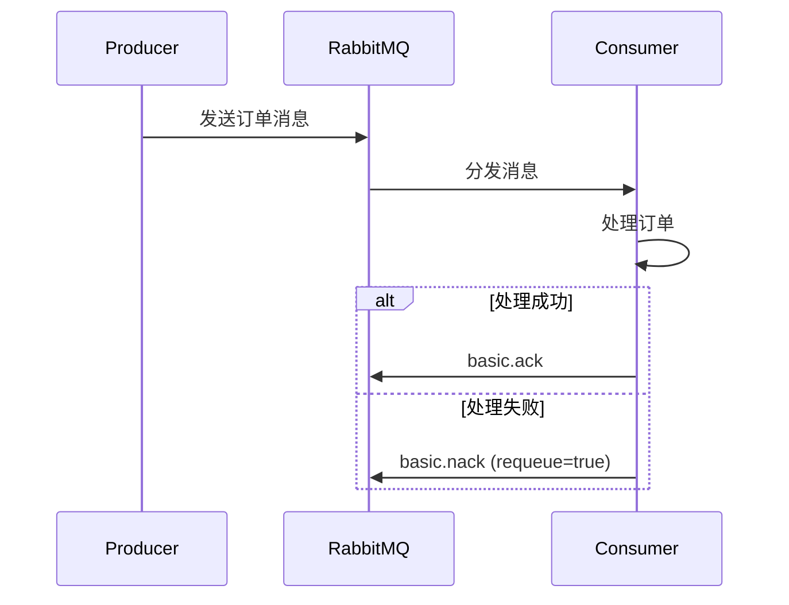

# RabbitMQ 消息确认

在分布式系统中，消息队列（如RabbitMQ）是确保系统组件之间可靠通信的关键工具。然而，仅仅发送消息到队列并不足以保证消息被正确处理。RabbitMQ提供了**消息确认**机制，以确保消息在消费者处理完毕后被正确地从队列中移除。本文将详细介绍RabbitMQ的消息确认机制，并通过代码示例和实际案例帮助你理解其工作原理。

## 什么是消息确认？

消息确认是RabbitMQ中的一种机制，用于确保消息在消费者成功处理后从队列中移除。如果没有消息确认机制，消息可能会在处理过程中丢失，或者在消费者崩溃时被重复处理。

RabbitMQ支持两种类型的消息确认：
1. **自动确认**：消息一旦被消费者接收，RabbitMQ就会立即将其从队列中移除。
2. **手动确认**：消费者在处理完消息后，显式地向RabbitMQ发送确认信号，RabbitMQ才会将消息从队列中移除。

:::caution
自动确认模式虽然简单，但在消费者处理消息时发生错误或崩溃的情况下，消息可能会丢失。因此，手动确认模式更为可靠。
:::

## 手动确认模式

在手动确认模式下，消费者需要在处理完消息后显式地向RabbitMQ发送确认信号。RabbitMQ提供了两种确认方式：
- **`basic.ack`**：确认消息已被成功处理。
- **`basic.nack`**：拒绝消息，可以选择将消息重新放回队列或丢弃。

### 代码示例

以下是一个使用Python和`pika`库实现手动确认的示例：

```python
import pika

# 连接到RabbitMQ服务器
connection = pika.BlockingConnection(pika.ConnectionParameters('localhost'))
channel = connection.channel()

# 声明队列
channel.queue_declare(queue='task_queue', durable=True)

def callback(ch, method, properties, body):
    print(f" [x] 收到消息: {body.decode()}")
    # 模拟消息处理
    try:
        # 处理消息
        print(" [x] 处理中...")
        # 处理完成后发送确认
        ch.basic_ack(delivery_tag=method.delivery_tag)
        print(" [x] 消息处理完成，已确认")
    except Exception as e:
        print(f" [x] 处理失败: {e}")
        # 拒绝消息并重新放回队列
        ch.basic_nack(delivery_tag=method.delivery_tag, requeue=True)

# 设置消费者
channel.basic_consume(queue='task_queue', on_message_callback=callback)

print(' [*] 等待消息。按 CTRL+C 退出')
channel.start_consuming()
```

### 输入与输出

假设我们向队列发送了一条消息 `"Hello, RabbitMQ!"`，消费者将输出以下内容：

```
 [*] 等待消息。按 CTRL+C 退出
 [x] 收到消息: Hello, RabbitMQ!
 [x] 处理中...
 [x] 消息处理完成，已确认
```

如果处理过程中发生异常，消息将被拒绝并重新放回队列：

```
 [*] 等待消息。按 CTRL+C 退出
 [x] 收到消息: Hello, RabbitMQ!
 [x] 处理中...
 [x] 处理失败: 模拟错误
```

## 实际应用场景

### 订单处理系统

在一个电商平台的订单处理系统中，订单消息被发送到RabbitMQ队列中。消费者（订单处理服务）从队列中获取订单消息并进行处理。如果订单处理成功，消费者发送`basic.ack`确认消息；如果处理失败（例如库存不足），消费者发送`basic.nack`并将消息重新放回队列，以便稍后重试。



## 总结

RabbitMQ的消息确认机制是确保消息可靠传递和处理的关键。通过手动确认模式，开发者可以更好地控制消息的生命周期，避免消息丢失或重复处理。在实际应用中，消息确认机制在订单处理、任务调度等场景中发挥着重要作用。

:::tip
建议在生产环境中始终使用手动确认模式，以确保消息处理的可靠性。
:::

## 附加资源与练习

- **练习**：尝试修改上述代码，模拟不同的处理结果（成功、失败），并观察消息确认的行为。
- **进一步阅读**：
  - [RabbitMQ官方文档 - 消息确认](https://www.rabbitmq.com/confirms.html)
  - [RabbitMQ消息持久化](https://www.rabbitmq.com/persistence-conf.html)

通过本文的学习，你应该已经掌握了RabbitMQ消息确认的基本概念和应用方法。继续探索RabbitMQ的其他高级特性，以构建更健壮的分布式系统。