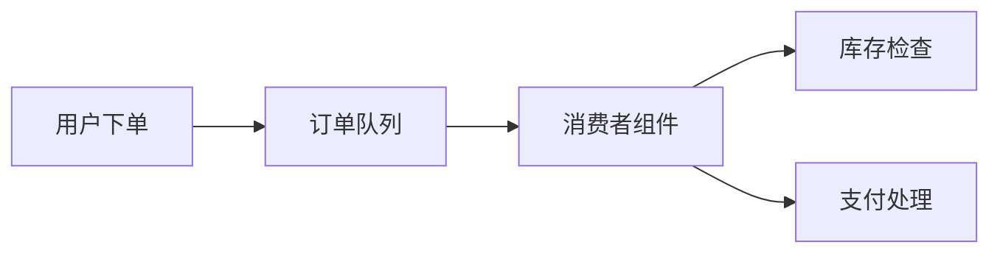
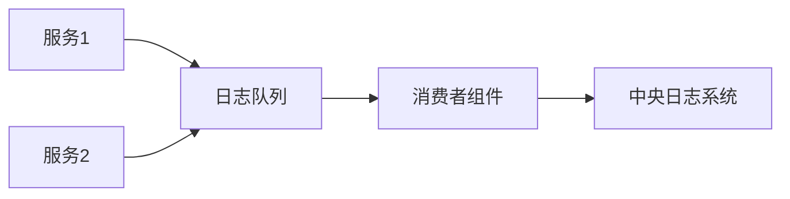

# RabbitMQ 消费者组件

在消息队列系统中，**消费者**是负责从队列中接收并处理消息的组件。RabbitMQ作为一个广泛使用的消息代理，提供了强大的功能来支持消息的生产和消费。本文将详细介绍RabbitMQ中的消费者组件，帮助你理解其工作原理和实际应用。

## 什么是消费者？

消费者是消息队列系统中的接收端，它从队列中获取消息并执行相应的处理逻辑。在RabbitMQ中，消费者通过订阅队列来接收消息。一旦队列中有新的消息，RabbitMQ会将消息推送给消费者，消费者则负责处理这些消息。

## 消费者的基本工作流程

1. **连接到RabbitMQ服务器**：消费者首先需要与RabbitMQ服务器建立连接。
2. **创建通道**：在连接的基础上，消费者会创建一个通道（Channel），用于与RabbitMQ进行通信。
3. **订阅队列**：消费者通过通道订阅一个或多个队列，以便接收消息。
4. **接收消息**：当队列中有消息时，RabbitMQ会将消息推送给消费者。
5. **处理消息**：消费者接收到消息后，执行相应的处理逻辑。
6. **确认消息**：处理完成后，消费者可以向RabbitMQ发送确认（acknowledgement），告知消息已成功处理。

## 代码示例

以下是一个简单的Python示例，展示了如何使用`pika`库创建一个RabbitMQ消费者：

```python
import pika

# 连接到RabbitMQ服务器
connection = pika.BlockingConnection(pika.ConnectionParameters('localhost'))
channel = connection.channel()

# 声明队列
channel.queue_declare(queue='hello')

# 定义回调函数来处理消息
def callback(ch, method, properties, body):
    print(f" [x] Received {body}")

# 订阅队列并指定回调函数
channel.basic_consume(queue='hello', on_message_callback=callback, auto_ack=True)

print(' [*] Waiting for messages. To exit press CTRL+C')
channel.start_consuming()
```

### 输入和输出

- **输入**：队列`hello`中的消息。
- **输出**：消费者接收到消息后，打印出消息内容。

## 实际应用场景

### 订单处理系统

在一个电商平台中，订单处理系统通常使用消息队列来解耦订单的创建和处理。当用户下单时，订单信息会被发送到RabbitMQ队列中。消费者组件从队列中获取订单信息，并执行库存检查、支付处理等操作。



### 日志收集系统

在分布式系统中，日志收集是一个常见的需求。各个服务将日志信息发送到RabbitMQ队列中，消费者组件从队列中获取日志信息，并将其存储到中央日志系统中。



## 总结

RabbitMQ的消费者组件是消息队列系统中不可或缺的一部分。通过本文的学习，你应该已经掌握了消费者的基本概念、工作流程以及如何在实际项目中应用消费者组件。希望这些知识能够帮助你在未来的项目中更好地使用RabbitMQ。

## 附加资源

- [RabbitMQ官方文档](https://www.rabbitmq.com/documentation.html)
- [pika库文档](https://pika.readthedocs.io/en/stable/)

## 练习

1. 修改上述代码示例，使消费者在处理完消息后手动发送确认（acknowledgement）。
2. 尝试创建一个包含多个消费者的系统，观察消息是如何在多个消费者之间分配的。

:::tip
在开发过程中，记得使用RabbitMQ的管理界面来监控队列和消费者的状态，这有助于调试和优化你的系统。
:::