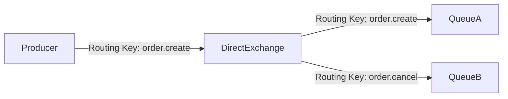

# RabbitMQ 直接交换机

RabbitMQ是一个功能强大的消息代理工具，广泛用于分布式系统中实现消息传递。在RabbitMQ中，**直接交换机（Direct Exchange）**是一种常见的交换机类型，用于根据消息的路由键（Routing Key）将消息精确地路由到特定的队列。本文将详细介绍直接交换机的工作原理、使用场景以及如何通过代码实现消息路由。

## 什么是直接交换机？

直接交换机是RabbitMQ中最简单的交换机类型之一。它的工作原理是基于**路由键**的精确匹配。当生产者发送消息到直接交换机时，交换机会根据消息的路由键将消息路由到与之完全匹配的队列。

### 直接交换机的工作原理

1. **绑定队列**：在直接交换机中，队列通过一个路由键与交换机绑定。例如，队列A绑定到路由键`order.create`，队列B绑定到路由键`order.cancel`。
2. **发送消息**：生产者发送消息时，指定一个路由键。例如，发送一条路由键为`order.create`的消息。
3. **路由消息**：直接交换机会将消息路由到与路由键完全匹配的队列。在上面的例子中，消息会被路由到队列A。



## 直接交换机的使用场景

直接交换机适用于需要精确控制消息路由的场景。以下是一些常见的应用场景：

1. **任务分发**：在任务队列中，不同的任务类型可以通过不同的路由键分发到不同的队列。例如，`task.type1`和`task.type2`分别路由到不同的队列。
2. **日志处理**：不同级别的日志（如`info`、`error`、`debug`）可以通过不同的路由键分发到不同的队列进行处理。
3. **订单处理**：在电商系统中，订单的创建、取消、支付等操作可以通过不同的路由键分发到不同的队列进行处理。

## 代码示例

以下是一个使用Python和`pika`库实现直接交换机的示例。

### 1. 创建直接交换机和队列

```python
import pika

# 连接到RabbitMQ服务器
connection = pika.BlockingConnection(pika.ConnectionParameters('localhost'))
channel = connection.channel()

# 声明一个直接交换机
channel.exchange_declare(exchange='direct_logs', exchange_type='direct')

# 声明两个队列
channel.queue_declare(queue='info_queue')
channel.queue_declare(queue='error_queue')

# 将队列绑定到交换机，并指定路由键
channel.queue_bind(exchange='direct_logs', queue='info_queue', routing_key='info')
channel.queue_bind(exchange='direct_logs', queue='error_queue', routing_key='error')

print("交换机和队列已创建并绑定")
```

### 2. 发送消息到直接交换机

```python
# 发送消息到直接交换机
channel.basic_publish(exchange='direct_logs', routing_key='info', body='这是一条info级别的日志')
channel.basic_publish(exchange='direct_logs', routing_key='error', body='这是一条error级别的日志')

print("消息已发送")
```

### 3. 消费消息

```python
# 定义一个回调函数来处理消息
def callback(ch, method, properties, body):
    print(f"收到消息: {body}")

# 消费info队列中的消息
channel.basic_consume(queue='info_queue', on_message_callback=callback, auto_ack=True)

# 消费error队列中的消息
channel.basic_consume(queue='error_queue', on_message_callback=callback, auto_ack=True)

print("等待消息...")
channel.start_consuming()
```

:::note
在以上代码中，`info_queue`只会接收到路由键为`info`的消息，而`error_queue`只会接收到路由键为`error`的消息。
:::

## 实际案例

假设我们正在开发一个电商系统，需要处理订单的创建和取消操作。我们可以使用直接交换机来实现消息的路由。

1. **订单创建**：当用户创建一个订单时，系统发送一条路由键为`order.create`的消息到直接交换机。
2. **订单取消**：当用户取消一个订单时，系统发送一条路由键为`order.cancel`的消息到直接交换机。

通过这种方式，我们可以确保订单创建和取消的消息被分别路由到不同的队列进行处理。

## 总结

直接交换机是RabbitMQ中一种简单但强大的消息路由机制。它通过精确匹配路由键，将消息路由到特定的队列。直接交换机适用于需要精确控制消息路由的场景，如任务分发、日志处理和订单处理等。

通过本文的介绍和代码示例，你应该已经掌握了直接交换机的基本概念和使用方法。接下来，你可以尝试在自己的项目中应用直接交换机，或者通过以下附加资源进一步学习。

## 附加资源

- [RabbitMQ官方文档](https://www.rabbitmq.com/documentation.html)
- [RabbitMQ教程](https://www.rabbitmq.com/getstarted.html)
- [pika库文档](https://pika.readthedocs.io/en/stable/)

## 练习

1. 修改上面的代码示例，添加一个新的队列`debug_queue`，并将其绑定到路由键`debug`。
2. 发送一条路由键为`debug`的消息，并确保它被正确路由到`debug_queue`。
3. 尝试在多个消费者之间分发消息，观察直接交换机如何工作。