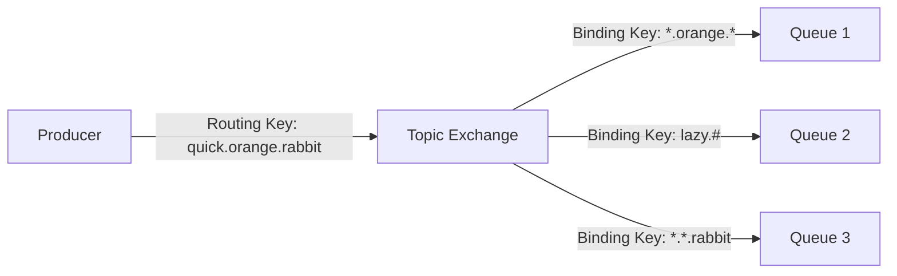

# RabbitMQ 主题交换机

RabbitMQ是一个功能强大的消息代理，支持多种消息模型。其中，**主题交换机（Topic Exchange）** 是一种灵活且强大的消息路由机制，允许生产者根据消息的主题（Topic）将消息发送到特定的队列。本文将详细介绍主题交换机的工作原理、使用场景以及如何通过代码实现消息的路由。

## 什么是主题交换机？

主题交换机是一种基于消息的路由键（Routing Key）和绑定键（Binding Key）进行消息路由的交换机。与直连交换机（Direct Exchange）和扇出交换机（Fanout Exchange）不同，主题交换机允许使用通配符来匹配路由键，从而实现更灵活的消息路由。

### 路由键与绑定键

- **路由键（Routing Key）**：生产者发送消息时指定的键，用于标识消息的主题。
- **绑定键（Binding Key）**：消费者在绑定队列到交换机时指定的键，用于匹配路由键。

主题交换机使用通配符来匹配路由键和绑定键。通配符有两种：
- `*`：匹配一个单词（由`.`分隔的部分）。
- `#`：匹配零个或多个单词。

例如，绑定键 `*.orange.*` 可以匹配路由键 `quick.orange.rabbit`，但不能匹配 `lazy.orange.rabbit.fast`。

## 主题交换机的工作原理

当生产者发送一条消息到主题交换机时，交换机会根据消息的路由键和绑定键进行匹配，将消息路由到符合条件的队列。如果没有任何队列匹配，消息将被丢弃。



在上图中，生产者发送了一条路由键为 `quick.orange.rabbit` 的消息。主题交换机根据绑定键将消息路由到 `Queue 1` 和 `Queue 3`。

## 代码示例

以下是一个使用Python和`pika`库实现主题交换机的示例。

### 生产者代码

```python
import pika

# 连接到RabbitMQ服务器
connection = pika.BlockingConnection(pika.ConnectionParameters('localhost'))
channel = connection.channel()

# 声明主题交换机
channel.exchange_declare(exchange='topic_logs', exchange_type='topic')

# 发送消息
routing_key = 'quick.orange.rabbit'
message = 'Hello, RabbitMQ!'
channel.basic_publish(exchange='topic_logs', routing_key=routing_key, body=message)

print(f" [x] Sent {routing_key}:{message}")
connection.close()
```

### 消费者代码

```python
import pika

# 连接到RabbitMQ服务器
connection = pika.BlockingConnection(pika.ConnectionParameters('localhost'))
channel = connection.channel()

# 声明主题交换机
channel.exchange_declare(exchange='topic_logs', exchange_type='topic')

# 声明队列
result = channel.queue_declare(queue='', exclusive=True)
queue_name = result.method.queue

# 绑定队列到交换机
binding_key = '*.orange.*'
channel.queue_bind(exchange='topic_logs', queue=queue_name, routing_key=binding_key)

print(f" [*] Waiting for logs with binding key {binding_key}. To exit press CTRL+C")

# 定义回调函数
def callback(ch, method, properties, body):
    print(f" [x] Received {method.routing_key}:{body}")

# 开始消费消息
channel.basic_consume(queue=queue_name, on_message_callback=callback, auto_ack=True)
channel.start_consuming()
```

### 输出示例

假设生产者发送了一条路由键为 `quick.orange.rabbit` 的消息，消费者将输出：

```
 [x] Received quick.orange.rabbit:Hello, RabbitMQ!
```

## 实际应用场景

主题交换机在许多实际场景中非常有用，例如：

1. **日志系统**：根据日志的严重程度（如 `info`、`error`）和来源（如 `auth`、`database`）将日志消息路由到不同的队列。
2. **通知系统**：根据用户的地理位置和兴趣将通知消息路由到不同的用户组。
3. **股票交易系统**：根据股票代码和交易类型（如 `buy`、`sell`）将交易消息路由到不同的处理队列。

## 总结

主题交换机是RabbitMQ中一种非常灵活的消息路由机制，允许根据消息的主题进行复杂的路由匹配。通过使用通配符，可以实现高度定制化的消息路由策略。本文介绍了主题交换机的工作原理、代码示例以及实际应用场景，希望能帮助你更好地理解和使用RabbitMQ。

## 附加资源与练习

- **练习**：尝试修改上述代码，使用不同的路由键和绑定键，观察消息如何被路由到不同的队列。
- **资源**：阅读RabbitMQ官方文档，了解更多关于主题交换机的详细信息。

:::tip
如果你对RabbitMQ的其他消息模型感兴趣，可以继续学习直连交换机和扇出交换机的相关内容。
:::