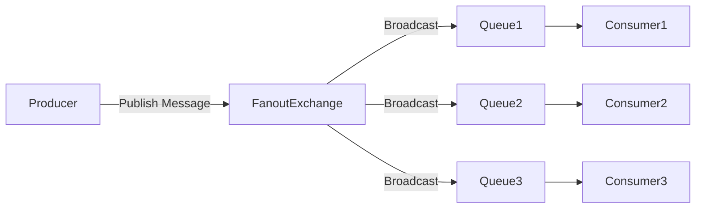

# RabbitMQ 扇出交换机

RabbitMQ 是一个功能强大的消息代理工具，支持多种消息模型。其中，**扇出交换机（Fanout Exchange）** 是一种常用的交换机类型，用于将消息广播到所有绑定的队列中。本文将详细介绍扇出交换机的工作原理、使用场景以及如何通过代码实现消息广播。

## 什么是扇出交换机？

扇出交换机是一种特殊的交换机类型，它会将接收到的消息**无条件地广播**到所有与之绑定的队列中。无论消息的路由键（Routing Key）是什么，扇出交换机都会将消息发送到所有绑定的队列。

:::tip
扇出交换机适用于需要将消息广播到多个消费者的场景，例如日志系统、通知系统等。
:::

## 扇出交换机的工作原理

扇出交换机的工作方式非常简单：

1. **消息发布**：生产者将消息发送到扇出交换机。
2. **消息广播**：扇出交换机将消息广播到所有与之绑定的队列。
3. **消息消费**：每个绑定的队列都会接收到相同的消息，消费者从各自的队列中消费消息。



如上图所示，生产者将消息发送到扇出交换机，扇出交换机将消息广播到所有绑定的队列中，每个队列的消费者都会接收到相同的消息。

## 代码示例

下面是一个使用 Python 和 `pika` 库实现扇出交换机的示例。

### 生产者代码

```python
import pika

# 连接到 RabbitMQ 服务器
connection = pika.BlockingConnection(pika.ConnectionParameters('localhost'))
channel = connection.channel()

# 声明一个扇出交换机
channel.exchange_declare(exchange='logs', exchange_type='fanout')

# 发布消息
message = "Hello, Fanout Exchange!"
channel.basic_publish(exchange='logs', routing_key='', body=message)
print(f" [x] Sent {message}")

# 关闭连接
connection.close()
```

### 消费者代码

```python
import pika

# 连接到 RabbitMQ 服务器
connection = pika.BlockingConnection(pika.ConnectionParameters('localhost'))
channel = connection.channel()

# 声明一个扇出交换机
channel.exchange_declare(exchange='logs', exchange_type='fanout')

# 声明一个临时队列
result = channel.queue_declare(queue='', exclusive=True)
queue_name = result.method.queue

# 将队列绑定到扇出交换机
channel.queue_bind(exchange='logs', queue=queue_name)

# 定义回调函数
def callback(ch, method, properties, body):
    print(f" [x] Received {body}")

# 开始消费消息
channel.basic_consume(queue=queue_name, on_message_callback=callback, auto_ack=True)

print(' [*] Waiting for messages. To exit press CTRL+C')
channel.start_consuming()
```

### 运行结果

1. 运行生产者代码，消息将被发送到扇出交换机。
2. 运行多个消费者实例，每个消费者都会接收到相同的消息。

:::note
由于扇出交换机会将消息广播到所有绑定的队列，因此每个消费者都会接收到相同的消息。
:::

## 实际应用场景

扇出交换机在以下场景中非常有用：

1. **日志系统**：将日志消息广播到多个日志处理服务，例如存储日志、分析日志等。
2. **通知系统**：将通知消息广播到多个通知渠道，例如邮件、短信、推送通知等。
3. **实时数据分发**：将实时数据广播到多个数据处理服务，例如实时监控、数据分析等。

## 总结

扇出交换机是 RabbitMQ 中一种强大的消息广播机制，适用于需要将消息广播到多个消费者的场景。通过本文的介绍和代码示例，你应该已经掌握了扇出交换机的基本概念和使用方法。

## 附加资源

- [RabbitMQ 官方文档](https://www.rabbitmq.com/documentation.html)
- [pika 库文档](https://pika.readthedocs.io/en/stable/)

## 练习

1. 修改生产者代码，使其能够发送多条消息到扇出交换机。
2. 创建多个消费者实例，观察每个消费者是否都能接收到相同的消息。
3. 尝试将扇出交换机与其他类型的交换机（如直连交换机、主题交换机）进行比较，分析它们的使用场景和优缺点。

通过以上练习，你将更深入地理解扇出交换机的工作原理和应用场景。