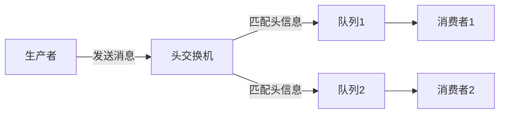

# RabbitMQ 头交换机

RabbitMQ是一个功能强大的消息队列系统，支持多种消息路由模式。其中，**头交换机（Headers Exchange）**是一种基于消息头信息（headers）而非路由键（routing key）进行消息路由的交换机类型。本文将详细介绍头交换机的工作原理、使用场景以及如何在实际项目中应用它。

## 什么是头交换机？

头交换机是一种特殊的交换机类型，它根据消息的**头信息（headers）**而不是路由键来决定消息的路由。头信息是键值对的形式，可以包含任意自定义数据。头交换机通过匹配这些头信息来决定将消息路由到哪些队列。

与直接交换机、主题交换机和扇出交换机不同，头交换机不依赖于路由键，而是依赖于消息头中的键值对。这使得头交换机在处理复杂路由逻辑时非常灵活。

## 头交换机的工作原理

头交换机的工作原理如下：

1. **消息发布**：生产者将消息发送到头交换机，并附带一组头信息（headers）。
2. **绑定队列**：队列通过绑定键（binding key）与头交换机绑定。绑定键是一个键值对的集合，用于匹配消息的头信息。
3. **匹配规则**：头交换机根据绑定时指定的匹配规则（`x-match`）来决定是否将消息路由到绑定的队列。`x-match`可以设置为`all`（所有头信息必须匹配）或`any`（至少一个头信息匹配）。
4. **消息路由**：如果消息的头信息与绑定键匹配，消息将被路由到相应的队列。

### 示例：头交换机的工作流程



## 头交换机的使用场景

头交换机适用于以下场景：

1. **复杂路由逻辑**：当消息的路由逻辑依赖于多个条件时，头交换机可以通过头信息灵活地实现复杂的路由规则。
2. **动态路由**：头交换机可以根据消息的头信息动态地决定消息的路由目标，适用于需要动态调整路由策略的场景。
3. **多条件匹配**：头交换机支持`all`和`any`两种匹配模式，可以根据需要选择严格匹配或部分匹配。

## 头交换机的实际应用

### 案例：订单处理系统

假设我们有一个订单处理系统，订单消息需要根据订单类型和优先级进行路由。我们可以使用头交换机来实现这一需求。

1. **消息头信息**：订单消息包含以下头信息：
   - `orderType`: `standard` 或 `express`
   - `priority`: `high` 或 `low`

2. **队列绑定**：
   - 队列`standardOrders`绑定到头交换机，匹配`orderType=standard`。
   - 队列`expressOrders`绑定到头交换机，匹配`orderType=express`。
   - 队列`highPriorityOrders`绑定到头交换机，匹配`priority=high`。

3. **消息路由**：
   - 如果消息的`orderType`为`standard`，消息将被路由到`standardOrders`队列。
   - 如果消息的`orderType`为`express`，消息将被路由到`expressOrders`队列。
   - 如果消息的`priority`为`high`，消息将被路由到`highPriorityOrders`队列。

### 代码示例

以下是一个使用RabbitMQ头交换机的Python示例：

```python
import pika

# 连接到RabbitMQ服务器
connection = pika.BlockingConnection(pika.ConnectionParameters('localhost'))
channel = connection.channel()

# 声明头交换机
channel.exchange_declare(exchange='headers_exchange', exchange_type='headers')

# 声明队列
channel.queue_declare(queue='standardOrders')
channel.queue_declare(queue='expressOrders')
channel.queue_declare(queue='highPriorityOrders')

# 绑定队列到头交换机
channel.queue_bind(queue='standardOrders', exchange='headers_exchange', arguments={'orderType': 'standard', 'x-match': 'all'})
channel.queue_bind(queue='expressOrders', exchange='headers_exchange', arguments={'orderType': 'express', 'x-match': 'all'})
channel.queue_bind(queue='highPriorityOrders', exchange='headers_exchange', arguments={'priority': 'high', 'x-match': 'any'})

# 发布消息
headers = {'orderType': 'express', 'priority': 'high'}
channel.basic_publish(exchange='headers_exchange', routing_key='', body='Order 123', properties=pika.BasicProperties(headers=headers))

print(" [x] Sent 'Order 123'")

connection.close()
```

:::note
在上面的代码中，我们声明了一个头交换机`headers_exchange`，并将三个队列绑定到该交换机。每个队列根据不同的头信息进行匹配。发布消息时，我们指定了消息的头信息，头交换机会根据这些头信息将消息路由到相应的队列。
:::

## 总结

头交换机是RabbitMQ中一种强大的消息路由机制，它通过消息头信息来决定消息的路由目标。头交换机适用于需要复杂路由逻辑和动态路由的场景，能够灵活地处理多条件匹配的需求。

通过本文的介绍和示例，你应该已经了解了头交换机的工作原理以及如何在实际项目中使用它。希望这些内容能帮助你在使用RabbitMQ时更好地利用头交换机的功能。

## 附加资源

- [RabbitMQ官方文档](https://www.rabbitmq.com/documentation.html)
- [RabbitMQ头交换机教程](https://www.rabbitmq.com/tutorials/tutorial-five-python.html)

## 练习

1. 修改上面的代码示例，添加一个新的队列`lowPriorityOrders`，并绑定到头交换机，匹配`priority=low`。
2. 发布一条消息，头信息为`orderType=standard`和`priority=low`，观察消息被路由到哪些队列。

通过完成这些练习，你将更深入地理解头交换机的工作原理和应用场景。