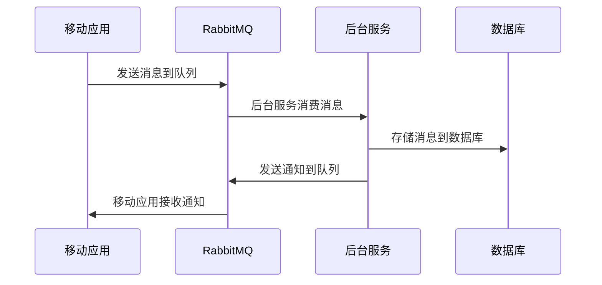

## 介绍

在现代移动应用开发中，消息队列（Message Queue）是实现异步通信和解耦系统组件的重要工具。RabbitMQ 是一个广泛使用的开源消息代理，它支持多种消息协议，并提供了可靠的消息传递机制。通过将 RabbitMQ 与移动应用集成，开发者可以实现高效的消息传递、任务队列管理以及跨平台通信。

本文将逐步介绍如何将 RabbitbitMQ 与移动应用集成，并提供实际案例和代码示例，帮助初学者快速上手。

## RabbitMQ 与移动应用集成的基本概念

### 1. 消息队列的作用

消息队列允许应用程序通过发送和接收消息来进行通信。在移动应用中，消息队列可以用于以下场景：

- **异步任务处理**：将耗时的任务（如图片上传、数据处理）放入队列，由后台服务异步处理。
- **事件通知**：当某个事件发生时（如用户注册、订单创建），通过消息队列通知其他服务。
- **跨平台通信**：在移动应用与后端服务之间传递消息，确保数据一致性。

### 2. RabbitMQ 的核心组件

- **Producer（生产者）**：负责发送消息到队列。
- **Queue（队列）**：存储消息的缓冲区，等待消费者处理。
- **Consumer（消费者）**：从队列中获取消息并进行处理。
- **Exchange（交换机）**：决定消息如何路由到队列。

## 集成步骤

### 1. 设置 RabbitMQ 服务器

首先，你需要在服务器上安装并配置 RabbitMQ。你可以使用 Docker 快速启动一个 RabbitMQ 实例：

```bash
docker run -d --hostname my-rabbitmq --name some-rabbitmq -p 5672:5672 -p 15672:15672 rabbitmq:3-management
```

### 2. 在移动应用中集成 RabbitMQ 客户端

移动应用通常通过 HTTP 或 WebSocket 与 RabbitMQ 进行通信。你可以使用以下库来简化集成：

- **Android**：使用 `RabbitMQ Java Client` 或 `OkHttp` 进行 HTTP 请求。
- **iOS**：使用 `Alamofire` 或 `URLSession` 进行 HTTP 请求。

以下是一个 Android 示例，展示如何发送消息到 RabbitMQ：

```java
import com.rabbitmq.client.ConnectionFactory;
import com.rabbitmq.client.Connection;
import com.rabbitmq.client.Channel;

public class RabbitMQProducer {
    private final static String QUEUE_NAME = "mobile_queue";

    public static void main(String[] argv) throws Exception {
        ConnectionFactory factory = new ConnectionFactory();
        factory.setHost("localhost");
        try (Connection connection = factory.newConnection();
             Channel channel = connection.createChannel()) {
            channel.queueDeclare(QUEUE_NAME, false, false, false, null);
            String message = "Hello from Mobile App!";
            channel.basicPublish("", QUEUE_NAME, null, message.getBytes());
            System.out.println(" [x] Sent '" + message + "'");
        }
    }
}
```

### 3. 处理消息

在移动应用中，你可以通过轮询或长连接（如 WebSocket）来接收消息。以下是一个 iOS 示例，展示如何从 RabbitMQ 接收消息：

```swift
import Foundation

func receiveMessage() {
    let url = URL(string: "http://localhost:15672/api/queues/%2F/mobile_queue/get")!
    var request = URLRequest(url: url)
    request.httpMethod = "POST"
    request.setValue("application/json", forHTTPHeaderField: "Content-Type")
    request.httpBody = try? JSONSerialization.data(withJSONObject: ["count": 1, "ackmode": "ack_requeue_true"], options: [])

    let task = URLSession.shared.dataTask(with: request) { data, response, error in
        if let data = data {
            if let json = try? JSONSerialization.jsonObject(with: data, options: []) as? [[String: Any]] {
                for message in json {
                    print("Received message: $message["payload"] as? String ?? "")")
                }
            }
        }
    }
    task.resume()
}
```

## 实际案例

### 案例：移动应用中的消息通知系统

假设你正在开发一个社交应用，用户可以在应用中发送消息。当用户发送消息时，应用将消息发送到 RabbitMQ 队列，后台服务处理消息并将其存储到数据库中。同时，接收方用户的应用会从 RabbitMQ 队列中获取消息并显示通知。



## 总结

通过将 RabbitMQ 与移动应用集成，你可以实现高效的消息传递和异步通信。本文介绍了 RabbitMQ 的基本概念、集成步骤以及一个实际案例，帮助你理解如何在实际项目中应用 RabbitMQ。

## 附加资源与练习

- **练习**：尝试在移动应用中实现一个简单的聊天功能，使用 RabbitMQ 作为消息传递的中间件。
- **资源**：
  - [RabbitMQ 官方文档](https://www.rabbitmq.com/documentation.html)
  - [RabbitMQ Java Client 文档](https://www.rabbitmq.com/api-guide.html)
  - [Alamofire 文档](https://github.com/Alamofire/Alamofire)

:::tip
在实际开发中，确保消息的可靠传递和错误处理是非常重要的。你可以使用 RabbitMQ 的确认机制（Publisher Confirms）和持久化队列来增强系统的可靠性。
:::