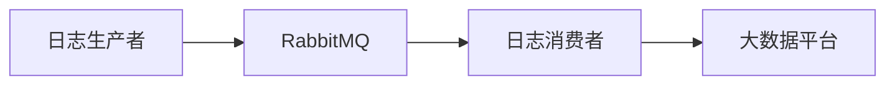

## 介绍

RabbitMQ是一个广泛使用的消息队列系统，它允许应用程序通过消息进行通信。在大数据领域，RabbitMQ可以作为数据传输的桥梁，将数据从生产者传递到大数据平台进行处理和分析。本文将介绍如何将RabbitMQ与大数据平台集成，并提供实际案例和代码示例。

## RabbitMQ 与大数据平台集成的基本概念

### 消息队列的作用

消息队列（Message Queue）是一种异步通信机制，允许应用程序通过发送和接收消息来进行通信。在大数据平台中，消息队列可以用于：

- **数据采集**：从多个数据源收集数据。
- **数据传输**：将数据从生产者传递到消费者。
- **数据缓冲**：在高负载情况下，缓冲数据以避免系统过载。

### RabbitMQ 的核心组件

- **Producer**：生产者，负责发送消息。
- **Consumer**：消费者，负责接收和处理消息。
- **Queue**：队列，存储消息的地方。
- **Exchange**：交换机，负责将消息路由到正确的队列。

## 集成步骤

### 1. 安装和配置RabbitMQ

首先，需要在服务器上安装RabbitMQ。可以通过以下命令在Linux系统上安装RabbitMQ：

```bash
sudo apt-get install rabbitmq-server
```

安装完成后，启动RabbitMQ服务：

```bash
sudo systemctl start rabbitmq-server
```

### 2. 创建生产者和消费者

#### 生产者示例

以下是一个简单的Python生产者示例，用于向RabbitMQ发送消息：

```python
import pika

# 连接到RabbitMQ服务器
connection = pika.BlockingConnection(pika.ConnectionParameters('localhost'))
channel = connection.channel()

# 声明一个队列
channel.queue_declare(queue='data_queue')

# 发送消息
channel.basic_publish(exchange='',
                      routing_key='data_queue',
                      body='Hello, Big Data!')

print(" [x] Sent 'Hello, Big Data!'")

# 关闭连接
connection.close()
```

#### 消费者示例

以下是一个简单的Python消费者示例，用于从RabbitMQ接收消息：

```python
import pika

# 连接到RabbitMQ服务器
connection = pika.BlockingConnection(pika.ConnectionParameters('localhost'))
channel = connection.channel()

# 声明一个队列
channel.queue_declare(queue='data_queue')

# 定义回调函数
def callback(ch, method, properties, body):
    print(" [x] Received %r" % body)

# 监听队列
channel.basic_consume(queue='data_queue',
                      auto_ack=True,
                      on_message_callback=callback)

print(' [*] Waiting for messages. To exit press CTRL+C')
channel.start_consuming()
```

### 3. 将数据传递到大数据平台

在大数据平台中，通常使用Apache Kafka、Apache Flink或Apache Spark等工具来处理数据。以下是一个简单的示例，展示如何将RabbitMQ中的数据传递到Apache Kafka：

```python
from kafka import KafkaProducer
import pika

# 连接到RabbitMQ
connection = pika.BlockingConnection(pika.ConnectionParameters('localhost'))
channel = connection.channel()

# 声明队列
channel.queue_declare(queue='data_queue')

# 连接到Kafka
producer = KafkaProducer(bootstrap_servers='localhost:9092')

# 定义回调函数
def callback(ch, method, properties, body):
    print(" [x] Received %r" % body)
    # 将消息发送到Kafka
    producer.send('big_data_topic', body)

# 监听队列
channel.basic_consume(queue='data_queue',
                      auto_ack=True,
                      on_message_callback=callback)

print(' [*] Waiting for messages. To exit press CTRL+C')
channel.start_consuming()
```

## 实际案例

### 案例：实时日志处理

假设我们有一个分布式系统，需要实时收集和处理日志数据。我们可以使用RabbitMQ作为日志数据的传输通道，将日志数据从各个节点传递到大数据平台进行处理。

1. **日志生产者**：每个节点上的应用程序将日志数据发送到RabbitMQ。
2. **日志消费者**：大数据平台从RabbitMQ中接收日志数据，并进行实时分析。



## 总结

通过将RabbitMQ与大数据平台集成，可以实现高效的数据传输和处理。本文介绍了RabbitMQ的基本概念、集成步骤以及一个实际案例。希望这些内容能帮助你理解如何在实际项目中使用RabbitMQ与大数据平台进行集成。

## 附加资源

- [RabbitMQ官方文档](https://www.rabbitmq.com/documentation.html)
- [Apache Kafka官方文档](https://kafka.apache.org/documentation/)
- [Apache Flink官方文档](https://flink.apache.org/docs/)
- [Apache Spark官方文档](https://spark.apache.org/docs/)

## 练习

1. 尝试在本地环境中安装RabbitMQ，并运行生产者和消费者示例。
2. 修改消费者代码，将接收到的消息存储到文件中。
3. 尝试将RabbitMQ与Apache Kafka集成，并将数据传递到Kafka中进行处理。
