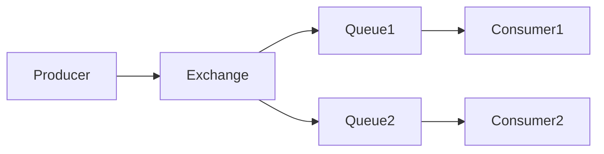

# RabbitMQ 与ActiveMQ比较

在现代分布式系统中，消息队列（Message Queue）是一种常见的通信机制，用于解耦系统组件、提高系统的可扩展性和可靠性。RabbitMQ和ActiveMQ是两种广泛使用的消息队列技术，它们各有优缺点，适用于不同的场景。本文将从多个方面对RabbitMQ和ActiveMQ进行比较，帮助初学者理解如何选择适合的消息队列技术。

## 1. 介绍

### 什么是RabbitMQ？

RabbitMQ是一个开源的消息代理（Message Broker），实现了高级消息队列协议（AMQP）。它以其轻量级、高性能和易于使用而闻名，广泛应用于微服务架构、任务队列、事件驱动架构等场景。

### 什么是ActiveMQ？

ActiveMQ是Apache基金会下的一个开源消息代理，支持多种协议，包括AMQP、STOMP、MQTT等。它以其灵活性和强大的功能集著称，适用于需要复杂消息路由和事务处理的场景。

## 2. 协议支持

### RabbitMQ

RabbitMQ主要支持AMQP协议，但也支持STOMP、MQTT等协议。AMQP是一个开放标准，提供了丰富的消息传递功能，如消息确认、持久化、路由等。

### ActiveMQ

ActiveMQ支持多种协议，包括AMQP、STOMP、MQTT、OpenWire等。这使得ActiveMQ在需要与多种客户端或系统集成时具有更大的灵活性。

## 3. 性能与可扩展性

### RabbitMQ

RabbitMQ以其高性能和低延迟著称，特别适合处理大量小消息的场景。它支持集群部署，可以通过增加节点来提高系统的吞吐量和可用性。

### ActiveMQ

ActiveMQ在处理大消息时表现较好，但在高并发场景下可能会遇到性能瓶颈。它同样支持集群部署，但配置和管理相对复杂。

## 4. 消息路由与过滤

### RabbitMQ

RabbitMQ提供了灵活的路由机制，支持直接交换（Direct Exchange）、主题交换（Topic Exchange）、扇出交换（Fanout Exchange）等。开发者可以根据业务需求选择合适的路由方式。



### ActiveMQ

ActiveMQ支持复杂的消息路由和过滤机制，如基于内容的路由、消息选择器等。这使得ActiveMQ在处理复杂消息流时更具优势。

## 5. 事务与消息确认

### RabbitMQ

RabbitMQ支持事务和消息确认机制，确保消息的可靠传递。开发者可以通过事务来保证一组操作的原子性，或者通过消息确认机制来确保消息被正确处理。

```python
# RabbitMQ 事务示例
channel.tx_select()
try:
    channel.basic_publish(exchange='', routing_key='queue', body='message')
    channel.tx_commit()
except Exception as e:
    channel.tx_rollback()
```

### ActiveMQ

ActiveMQ同样支持事务和消息确认机制，并且提供了更丰富的API来处理事务。这使得ActiveMQ在需要严格消息顺序和可靠性的场景中更具优势。

## 6. 实际应用场景

### RabbitMQ

- **微服务架构**：RabbitMQ常用于微服务之间的异步通信，解耦服务之间的依赖。
- **任务队列**：RabbitMQ可以作为任务队列，处理后台任务，如发送邮件、生成报告等。

### ActiveMQ

- **企业级应用**：ActiveMQ适用于需要复杂消息路由和事务处理的企业级应用。
- **物联网（IoT）**：ActiveMQ支持MQTT协议，适合用于物联网设备之间的消息传递。

## 7. 总结

RabbitMQ和ActiveMQ都是强大的消息队列技术，各有优缺点。RabbitMQ以其高性能和易用性著称，适合处理大量小消息的场景；而ActiveMQ则以其灵活性和强大的功能集著称，适合需要复杂消息路由和事务处理的场景。

选择哪种消息队列技术取决于具体的业务需求和技术栈。对于初学者来说，建议从RabbitMQ入手，掌握基本的消息队列概念和操作，然后再逐步学习ActiveMQ的高级功能。

## 8. 附加资源与练习

- **RabbitMQ官方文档**: [https://www.rabbitmq.com/documentation.html](https://www.rabbitmq.com/documentation.html)
- **ActiveMQ官方文档**: [https://activemq.apache.org/components/classic/documentation](https://activemq.apache.org/components/classic/documentation)
- **练习**: 尝试在本地环境中搭建RabbitMQ和ActiveMQ，并编写简单的生产者-消费者程序，体验两者的不同。

:::tip
建议初学者先从RabbitMQ入手，掌握基本的消息队列概念和操作，然后再逐步学习ActiveMQ的高级功能。
:::