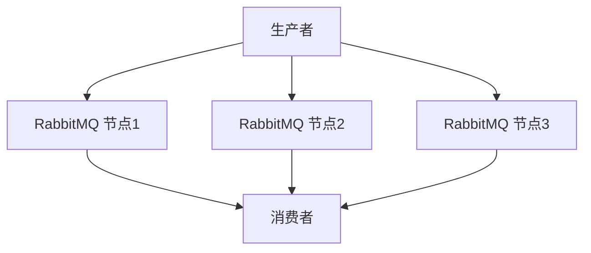

# RabbitMQ 性能优化概述

RabbitMQ 是一个广泛使用的开源消息代理，用于在分布式系统中传递消息。它支持多种消息协议，并提供了高可用性、可靠性和扩展性。然而，随着系统规模的扩大，RabbitMQ 的性能可能会成为瓶颈。因此，了解如何优化 RabbitMQ 的性能至关重要。

本文将介绍 RabbitMQ 性能优化的基本概念、方法和实际应用场景，帮助初学者提升消息队列的性能和可靠性。

## 1. 什么是 RabbitMQ 性能优化？

RabbitMQ 性能优化是指通过调整配置、优化代码和使用最佳实践，提高 RabbitMQ 的消息处理能力、降低延迟、减少资源消耗，从而提升系统的整体性能。

## 2. 为什么需要性能优化？

随着系统规模的扩大，消息队列可能会面临以下挑战：

- **高并发**：大量消息同时进入队列，可能导致消息积压。
- **高延迟**：消息处理时间过长，影响用户体验。
- **资源瓶颈**：CPU、内存、磁盘 I/O 等资源成为瓶颈，影响系统稳定性。

通过性能优化，可以有效应对这些挑战，确保系统在高负载下仍能稳定运行。

## 3. RabbitMQ 性能优化的关键点

### 3.1 消息持久化

消息持久化是确保消息在 RabbitMQ 重启后不会丢失的重要机制。然而，持久化操作会增加磁盘 I/O，影响性能。因此，需要根据业务需求权衡消息的可靠性和性能。

```python
# 示例：设置消息持久化
channel.basic_publish(
    exchange='',
    routing_key='task_queue',
    body=message,
    properties=pika.BasicProperties(
        delivery_mode=2,  # 使消息持久化
    ))
```

### 3.2 队列和交换机的配置

合理配置队列和交换机可以显著提升 RabbitMQ 的性能。例如，使用 `x-message-ttl` 参数设置消息的生存时间，避免消息积压。

```python
# 示例：设置消息的生存时间
args = {'x-message-ttl': 60000}  # 消息生存时间为60秒
channel.queue_declare(queue='my_queue', arguments=args)
```

### 3.3 消费者预取（Prefetch）

通过设置消费者的预取数量，可以控制消费者一次从队列中获取的消息数量，避免消费者过载。

```python
# 示例：设置消费者预取数量
channel.basic_qos(prefetch_count=10)
```

### 3.4 集群和高可用性

在高并发场景下，单节点 RabbitMQ 可能无法满足需求。通过搭建 RabbitMQ 集群，可以实现负载均衡和高可用性。



## 4. 实际应用场景

### 4.1 电商订单系统

在电商订单系统中，订单消息需要快速处理并确保不丢失。通过优化 RabbitMQ 的持久化和消费者预取设置，可以显著提升订单处理速度。

### 4.2 日志收集系统

在日志收集系统中，日志消息量巨大且实时性要求较低。通过设置消息的生存时间和合理配置队列，可以有效减少资源消耗。

## 5. 总结

RabbitMQ 性能优化是确保消息队列在高负载下稳定运行的关键。通过合理配置消息持久化、队列和交换机、消费者预取以及搭建集群，可以显著提升 RabbitMQ 的性能和可靠性。

## 6. 附加资源

- [RabbitMQ 官方文档](https://www.rabbitmq.com/documentation.html)
- [RabbitMQ 性能调优指南](https://www.rabbitmq.com/performance.html)

## 7. 练习

1. 尝试在你的 RabbitMQ 环境中设置消息持久化，并观察性能变化。
2. 搭建一个简单的 RabbitMQ 集群，测试其在高并发场景下的表现。

:::tip
提示：在进行性能优化时，建议逐步调整参数并监控系统表现，以找到最佳配置。
:::