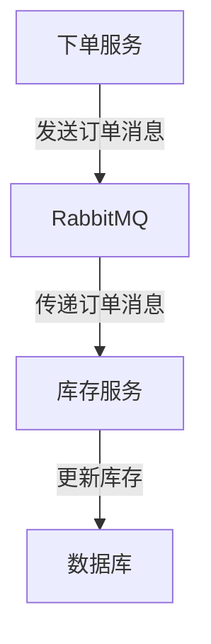

## 介绍

RabbitMQ 是一个广泛使用的消息队列系统，用于在分布式系统中传递消息。为了确保 RabbitMQ 在生产环境中的稳定性和可靠性，测试和调试是至关重要的环节。本文将介绍如何为 RabbitbitMQ 设计和实施有效的测试策略，涵盖单元测试、集成测试和性能测试等方面。

## 为什么需要测试 RabbitMQ？

RabbitMQ 作为消息队列的核心组件，负责消息的传递、存储和路由。如果 RabbitMQ 出现故障，可能会导致消息丢失、延迟或重复，进而影响整个系统的正常运行。因此，测试 RabbitMQ 的目的是确保：

1. **消息的可靠传递**：消息能够正确地发送和接收。
2. **系统的稳定性**：在高负载下，RabbitMQ 能够稳定运行。
3. **性能优化**：消息传递的延迟和吞吐量符合预期。

## RabbitMQ 测试策略

### 1. 单元测试

单元测试是针对 RabbitMQ 的最小功能单元进行的测试，通常是对生产者、消费者和队列的单独测试。单元测试的目标是验证每个组件的功能是否正确。

#### 示例：测试消息生产者

以下是一个使用 Python 和 `pika` 库的单元测试示例，测试消息生产者是否能够成功发送消息到队列。

```python
import pika
import unittest

class TestProducer(unittest.TestCase):
    def test_send_message(self):
        connection = pika.BlockingConnection(pika.ConnectionParameters('localhost'))
        channel = connection.channel()
        channel.queue_declare(queue='test_queue')

        channel.basic_publish(exchange='', routing_key='test_queue', body='Hello, RabbitMQ!')
        connection.close()

        # 断言消息是否成功发送
        self.assertTrue(True)  # 这里可以扩展为更复杂的断言逻辑

if __name__ == '__main__':
    unittest.main()
```

:::note
在单元测试中，通常使用模拟对象（Mock Objects）来模拟 RabbitMQ 的行为，以避免依赖外部系统。
:::

### 2. 集成测试

集成测试是验证 RabbitMQ 与其他系统组件（如数据库、微服务等）之间的交互是否正常。集成测试的目标是确保消息能够在整个系统中正确传递。

#### 示例：测试消息从生产者到消费者的传递

以下是一个集成测试示例，测试消息是否能够从生产者传递到消费者。

```python
import pika
import threading
import time
import unittest

class TestIntegration(unittest.TestCase):
    def test_message_flow(self):
        # 启动消费者线程
        def consumer():
            connection = pika.BlockingConnection(pika.ConnectionParameters('localhost'))
            channel = connection.channel()
            channel.queue_declare(queue='test_queue')

            def callback(ch, method, properties, body):
                self.assertEqual(body, b'Hello, RabbitMQ!')
                ch.basic_ack(delivery_tag=method.delivery_tag)
                connection.close()

            channel.basic_consume(queue='test_queue', on_message_callback=callback)
            channel.start_consuming()

        consumer_thread = threading.Thread(target=consumer)
        consumer_thread.start()

        # 生产者发送消息
        connection = pika.BlockingConnection(pika.ConnectionParameters('localhost'))
        channel = connection.channel()
        channel.queue_declare(queue='test_queue')

        channel.basic_publish(exchange='', routing_key='test_queue', body='Hello, RabbitMQ!')
        connection.close()

        # 等待消费者处理消息
        time.sleep(1)
        consumer_thread.join()

if __name__ == '__main__':
    unittest.main()
```

:::tip
集成测试通常需要模拟真实环境，因此可以使用 Docker 来启动 RabbitMQ 实例，以便在测试环境中进行验证。
:::

### 3. 性能测试

性能测试是评估 RabbitMQ 在高负载下的表现，包括消息的吞吐量、延迟和资源使用情况。性能测试的目标是确保 RabbitMQ 能够处理预期的消息量。

#### 示例：使用 `rabbitmq-perf-test` 进行性能测试

RabbitMQ 提供了一个名为 `rabbitmq-perf-test` 的工具，用于进行性能测试。以下是一个简单的性能测试命令示例：

```bash
rabbitmq-perf-test -x 1 -y 2 -u "test_queue" -a --id "test1" --json-body
```

:::caution
在进行性能测试时，确保测试环境与生产环境尽可能相似，以便获得准确的测试结果。
:::

## 实际案例：电商订单处理系统

假设我们有一个电商订单处理系统，订单消息通过 RabbitMQ 传递。以下是如何为该系统设计测试策略的示例：

1. **单元测试**：测试订单消息的生产者和消费者是否能够正确处理消息。
2. **集成测试**：测试订单消息从下单服务到库存服务的传递是否正常。
3. **性能测试**：模拟高并发订单场景，测试 RabbitMQ 的吞吐量和延迟。



## 总结

测试 RabbitMQ 是确保消息队列系统可靠性和性能的关键步骤。通过单元测试、集成测试和性能测试，可以全面验证 RabbitMQ 的功能和性能。在实际应用中，结合具体的业务场景设计测试策略，能够有效提高系统的稳定性和可靠性。

## 附加资源

- [RabbitMQ 官方文档](https://www.rabbitmq.com/documentation.html)
- [pika 库文档](https://pika.readthedocs.io/en/stable/)
- [rabbitmq-perf-test 工具](https://www.rabbitmq.com/java-tools.html)

## 练习

1. 编写一个单元测试，测试 RabbitMQ 消费者是否能够正确处理消息。
2. 使用 Docker 启动 RabbitMQ 实例，并编写一个集成测试，验证消息的传递。
3. 使用 `rabbitmq-perf-test` 工具，测试 RabbitMQ 在高并发场景下的性能表现。