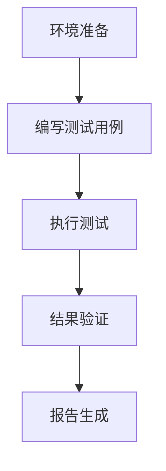

# RabbitMQ 自动化测试

在现代分布式系统中，消息队列（如 RabbitMQ）扮演着至关重要的角色。它们负责在不同的服务之间传递消息，确保系统的解耦和可扩展性。然而，随着系统复杂性的增加，手动测试 RabbitMQ 的行为和性能变得不切实际。因此，自动化测试成为了确保 RabbitMQ 配置和逻辑正确性的关键手段。

## 什么是 RabbitMQ 自动化测试？

RabbitMQ 自动化测试是指使用脚本和工具自动执行一系列测试用例，以验证 RabbitMQ 的消息传递、队列管理、交换器绑定等功能是否按预期工作。通过自动化测试，开发者可以快速发现和修复问题，确保系统的可靠性和稳定性。

## 为什么需要自动化测试？

1. **提高效率**：自动化测试可以快速执行大量测试用例，节省时间和人力。
2. **减少人为错误**：自动化测试减少了人为操作带来的错误风险。
3. **持续集成**：自动化测试可以与 CI/CD 管道集成，确保每次代码变更都能通过测试。
4. **性能测试**：自动化测试可以模拟高负载场景，验证 RabbitMQ 的性能。

## 自动化测试的基本步骤

1. **环境准备**：确保 RabbitMQ 服务器已启动并配置正确。
2. **编写测试用例**：定义需要测试的场景和预期结果。
3. **执行测试**：使用自动化测试工具运行测试用例。
4. **结果验证**：检查测试结果是否符合预期。
5. **报告生成**：生成测试报告，记录测试结果和问题。

## 实际案例：使用 Python 和 Pika 进行自动化测试

以下是一个使用 Python 和 Pika 库进行 RabbitMQ 自动化测试的简单示例。我们将测试一个基本的消息发送和接收场景。

### 1. 安装依赖

首先，确保已安装 Python 和 Pika 库：

```bash
pip install pika
```

### 2. 编写测试脚本

```python
import pika
import unittest

class RabbitMQTest(unittest.TestCase):
    def setUp(self):
        self.connection = pika.BlockingConnection(pika.ConnectionParameters('localhost'))
        self.channel = self.connection.channel()
        self.channel.queue_declare(queue='test_queue')

    def test_message_send_receive(self):
        # 发送消息
        self.channel.basic_publish(exchange='', routing_key='test_queue', body='Hello, RabbitMQ!')
        
        # 接收消息
        method_frame, header_frame, body = self.channel.basic_get(queue='test_queue', auto_ack=True)
        
        # 验证消息内容
        self.assertEqual(body.decode('utf-8'), 'Hello, RabbitMQ!')

    def tearDown(self):
        self.channel.queue_delete(queue='test_queue')
        self.connection.close()

if __name__ == '__main__':
    unittest.main()
```

### 3. 运行测试

在终端中运行测试脚本：

```bash
python test_rabbitmq.py
```

### 4. 预期输出

如果测试通过，你将看到类似以下的输出：

```bash
.
----------------------------------------------------------------------
Ran 1 test in 0.001s

OK
```

## 实际应用场景

### 场景 1：验证消息顺序

在某些系统中，消息的顺序至关重要。通过自动化测试，可以验证 RabbitMQ 是否按正确的顺序传递消息。

### 场景 2：性能测试

在高负载情况下，RabbitMQ 的性能可能会受到影响。自动化测试可以模拟大量消息的发送和接收，验证 RabbitMQ 在高负载下的表现。

### 场景 3：故障恢复

自动化测试可以模拟 RabbitMQ 服务器的故障，验证系统是否能够正确处理和恢复。

## 总结

RabbitMQ 自动化测试是确保消息队列系统可靠性和稳定性的重要手段。通过编写和执行自动化测试用例，开发者可以快速发现和修复问题，确保系统在各种场景下都能正常工作。

## 附加资源

- [RabbitMQ 官方文档](https://www.rabbitmq.com/documentation.html)
- [Pika 库文档](https://pika.readthedocs.io/en/stable/)
- [Python unittest 模块文档](https://docs.python.org/3/library/unittest.html)

## 练习

1. 扩展上述测试脚本，验证 RabbitMQ 的消息持久化功能。
2. 编写一个自动化测试用例，模拟 RabbitMQ 服务器的故障恢复过程。
3. 使用 Mermaid 绘制一个流程图，展示 RabbitMQ 自动化测试的基本流程。



通过以上内容，你应该对 RabbitMQ 自动化测试有了初步的了解。继续探索和实践，你将能够更深入地掌握这一重要技能。