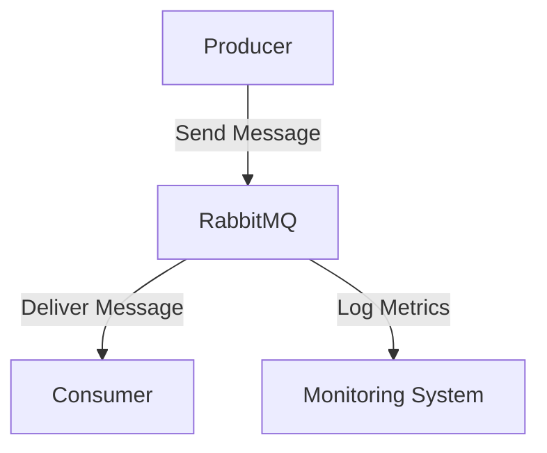

# RabbitMQ 测试最佳实践

RabbitMQ 是一个广泛使用的消息队列系统，用于在分布式系统中传递消息。为了确保 RabbitMQ 在生产环境中的可靠性和性能，测试和调试是不可或缺的环节。本文将介绍 RabbitMQ 测试的最佳实践，帮助你构建健壮的消息队列系统。

## 1. 为什么需要测试 RabbitMQ？

RabbitMQ 作为消息中间件，承担着消息传递的重要任务。如果消息传递失败或延迟，可能会导致系统功能异常或数据丢失。因此，测试 RabbitMQ 的目的是：

- 确保消息能够正确传递。
- 验证系统在高负载下的性能。
- 检测潜在的错误和瓶颈。
- 确保系统的可扩展性和容错性。

## 2. RabbitMQ 测试的类型

在测试 RabbitMQ 时，通常需要考虑以下几种测试类型：

### 2.1 单元测试
单元测试用于验证 RabbitMQ 的各个组件（如生产者、消费者、队列、交换机等）是否按预期工作。你可以使用模拟工具（如 `Mock`）来模拟 RabbitMQ 的行为。

```python
import unittest
from unittest.mock import MagicMock
from my_app import Producer

class TestProducer(unittest.TestCase):
    def test_send_message(self):
        mock_channel = MagicMock()
        producer = Producer(mock_channel)
        producer.send_message("test_queue", "Hello, RabbitMQ!")
        mock_channel.basic_publish.assert_called_once_with(
            exchange='',
            routing_key='test_queue',
            body='Hello, RabbitMQ!'
        )

if __name__ == '__main__':
    unittest.main()
```

### 2.2 集成测试
集成测试用于验证 RabbitMQ 与其他系统组件（如数据库、微服务等）的交互是否正常。你可以使用 Docker 来启动一个 RabbitMQ 实例，并在测试环境中运行集成测试。

```python
import pika
import unittest

class TestRabbitMQIntegration(unittest.TestCase):
    def setUp(self):
        self.connection = pika.BlockingConnection(pika.ConnectionParameters('localhost'))
        self.channel = self.connection.channel()
        self.channel.queue_declare(queue='test_queue')

    def test_message_delivery(self):
        self.channel.basic_publish(exchange='', routing_key='test_queue', body='Hello, RabbitMQ!')
        method_frame, header_frame, body = self.channel.basic_get(queue='test_queue', auto_ack=True)
        self.assertEqual(body.decode(), 'Hello, RabbitMQ!')

    def tearDown(self):
        self.channel.queue_delete(queue='test_queue')
        self.connection.close()

if __name__ == '__main__':
    unittest.main()
```

### 2.3 性能测试
性能测试用于评估 RabbitMQ 在高负载下的表现。你可以使用工具如 `JMeter` 或 `Locust` 来模拟大量消息的生产和消费。

```python
from locust import HttpUser, task, between

class RabbitMQUser(HttpUser):
    wait_time = between(1, 5)

    @task
    def send_message(self):
        self.client.post("/send", json={"queue": "test_queue", "message": "Hello, RabbitMQ!"})
```

## 3. RabbitMQ 测试的最佳实践

### 3.1 使用 Docker 进行测试
Docker 可以帮助你快速启动一个 RabbitMQ 实例，并在测试完成后销毁它。这样可以确保测试环境的隔离性和一致性。

```bash
docker run -d --name rabbitmq-test -p 5672:5672 -p 15672:15672 rabbitmq:3-management
```

### 3.2 模拟网络故障
在生产环境中，网络故障是不可避免的。你可以使用工具如 `toxiproxy` 来模拟网络延迟、丢包等故障，以测试 RabbitMQ 的容错能力。

```bash
toxiproxy-cli create rabbitmq -l localhost:5673 -u localhost:5672
toxiproxy-cli toxic add rabbitmq -t latency -a latency=1000
```

### 3.3 监控和日志记录
在测试过程中，监控 RabbitMQ 的性能指标（如消息吞吐量、队列长度等）是非常重要的。你可以使用 RabbitMQ 的管理插件或第三方监控工具（如 Prometheus）来收集和分析这些数据。



### 3.4 自动化测试
将 RabbitMQ 测试集成到 CI/CD 管道中，可以确保每次代码变更后都能自动运行测试。你可以使用 Jenkins、GitHub Actions 等工具来实现自动化测试。

```yaml
name: RabbitMQ CI

on: [push]

jobs:
  test:
    runs-on: ubuntu-latest
    steps:
      - uses: actions/checkout@v2
      - name: Set up Python
        uses: actions/setup-python@v2
        with:
          python-version: '3.8'
      - name: Install dependencies
        run: |
          python -m pip install --upgrade pip
          pip install -r requirements.txt
      - name: Run tests
        run: |
          python -m unittest discover tests
```

## 4. 实际案例：电商订单系统

假设你正在开发一个电商订单系统，订单信息通过 RabbitMQ 传递给库存管理系统。为了确保订单信息能够正确传递，你可以编写以下测试：

```python
import unittest
import pika

class TestOrderSystem(unittest.TestCase):
    def setUp(self):
        self.connection = pika.BlockingConnection(pika.ConnectionParameters('localhost'))
        self.channel = self.connection.channel()
        self.channel.queue_declare(queue='order_queue')

    def test_order_processing(self):
        order = {"order_id": 123, "product_id": 456, "quantity": 2}
        self.channel.basic_publish(exchange='', routing_key='order_queue', body=str(order))
        method_frame, header_frame, body = self.channel.basic_get(queue='order_queue', auto_ack=True)
        self.assertEqual(eval(body.decode()), order)

    def tearDown(self):
        self.channel.queue_delete(queue='order_queue')
        self.connection.close()

if __name__ == '__main__':
    unittest.main()
```

## 5. 总结

测试 RabbitMQ 是确保消息队列系统可靠性和性能的关键步骤。通过单元测试、集成测试和性能测试，你可以全面验证 RabbitMQ 的行为。使用 Docker、模拟网络故障、监控和自动化测试等最佳实践，可以进一步提高测试的效率和覆盖率。

:::tip
**附加资源：**
- [RabbitMQ 官方文档](https://www.rabbitmq.com/documentation.html)
- [Locust 性能测试工具](https://locust.io/)
- [Toxiproxy 网络故障模拟工具](https://github.com/Shopify/toxiproxy)
:::

:::caution
**练习：**
1. 编写一个单元测试，验证 RabbitMQ 消费者是否正确处理消息。
2. 使用 Docker 启动 RabbitMQ，并编写一个集成测试，验证消息的传递。
3. 使用 Locust 模拟高负载场景，测试 RabbitMQ 的性能表现。
:::