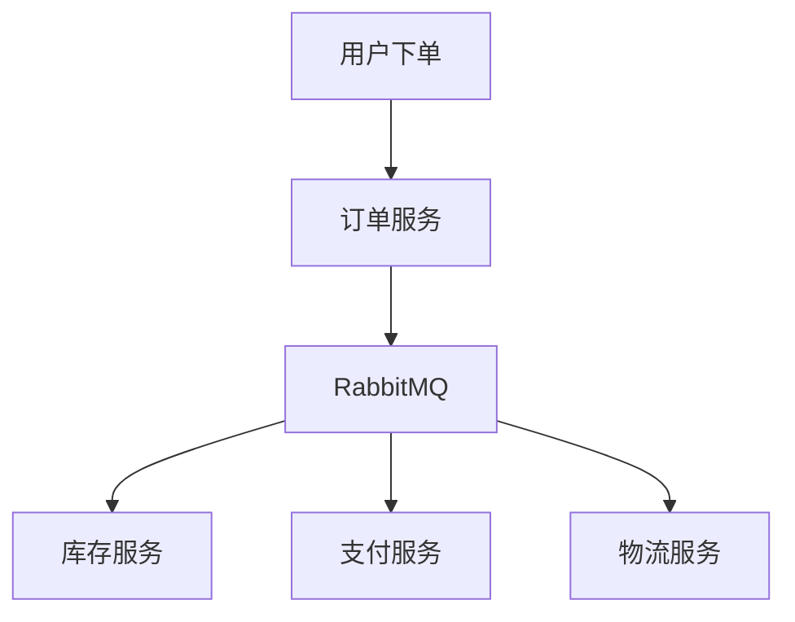

## 介绍

RabbitMQ 是一个广泛使用的消息队列系统，用于在分布式系统中传递消息。为了确保 RabbitMQ 在生产环境中能够稳定运行，测试和调试是至关重要的环节。本文将介绍一些常用的 RabbitMQ 测试工具，帮助你验证消息队列的行为，并确保系统的可靠性和性能。

## RabbitMQ 测试工具概述

RabbitMQ 提供了多种测试工具，帮助开发者在开发和部署过程中验证消息队列的行为。这些工具包括：

1. **RabbitMQ Management Plugin**：一个基于 Web 的管理界面，用于监控和管理 RabbitMQ 服务器。
2. **RabbitMQ PerfTest**：一个性能测试工具，用于模拟高负载下的消息生产和消费。
3. **RabbitMQ CLI Tools**：命令行工具，用于管理和测试 RabbitMQ 服务器。

### RabbitMQ Management Plugin

RabbitMQ Management Plugin 提供了一个直观的 Web 界面，允许你监控和管理 RabbitMQ 服务器。通过这个插件，你可以查看队列的状态、消息的流量、连接数等关键指标。

:::tip
要启用 RabbitMQ Management Plugin，可以使用以下命令：
```bash
rabbitmq-plugins enable rabbitmq_management
```
:::

启用后，你可以通过浏览器访问 `http://localhost:15672` 来使用管理界面。

### RabbitMQ PerfTest

RabbitMQ PerfTest 是一个性能测试工具，用于模拟高负载下的消息生产和消费。它可以帮助你评估 RabbitMQ 在高并发情况下的性能表现。

:::note
要安装 RabbitMQ PerfTest，可以使用以下命令：
```bash
sudo apt-get install rabbitmq-perf-test
```
:::

以下是一个简单的 PerfTest 示例，模拟 10 个生产者和 10 个消费者，每个生产者发送 1000 条消息：

```bash
rabbitmq-perf-test --uri amqp://localhost -x 10 -y 10 -u "test-queue" -a -C 1000
```

### RabbitMQ CLI Tools

RabbitMQ 提供了一系列命令行工具，用于管理和测试 RabbitMQ 服务器。常用的 CLI 工具包括 `rabbitmqctl` 和 `rabbitmqadmin`。

:::caution
确保在使用 CLI 工具时，RabbitMQ 服务器正在运行。
:::

以下是一些常用的 `rabbitmqctl` 命令：

- 查看队列状态：
  ```bash
  rabbitmqctl list_queues
  ```
- 查看连接状态：
  ```bash
  rabbitmqctl list_connections
  ```
- 查看消费者状态：
  ```bash
  rabbitmqctl list_consumers
  ```

## 实际案例

假设你正在开发一个电商平台，使用 RabbitMQ 来处理订单消息。为了确保系统在高并发情况下能够稳定运行，你可以使用 RabbitMQ PerfTest 来模拟高负载下的订单处理。



在这个案例中，你可以使用 PerfTest 模拟大量用户同时下单，观察 RabbitMQ 的消息处理能力，并确保各个服务能够正常处理订单。

## 总结

RabbitMQ 测试工具是确保消息队列系统稳定性和性能的关键。通过使用 RabbitMQ Management Plugin、PerfTest 和 CLI 工具，你可以有效地测试和调试 RabbitMQ 服务器，确保系统在高负载下仍能稳定运行。

## 附加资源

- [RabbitMQ 官方文档](https://www.rabbitmq.com/documentation.html)
- [RabbitMQ PerfTest 指南](https://www.rabbitmq.com/performance-testing.html)
- [RabbitMQ CLI 工具参考](https://www.rabbitmq.com/cli.html)

## 练习

1. 使用 RabbitMQ Management Plugin 监控你的 RabbitMQ 服务器，记录队列的状态和消息流量。
2. 使用 RabbitMQ PerfTest 模拟高负载下的消息生产和消费，观察系统的性能表现。
3. 使用 `rabbitmqctl` 命令查看当前 RabbitMQ 服务器的连接和消费者状态。

通过这些练习，你将更好地理解 RabbitMQ 测试工具的使用方法，并能够在实际项目中应用这些工具来确保系统的可靠性。