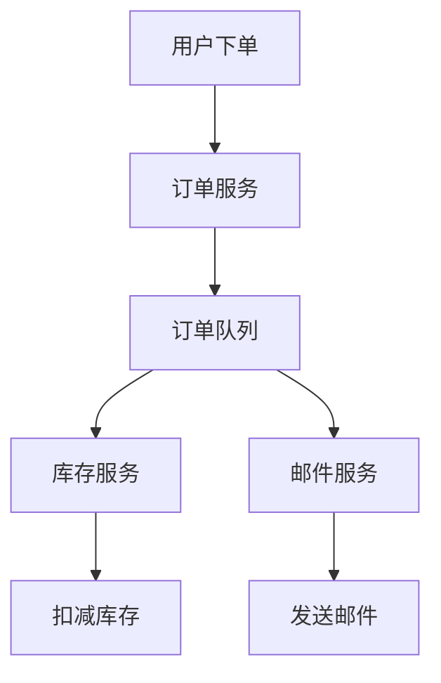

# RabbitMQ 电商系统应用

## 介绍

RabbitMQ 是一个开源的消息代理软件，它实现了高级消息队列协议（AMQP），用于在分布式系统中传递消息。在电商系统中，RabbitMQ 可以用于解耦系统组件、异步处理任务、以及实现高可用性和可扩展性。

本文将逐步讲解 RabbitMQ 在电商系统中的应用，并通过实际案例展示其如何解决常见的分布式系统问题。

## 电商系统中的常见问题

在电商系统中，常见的挑战包括：

1. **高并发处理**：用户下单、支付、库存管理等操作需要高效处理。
2. **系统解耦**：不同模块（如订单、库存、支付）需要独立运行，避免相互影响。
3. **异步处理**：某些操作（如发送邮件、生成报表）不需要实时完成，可以通过异步方式处理。

RabbitMQ 通过消息队列的方式，能够有效解决这些问题。

## RabbitMQ 核心概念

在深入案例之前，我们需要了解 RabbitMQ 的几个核心概念：

- **Producer（生产者）**：发送消息的应用程序。
- **Consumer（消费者）**：接收消息的应用程序。
- **Queue（队列）**：存储消息的缓冲区。
- **Exchange（交换机）**：接收生产者发送的消息，并根据规则将消息路由到队列。
- **Binding（绑定）**：连接交换机和队列的规则。

## 电商系统案例：订单处理

假设我们有一个电商系统，用户下单后需要进行以下操作：

1. 创建订单。
2. 扣减库存。
3. 发送订单确认邮件。

这些操作可以通过 RabbitMQ 实现异步处理，从而提高系统的响应速度和可扩展性。

### 1. 创建订单

当用户下单时，订单服务会生成一条订单消息，并将其发送到 RabbitMQ 的订单队列中。

```python
import pika

# 连接到 RabbitMQ 服务器
connection = pika.BlockingConnection(pika.ConnectionParameters('localhost'))
channel = connection.channel()

# 声明一个队列
channel.queue_declare(queue='order_queue')

# 发送订单消息
order_message = '{"order_id": 123, "user_id": 456, "items": [{"product_id": 789, "quantity": 2}]}'
channel.basic_publish(exchange='', routing_key='order_queue', body=order_message)

print(" [x] Sent order message")
connection.close()
```

### 2. 扣减库存

库存服务会监听订单队列，接收订单消息并扣减库存。

```python
import pika

# 连接到 RabbitMQ 服务器
connection = pika.BlockingConnection(pika.ConnectionParameters('localhost'))
channel = connection.channel()

# 声明队列
channel.queue_declare(queue='order_queue')

# 定义回调函数
def callback(ch, method, properties, body):
    print(" [x] Received %r" % body)
    # 扣减库存逻辑
    # ...

# 监听队列
channel.basic_consume(queue='order_queue', on_message_callback=callback, auto_ack=True)

print(' [*] Waiting for messages. To exit press CTRL+C')
channel.start_consuming()
```

### 3. 发送订单确认邮件

邮件服务会监听另一个队列，接收订单消息并发送确认邮件。

```python
import pika

# 连接到 RabbitMQ 服务器
connection = pika.BlockingConnection(pika.ConnectionParameters('localhost'))
channel = connection.channel()

# 声明队列
channel.queue_declare(queue='email_queue')

# 定义回调函数
def callback(ch, method, properties, body):
    print(" [x] Received %r" % body)
    # 发送邮件逻辑
    # ...

# 监听队列
channel.basic_consume(queue='email_queue', on_message_callback=callback, auto_ack=True)

print(' [*] Waiting for messages. To exit press CTRL+C')
channel.start_consuming()
```

## 系统架构图

为了更好地理解上述流程，我们可以通过 Mermaid 绘制一个简单的系统架构图。



## 总结

通过上述案例，我们可以看到 RabbitMQ 在电商系统中的应用场景。它通过消息队列的方式，实现了系统组件的解耦、异步处理任务，并提高了系统的可扩展性和可靠性。

:::tip
在实际应用中，RabbitMQ 还可以结合其他技术（如 Docker、Kubernetes）实现高可用性和负载均衡。
:::

## 附加资源

- [RabbitMQ 官方文档](https://www.rabbitmq.com/documentation.html)
- [RabbitMQ 入门教程](https://www.rabbitmq.com/getstarted.html)
- [分布式系统中的消息队列](https://en.wikipedia.org/wiki/Message_queue)

## 练习

1. 尝试在本地搭建 RabbitMQ 环境，并实现上述案例。
2. 扩展案例，增加支付服务，并思考如何通过 RabbitMQ 实现支付回调。
3. 研究 RabbitMQ 的持久化机制，并思考如何确保消息不丢失。

希望本文能帮助你更好地理解 RabbitMQ 在电商系统中的应用。如果你有任何问题或建议，欢迎在评论区留言！