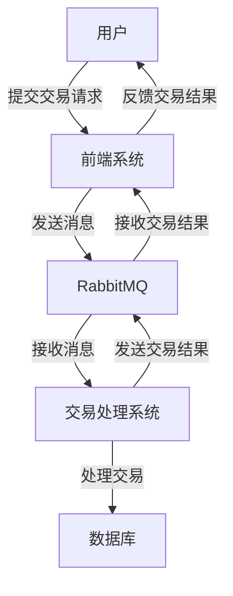

## 介绍

RabbitMQ 是一个开源的消息代理软件，广泛应用于分布式系统中，用于实现异步通信和解耦。在金融系统中，RabbitMQ 可以帮助处理高并发、高可靠性的交易请求，确保系统的稳定性和可扩展性。

本文将逐步介绍 RabbitMQ 在金融系统中的应用，并通过实际案例展示其如何解决金融交易中的常见问题。

## RabbitMQ 的基本概念

在深入金融系统应用之前，我们需要了解 RabbitMQ 的一些基本概念：

- **消息队列（Message Queue）**：用于存储消息的缓冲区，生产者将消息发送到队列，消费者从队列中获取消息进行处理。
- **生产者（Producer）**：发送消息的应用程序。
- **消费者（Consumer）**：接收并处理消息的应用程序。
- **交换机（Exchange）**：接收生产者发送的消息，并根据路由规则将消息分发到相应的队列。
- **绑定（Binding）**：连接交换机和队列的规则。

## RabbitMQ 在金融系统中的应用场景

金融系统通常需要处理大量的交易请求，这些请求可能来自不同的渠道（如移动端、网页端等）。为了确保系统的高效性和可靠性，RabbitMQ 可以用于以下场景：

1. **交易请求的异步处理**：将交易请求放入消息队列中，由后台系统异步处理，避免前端请求阻塞。
2. **交易结果的可靠传递**：通过消息队列确保交易结果能够可靠地传递到相关系统。
3. **系统解耦**：通过消息队列将不同的系统解耦，提高系统的可维护性和扩展性。

## 实际案例：股票交易系统

假设我们有一个股票交易系统，用户可以通过移动端或网页端提交股票交易请求。系统需要确保交易请求能够高效、可靠地处理，并且交易结果能够及时反馈给用户。

### 系统架构



### 代码示例

#### 生产者：发送交易请求

```python
import pika

# 连接到 RabbitMQ 服务器
connection = pika.BlockingConnection(pika.ConnectionParameters('localhost'))
channel = connection.channel()

# 声明一个队列
channel.queue_declare(queue='trade_requests')

# 发送交易请求
channel.basic_publish(exchange='',
                      routing_key='trade_requests',
                      body='{"user_id": 123, "stock": "AAPL", "quantity": 10}')

print(" [x] Sent trade request")

# 关闭连接
connection.close()
```

#### 消费者：处理交易请求

```python
import pika
import json

# 连接到 RabbitMQ 服务器
connection = pika.BlockingConnection(pika.ConnectionParameters('localhost'))
channel = connection.channel()

# 声明一个队列
channel.queue_declare(queue='trade_requests')

# 定义回调函数
def callback(ch, method, properties, body):
    trade_request = json.loads(body)
    print(f" [x] Processing trade request: {trade_request}")
    # 处理交易逻辑
    # ...

    # 发送交易结果
    channel.basic_publish(exchange='',
                          routing_key='trade_results',
                          body='{"status": "success", "message": "Trade executed"}')

# 消费消息
channel.basic_consume(queue='trade_requests',
                      auto_ack=True,
                      on_message_callback=callback)

print(' [*] Waiting for trade requests. To exit press CTRL+C')
channel.start_consuming()
```

#### 生产者：接收交易结果

```python
import pika

# 连接到 RabbitMQ 服务器
connection = pika.BlockingConnection(pika.ConnectionParameters('localhost'))
channel = connection.channel()

# 声明一个队列
channel.queue_declare(queue='trade_results')

# 定义回调函数
def callback(ch, method, properties, body):
    trade_result = json.loads(body)
    print(f" [x] Received trade result: {trade_result}")

# 消费消息
channel.basic_consume(queue='trade_results',
                      auto_ack=True,
                      on_message_callback=callback)

print(' [*] Waiting for trade results. To exit press CTRL+C')
channel.start_consuming()
```

### 输入与输出

- **输入**：用户提交的交易请求，例如 `{"user_id": 123, "stock": "AAPL", "quantity": 10}`。
- **输出**：交易处理系统返回的交易结果，例如 `{"status": "success", "message": "Trade executed"}`。

## 总结

通过 RabbitMQ，我们可以实现金融系统中的高效、可靠的交易处理。消息队列的使用不仅提高了系统的响应速度，还增强了系统的可扩展性和可维护性。

在实际应用中，RabbitMQ 还可以与其他技术（如数据库、缓存等）结合，构建更加复杂的金融系统。

## 附加资源

- [RabbitMQ 官方文档](https://www.rabbitmq.com/documentation.html)
- [RabbitMQ 入门教程](https://www.rabbitmq.com/getstarted.html)
- [消息队列在金融系统中的应用](https://www.example.com)

## 练习

1. 尝试修改上述代码，使其能够处理多个用户的并发交易请求。
2. 研究 RabbitMQ 的其他特性（如持久化、消息确认等），并尝试在代码中实现这些特性。
3. 设计一个简单的金融系统架构，使用 RabbitMQ 实现系统间的异步通信。

:::tip
在完成练习时，建议使用本地或云端的 RabbitMQ 实例进行测试，以确保代码的正确性和可靠性。
:::