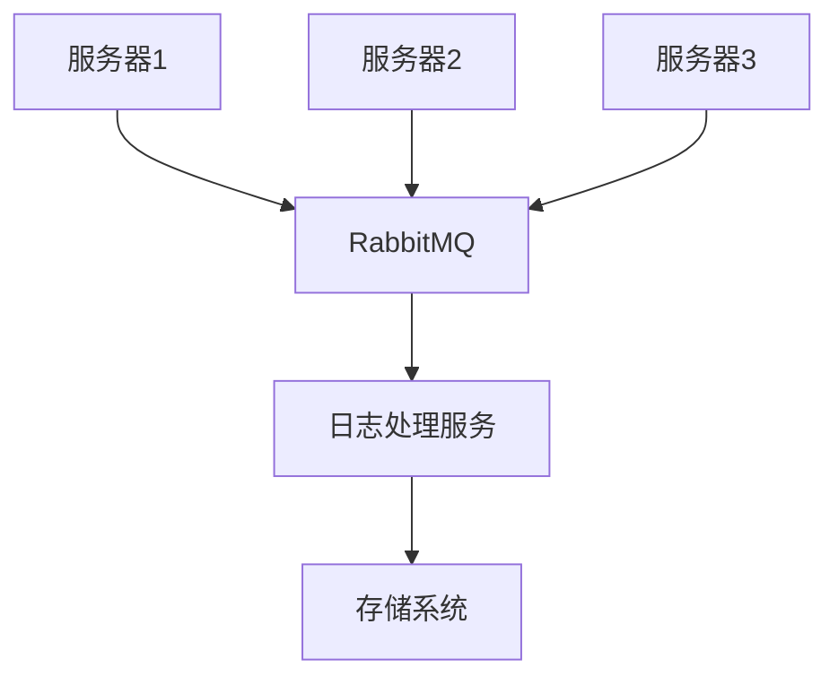

## 介绍

在现代大数据应用中，处理海量数据是一个常见的挑战。RabbitMQ作为一个强大的消息队列系统，可以帮助我们构建高效、可靠的大数据管道。通过RabbitMQ，我们可以将数据从生产者传递到消费者，确保数据在传输过程中不会丢失，并且能够高效地处理大量数据。

本文将逐步介绍如何使用RabbitMQ构建大数据管道，并通过实际案例展示其应用场景。

## RabbitMQ 基础

在深入探讨大数据管道之前，我们需要了解RabbitMQ的一些基本概念：

- **生产者（Producer）**：负责发送消息到RabbitMQ。
- **消费者（Consumer）**：从RabbitMQ接收并处理消息。
- **队列（Queue）**：存储消息的地方，生产者将消息发送到队列，消费者从队列中获取消息。
- **交换机（Exchange）**：接收生产者发送的消息，并根据路由规则将消息分发到相应的队列。

## 构建大数据管道

### 1. 安装RabbitMQ

首先，我们需要安装RabbitMQ。你可以通过以下命令在Ubuntu上安装RabbitMQ：

```bash
sudo apt-get update
sudo apt-get install rabbitmq-server
```

### 2. 创建生产者和消费者

接下来，我们将创建一个简单的生产者和消费者来演示RabbitMQ的基本用法。

#### 生产者代码示例

```python
import pika

# 连接到RabbitMQ服务器
connection = pika.BlockingConnection(pika.ConnectionParameters('localhost'))
channel = connection.channel()

# 声明一个队列
channel.queue_declare(queue='data_pipeline')

# 发送消息
channel.basic_publish(exchange='',
                      routing_key='data_pipeline',
                      body='Hello, RabbitMQ!')

print(" [x] Sent 'Hello, RabbitMQ!'")

# 关闭连接
connection.close()
```

#### 消费者代码示例

```python
import pika

# 连接到RabbitMQ服务器
connection = pika.BlockingConnection(pika.ConnectionParameters('localhost'))
channel = connection.channel()

# 声明一个队列
channel.queue_declare(queue='data_pipeline')

# 定义回调函数
def callback(ch, method, properties, body):
    print(f" [x] Received {body}")

# 设置消费者
channel.basic_consume(queue='data_pipeline',
                      auto_ack=True,
                      on_message_callback=callback)

print(' [*] Waiting for messages. To exit press CTRL+C')
channel.start_consuming()
```

### 3. 处理大数据

在大数据场景中，我们可能需要处理大量的消息。RabbitMQ提供了多种机制来确保消息的可靠传递和高效处理。

#### 消息持久化

为了防止消息在RabbitMQ服务器崩溃时丢失，我们可以将消息和队列设置为持久化。

```python
# 声明持久化队列
channel.queue_declare(queue='data_pipeline', durable=True)

# 发送持久化消息
channel.basic_publish(exchange='',
                      routing_key='data_pipeline',
                      body='Hello, RabbitMQ!',
                      properties=pika.BasicProperties(
                         delivery_mode=2,  # 使消息持久化
                      ))
```

#### 消息确认

为了确保消息被消费者正确处理，我们可以启用消息确认机制。

```python
# 设置消费者
channel.basic_consume(queue='data_pipeline',
                      on_message_callback=callback)

# 启用消息确认
channel.basic_qos(prefetch_count=1)
```

### 4. 实际案例：日志处理系统

假设我们有一个日志处理系统，需要处理来自多个服务器的日志数据。我们可以使用RabbitMQ来构建一个高效的大数据管道。

#### 架构图



#### 实现步骤

1. **日志生产者**：每个服务器将日志消息发送到RabbitMQ。
2. **日志消费者**：日志处理服务从RabbitMQ接收日志消息，并进行处理（如解析、存储等）。

## 总结

通过本文，我们了解了如何使用RabbitMQ构建高效的大数据管道。我们从基础概念入手，逐步讲解了如何创建生产者和消费者，如何处理大数据，并通过一个实际案例展示了RabbitMQ在大数据场景中的应用。

## 附加资源

- [RabbitMQ官方文档](https://www.rabbitmq.com/documentation.html)
- [RabbitMQ教程](https://www.rabbitmq.com/getstarted.html)
- [Python pika库文档](https://pika.readthedocs.io/en/stable/)

## 练习

1. 尝试修改生产者和消费者代码，使其能够处理更复杂的消息格式（如JSON）。
2. 在日志处理系统的案例中，尝试添加更多的日志处理服务，并观察RabbitMQ如何分配消息。
3. 研究RabbitMQ的其他高级特性，如消息优先级、死信队列等，并尝试在代码中实现。
