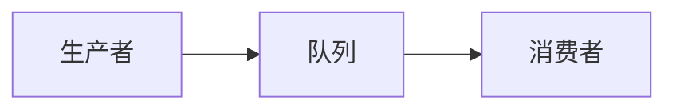
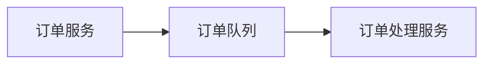

# RabbitMQ 高流量系统案例

在现代分布式系统中，处理高流量是一个常见的挑战。RabbitMQ 是一个强大的消息队列系统，能够帮助开发者在高流量场景下实现高效的消息传递和处理。本文将介绍 RabbitMQ 在高流量系统中的应用，并通过实际案例展示其工作原理和优势。

## 什么是RabbitMQ？

RabbitMQ 是一个开源的消息代理软件，它实现了高级消息队列协议（AMQP）。它允许应用程序通过消息队列进行异步通信，从而解耦系统组件，提高系统的可扩展性和可靠性。

## 为什么选择RabbitMQ处理高流量？

在高流量系统中，消息队列的作用至关重要。RabbitMQ 提供了以下优势：

- **异步处理**：允许系统组件异步处理消息，减少响应时间。
- **负载均衡**：通过多个消费者处理消息，实现负载均衡。
- **消息持久化**：确保消息在系统崩溃时不会丢失。
- **高可用性**：支持集群部署，提高系统的可用性。

## RabbitMQ 在高流量系统中的应用

### 1. 消息队列的基本结构

在高流量系统中，消息队列通常由以下几个组件组成：

- **生产者（Producer）**：负责生成消息并将其发送到队列。
- **队列（Queue）**：存储消息的缓冲区。
- **消费者（Consumer）**：从队列中获取消息并进行处理。



### 2. 实际案例：电商订单处理系统

假设我们有一个电商平台，每天需要处理数百万个订单。为了确保系统的高效运行，我们可以使用 RabbitMQ 来处理订单消息。

#### 2.1 系统架构

- **生产者**：订单服务，负责生成订单消息。
- **队列**：订单队列，存储待处理的订单消息。
- **消费者**：订单处理服务，从队列中获取订单消息并进行处理。



#### 2.2 代码示例

以下是一个简单的 Python 示例，展示如何使用 RabbitMQ 处理订单消息。

```python
import pika

# 连接到RabbitMQ服务器
connection = pika.BlockingConnection(pika.ConnectionParameters('localhost'))
channel = connection.channel()

# 声明队列
channel.queue_declare(queue='order_queue')

# 生产者：发送订单消息
def send_order(order_id):
    channel.basic_publish(exchange='',
                          routing_key='order_queue',
                          body=str(order_id))
    print(f" [x] Sent order {order_id}")

# 消费者：处理订单消息
def callback(ch, method, properties, body):
    order_id = int(body)
    print(f" [x] Processing order {order_id}")
    # 模拟订单处理
    process_order(order_id)
    print(f" [x] Finished processing order {order_id}")

def process_order(order_id):
    # 订单处理逻辑
    pass

# 开始消费消息
channel.basic_consume(queue='order_queue',
                      on_message_callback=callback,
                      auto_ack=True)

print(' [*] Waiting for orders. To exit press CTRL+C')
channel.start_consuming()
```

#### 2.3 输入与输出

- **输入**：订单服务发送订单消息到队列。
- **输出**：订单处理服务从队列中获取订单消息并进行处理。

:::note
在实际生产环境中，订单处理服务可能会部署多个实例，以实现负载均衡和高可用性。
:::

### 3. 高流量处理策略

在高流量场景下，RabbitMQ 提供了多种策略来优化消息处理：

- **消息持久化**：确保消息在系统崩溃时不会丢失。
- **消费者预取**：限制每个消费者同时处理的消息数量，避免过载。
- **集群部署**：通过 RabbitMQ 集群提高系统的可用性和扩展性。

## 总结

RabbitMQ 是一个强大的消息队列系统，特别适合处理高流量场景。通过异步处理、负载均衡和消息持久化等特性，RabbitMQ 能够帮助开发者构建高效、可靠的分布式系统。

## 附加资源与练习

- **资源**：
  - [RabbitMQ 官方文档](https://www.rabbitmq.com/documentation.html)
  - [RabbitMQ 教程](https://www.rabbitmq.com/getstarted.html)

- **练习**：
  - 尝试在本地搭建一个 RabbitMQ 集群，并模拟高流量场景。
  - 修改上述代码示例，实现消息持久化和消费者预取功能。

通过本文的学习，你应该对 RabbitMQ 在高流量系统中的应用有了更深入的理解。继续探索和实践，你将能够更好地掌握这一强大的消息队列工具。