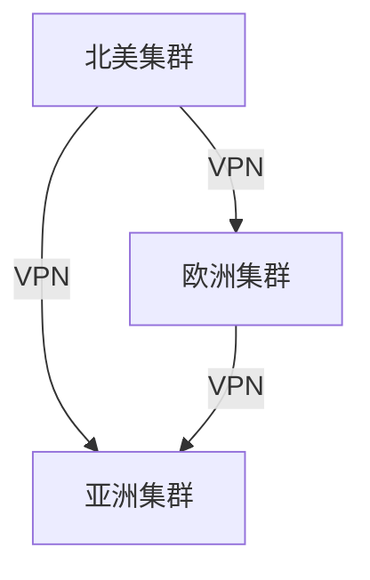

# RabbitMQ 跨地域部署案例

## 介绍

在现代分布式系统中，跨地域部署是一个常见的需求。RabbitMQ作为一个流行的消息队列系统，支持跨地域部署，以确保不同地理位置的应用程序能够高效、可靠地进行消息传递。本文将详细介绍RabbitMQ跨地域部署的概念、实现方法以及实际应用案例。

## 什么是RabbitMQ跨地域部署？

RabbitMQ跨地域部署指的是将RabbitMQ集群部署在多个地理区域，以实现高可用性、低延迟和灾难恢复。通过跨地域部署，系统可以在一个区域发生故障时，自动切换到另一个区域的RabbitMQ集群，从而保证服务的连续性。

## 实现方法

### 1. 集群配置

RabbitMQ支持集群模式，可以将多个RabbitMQ节点组成一个集群。在跨地域部署中，每个地理区域可以有一个或多个RabbitMQ节点，这些节点通过集群模式连接在一起。

```bash
# 在节点1上执行
rabbitmqctl stop_app
rabbitmqctl reset
rabbitmqctl join_cluster rabbit@node2
rabbitmqctl start_app
```

### 2. 镜像队列

为了确保消息在跨地域部署中的高可用性，可以使用RabbitMQ的镜像队列功能。镜像队列会将队列中的消息复制到多个节点上，即使某个节点发生故障，消息也不会丢失。

```bash
# 创建镜像队列
rabbitmqctl set_policy ha-all "^ha\." '{"ha-mode":"all"}'
```

### 3. 网络配置

跨地域部署需要确保不同地理区域的RabbitMQ节点之间能够通过网络进行通信。通常，这需要配置VPN或专线连接，以确保网络延迟和带宽满足需求。

## 实际案例

### 案例背景

假设我们有一个全球性的电商平台，用户分布在不同地理区域。为了提高系统的响应速度和可用性，我们决定在不同区域部署RabbitMQ集群，并通过跨地域部署实现消息的高效传递。

### 案例实现

1. **集群配置**：我们在北美、欧洲和亚洲各部署一个RabbitMQ集群，每个集群包含3个节点。
2. **镜像队列**：我们为所有关键队列启用镜像队列功能，确保消息在多个节点上都有备份。
3. **网络配置**：我们使用VPN连接不同区域的RabbitMQ集群，确保它们之间能够高效通信。



### 案例结果

通过跨地域部署，我们的电商平台在不同区域的用户都能够享受到低延迟的消息传递服务。即使某个区域的RabbitMQ集群发生故障，系统也能够自动切换到其他区域的集群，确保服务的连续性。

## 总结

RabbitMQ跨地域部署是实现高可用性和低延迟消息传递的重要手段。通过合理的集群配置、镜像队列和网络配置，可以确保系统在不同地理区域之间高效、可靠地运行。本文通过一个实际案例展示了RabbitMQ跨地域部署的实现方法和效果，希望对初学者有所帮助。

## 附加资源

- [RabbitMQ官方文档](https://www.rabbitmq.com/documentation.html)
- [RabbitMQ集群配置指南](https://www.rabbitmq.com/clustering.html)
- [RabbitMQ镜像队列配置指南](https://www.rabbitmq.com/ha.html)

## 练习

1. 尝试在本地环境中配置一个简单的RabbitMQ集群，并启用镜像队列功能。
2. 研究如何在跨地域部署中优化网络配置，以减少延迟和提高带宽利用率。
