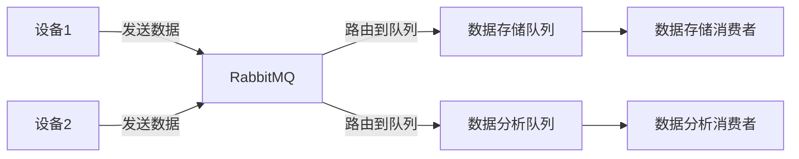

# RabbitMQ 物联网应用

## 介绍

物联网（IoT）是指通过互联网连接各种物理设备，使它们能够相互通信和交换数据。随着物联网设备的数量不断增加，如何高效地管理和处理这些设备产生的数据成为了一个重要的挑战。RabbitMQ 是一个开源的消息代理软件，它可以帮助我们在物联网系统中实现可靠的消息传递和设备间的通信。

在本篇文章中，我们将探讨 RabbitMQ 在物联网中的应用场景，并通过实际案例展示如何使用 RabbitMQ 来处理物联网设备之间的消息传递。

## RabbitMQ 的基本概念

在深入探讨 RabbitMQ 在物联网中的应用之前，让我们先回顾一下 RabbitMQ 的一些基本概念：

- **消息队列（Message Queue）**：RabbitMQ 使用消息队列来存储和传递消息。消息生产者将消息发送到队列中，消息消费者从队列中接收并处理消息。
- **交换机（Exchange）**：交换机负责将消息路由到一个或多个队列中。RabbitMQ 支持多种类型的交换机，如直连交换机、主题交换机、扇出交换机等。
- **绑定（Binding）**：绑定是交换机和队列之间的连接规则，它定义了消息如何从交换机路由到队列。

## RabbitMQ 在物联网中的应用场景

在物联网系统中，设备通常需要与其他设备或服务器进行通信。RabbitMQ 可以作为一个中间件，帮助设备之间进行可靠的消息传递。以下是 RabbitMQ 在物联网中的一些常见应用场景：

### 1. 设备状态监控

物联网设备通常会定期发送其状态信息（如温度、湿度、电量等）到服务器。通过 RabbitMQ，我们可以将这些状态信息发送到消息队列中，然后由服务器端的消费者进行处理和存储。

```python
import pika

# 连接到 RabbitMQ 服务器
connection = pika.BlockingConnection(pika.ConnectionParameters('localhost'))
channel = connection.channel()

# 声明一个队列
channel.queue_declare(queue='device_status')

# 发送设备状态消息
channel.basic_publish(exchange='',
                      routing_key='device_status',
                      body='{"device_id": "12345", "temperature": 25.5, "humidity": 60}')

print(" [x] Sent device status")
connection.close()
```

### 2. 设备控制

除了监控设备状态，我们还可以通过 RabbitMQ 向设备发送控制命令。例如，服务器可以向特定的设备发送命令，要求其执行某些操作（如打开/关闭开关、调整亮度等）。

```python
import pika

# 连接到 RabbitMQ 服务器
connection = pika.BlockingConnection(pika.ConnectionParameters('localhost'))
channel = connection.channel()

# 声明一个队列
channel.queue_declare(queue='device_control')

# 发送控制命令
channel.basic_publish(exchange='',
                      routing_key='device_control',
                      body='{"device_id": "12345", "command": "turn_on"}')

print(" [x] Sent control command")
connection.close()
```

### 3. 数据聚合与分析

在物联网系统中，设备产生的数据通常需要被聚合和分析。通过 RabbitMQ，我们可以将设备数据发送到不同的队列中，然后由不同的消费者进行处理。例如，一个消费者可以负责存储数据，另一个消费者可以负责实时分析数据。



## 实际案例：智能家居系统

让我们通过一个实际的案例来展示 RabbitMQ 在物联网中的应用。假设我们有一个智能家居系统，系统中包含多个设备，如温度传感器、灯光控制器和智能插座。

### 1. 设备状态监控

温度传感器定期将当前的温度数据发送到 RabbitMQ 的 `temperature_status` 队列中。服务器端的消费者从队列中读取数据并存储到数据库中。

```python
# 温度传感器代码
import pika

connection = pika.BlockingConnection(pika.ConnectionParameters('localhost'))
channel = connection.channel()

channel.queue_declare(queue='temperature_status')

# 模拟温度数据
temperature = 22.5
channel.basic_publish(exchange='',
                      routing_key='temperature_status',
                      body=f'{{"device_id": "sensor_1", "temperature": {temperature}}}')

print(f" [x] Sent temperature: {temperature}")
connection.close()
```

### 2. 设备控制

用户可以通过手机应用发送控制命令到 RabbitMQ 的 `light_control` 队列中。灯光控制器从队列中读取命令并执行相应的操作。

```python
# 灯光控制器代码
import pika

def callback(ch, method, properties, body):
    print(f" [x] Received {body}")
    # 执行控制命令
    # 例如：打开或关闭灯光

connection = pika.BlockingConnection(pika.ConnectionParameters('localhost'))
channel = connection.channel()

channel.queue_declare(queue='light_control')

channel.basic_consume(queue='light_control',
                      on_message_callback=callback,
                      auto_ack=True)

print(' [*] Waiting for control commands. To exit press CTRL+C')
channel.start_consuming()
```

### 3. 数据聚合与分析

智能插座定期将用电量数据发送到 RabbitMQ 的 `power_usage` 队列中。服务器端的消费者从队列中读取数据并进行实时分析。

```python
# 智能插座代码
import pika

connection = pika.BlockingConnection(pika.ConnectionParameters('localhost'))
channel = connection.channel()

channel.queue_declare(queue='power_usage')

# 模拟用电量数据
power_usage = 120.3
channel.basic_publish(exchange='',
                      routing_key='power_usage',
                      body=f'{{"device_id": "plug_1", "power_usage": {power_usage}}}')

print(f" [x] Sent power usage: {power_usage}")
connection.close()
```

## 总结

RabbitMQ 在物联网中的应用非常广泛，它可以帮助我们实现设备之间的可靠通信和数据交换。通过消息队列，我们可以轻松地处理设备状态监控、设备控制和数据聚合与分析等任务。在实际的物联网系统中，RabbitMQ 可以作为一个强大的中间件，帮助我们构建高效、可靠的物联网应用。

## 附加资源与练习

- **练习 1**：尝试在本地搭建一个 RabbitMQ 服务器，并使用 Python 编写一个简单的生产者和消费者程序。
- **练习 2**：扩展智能家居系统的案例，添加更多的设备类型（如湿度传感器、门窗传感器等），并实现相应的消息处理逻辑。
- **附加资源**：
  - [RabbitMQ 官方文档](https://www.rabbitmq.com/documentation.html)
  - [Python pika 库文档](https://pika.readthedocs.io/en/stable/)

通过学习和实践，你将能够更好地理解 RabbitMQ 在物联网中的应用，并能够将其应用到实际的物联网项目中。