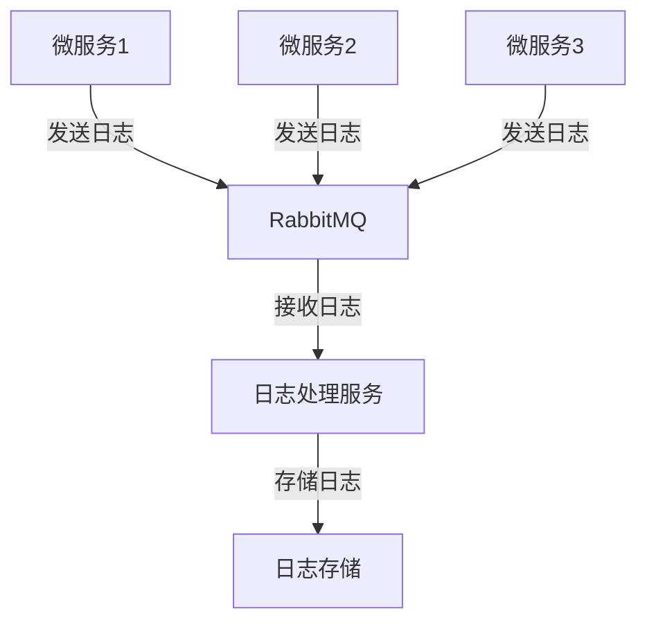

# RabbitMQ 日志处理应用

在现代分布式系统中，日志处理是一个至关重要的任务。日志不仅用于调试和监控，还用于分析和优化系统性能。RabbitMQ作为一个强大的消息队列系统，可以帮助我们构建一个高效、可靠的日志处理系统。本文将逐步介绍如何使用RabbitMQ来处理日志，并通过实际案例展示其应用场景。

## 什么是RabbitMQ？

RabbitMQ是一个开源的消息代理软件，它实现了高级消息队列协议（AMQP）。它允许应用程序通过消息进行通信，从而实现解耦、异步处理和负载均衡。RabbitMQ的核心概念包括生产者（Producer）、消费者（Consumer）、队列（Queue）和交换机（Exchange）。

## 为什么使用RabbitMQ处理日志？

在分布式系统中，日志通常由多个服务生成，并且需要集中存储和处理。使用RabbitMQ处理日志有以下优势：

1. **异步处理**：日志生成和日志处理可以异步进行，避免阻塞主业务流程。
2. **解耦**：日志生成服务和日志处理服务可以独立开发和部署。
3. **可靠性**：RabbitMQ提供了消息持久化、确认机制等，确保日志不会丢失。
4. **扩展性**：通过增加消费者，可以轻松扩展日志处理能力。

## 构建一个简单的日志处理系统

### 1. 安装RabbitMQ

首先，你需要在本地或服务器上安装RabbitMQ。你可以通过以下命令在Ubuntu上安装RabbitMQ：

```bash
sudo apt-get update
sudo apt-get install rabbitmq-server
```

安装完成后，启动RabbitMQ服务：

```bash
sudo systemctl start rabbitmq-server
```

### 2. 创建生产者和消费者

我们将使用Python来创建生产者和消费者。首先，安装`pika`库，它是RabbitMQ的Python客户端：

```bash
pip install pika
```

#### 生产者：生成日志消息

以下是一个简单的生产者代码，它将日志消息发送到RabbitMQ队列：

```python
import pika

# 连接到RabbitMQ服务器
connection = pika.BlockingConnection(pika.ConnectionParameters('localhost'))
channel = connection.channel()

# 声明一个队列
channel.queue_declare(queue='log_queue')

# 发送日志消息
log_message = "This is a log message"
channel.basic_publish(exchange='',
                      routing_key='log_queue',
                      body=log_message)

print(f" [x] Sent '{log_message}'")

# 关闭连接
connection.close()
```

#### 消费者：处理日志消息

以下是一个简单的消费者代码，它从RabbitMQ队列中接收并处理日志消息：

```python
import pika

# 连接到RabbitMQ服务器
connection = pika.BlockingConnection(pika.ConnectionParameters('localhost'))
channel = connection.channel()

# 声明一个队列
channel.queue_declare(queue='log_queue')

# 定义回调函数来处理消息
def callback(ch, method, properties, body):
    print(f" [x] Received {body}")

# 开始消费消息
channel.basic_consume(queue='log_queue',
                      auto_ack=True,
                      on_message_callback=callback)

print(' [*] Waiting for messages. To exit press CTRL+C')
channel.start_consuming()
```

### 3. 运行生产者和消费者

首先运行消费者，然后运行生产者。你应该会看到消费者接收到生产者发送的日志消息。

## 实际案例：分布式系统中的日志收集

假设我们有一个分布式系统，由多个微服务组成。每个微服务都会生成日志，并且我们需要将这些日志集中存储和处理。我们可以使用RabbitMQ来实现这一目标。

### 架构设计



在这个架构中，每个微服务都将日志发送到RabbitMQ队列，日志处理服务从队列中接收日志并将其存储到日志存储中（如Elasticsearch、MongoDB等）。

### 实现步骤

1. **微服务发送日志**：每个微服务使用生产者代码将日志发送到RabbitMQ队列。
2. **日志处理服务接收日志**：日志处理服务使用消费者代码从队列中接收日志。
3. **存储日志**：日志处理服务将接收到的日志存储到日志存储中。

### 代码示例

以下是一个简单的日志处理服务代码，它将接收到的日志存储到文件中：

```python
import pika

# 连接到RabbitMQ服务器
connection = pika.BlockingConnection(pika.ConnectionParameters('localhost'))
channel = connection.channel()

# 声明一个队列
channel.queue_declare(queue='log_queue')

# 定义回调函数来处理消息
def callback(ch, method, properties, body):
    with open('logs.txt', 'a') as f:
        f.write(f"{body}\n")
    print(f" [x] Received and stored {body}")

# 开始消费消息
channel.basic_consume(queue='log_queue',
                      auto_ack=True,
                      on_message_callback=callback)

print(' [*] Waiting for messages. To exit press CTRL+C')
channel.start_consuming()
```

## 总结

通过本文，我们学习了如何使用RabbitMQ构建一个高效的日志处理系统。我们从RabbitMQ的基本概念入手，逐步实现了生产者和消费者，并通过实际案例展示了如何在分布式系统中使用RabbitMQ进行日志收集和处理。

:::tip
如果你想进一步学习RabbitMQ，可以尝试以下练习：
1. 实现日志的持久化存储，确保即使在RabbitMQ重启后也不会丢失日志。
2. 使用多个消费者并行处理日志，提高日志处理速度。
3. 将日志存储到Elasticsearch中，以便进行更复杂的查询和分析。
:::

## 附加资源

- [RabbitMQ官方文档](https://www.rabbitmq.com/documentation.html)
- [pika库文档](https://pika.readthedocs.io/en/stable/)
- [分布式系统中的日志处理](https://www.oreilly.com/library/view/designing-data-intensive-applications/9781491903063/)

希望本文能帮助你更好地理解RabbitMQ在日志处理中的应用。如果你有任何问题或建议，欢迎在评论区留言！