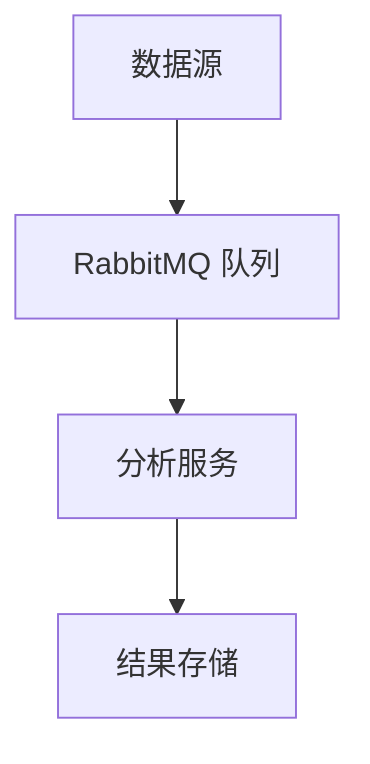

## 介绍

RabbitMQ 是一个开源的消息代理软件，广泛用于分布式系统中的消息传递。它支持多种消息协议，并且能够处理高并发的消息传递任务。实时分析应用是指通过实时处理数据流来生成即时分析结果的应用场景。结合 RabbitMQ，我们可以构建一个高效的实时分析系统。

本文将逐步讲解如何使用 RabbitbitMQ 实现实时分析应用，并通过代码示例和实际案例帮助你理解其工作原理。

## RabbitMQ 基本概念

在深入实时分析应用之前，我们需要了解 RabbitMQ 的一些基本概念：

- **生产者（Producer）**：发送消息的应用程序。
- **消费者（Consumer）**：接收消息的应用程序。
- **队列（Queue）**：存储消息的缓冲区。
- **交换机（Exchange）**：接收生产者发送的消息，并根据规则将消息路由到队列。
- **绑定（Binding）**：连接交换机和队列的规则。

## 实时分析应用的基本架构

实时分析应用通常包括以下组件：

1. **数据源**：生成需要分析的数据。
2. **消息队列**：使用 RabbitMQ 作为消息队列，接收和传递数据。
3. **分析服务**：从队列中读取数据并进行实时分析。
4. **结果存储**：将分析结果存储到数据库或其他存储系统中。

以下是一个简单的架构图：



## 代码示例

### 1. 生产者代码

以下是一个使用 Python 和 `pika` 库的生产者示例代码，它将数据发送到 RabbitMQ 队列：

```python
import pika

# 连接到 RabbitMQ 服务器
connection = pika.BlockingConnection(pika.ConnectionParameters('localhost'))
channel = connection.channel()

# 声明一个队列
channel.queue_declare(queue='analysis_queue')

# 发送消息
channel.basic_publish(exchange='',
                      routing_key='analysis_queue',
                      body='Hello, RabbitMQ!')

print(" [x] Sent 'Hello, RabbitMQ!'")

# 关闭连接
connection.close()
```

### 2. 消费者代码

以下是一个消费者示例代码，它从 RabbitMQ 队列中读取数据并进行简单的分析：

```python
import pika

# 连接到 RabbitMQ 服务器
connection = pika.BlockingConnection(pika.ConnectionParameters('localhost'))
channel = connection.channel()

# 声明队列
channel.queue_declare(queue='analysis_queue')

# 定义回调函数
def callback(ch, method, properties, body):
    print(f" [x] Received {body}")
    # 在这里添加分析逻辑
    print(" [x] Processing data...")

# 开始消费消息
channel.basic_consume(queue='analysis_queue',
                      on_message_callback=callback,
                      auto_ack=True)

print(' [*] Waiting for messages. To exit press CTRL+C')
channel.start_consuming()
```

### 3. 运行示例

1. 启动 RabbitMQ 服务器。
2. 运行生产者代码，发送消息到队列。
3. 运行消费者代码，接收并处理消息。

:::note
确保你已经安装了 `pika` 库。可以通过 `pip install pika` 安装。
:::

## 实际案例：实时日志分析

假设我们有一个日志系统，需要实时分析日志数据并生成统计信息。我们可以使用 RabbitMQ 来实现这一需求。

### 1. 日志生产者

日志生产者将日志消息发送到 RabbitMQ 队列：

```python
import pika
import time

connection = pika.BlockingConnection(pika.ConnectionParameters('localhost'))
channel = connection.channel()

channel.queue_declare(queue='log_queue')

logs = [
    "INFO: User logged in",
    "ERROR: Database connection failed",
    "WARNING: Disk space low",
    "INFO: User logged out"
]

for log in logs:
    channel.basic_publish(exchange='',
                          routing_key='log_queue',
                          body=log)
    print(f" [x] Sent {log}")
    time.sleep(1)  # 模拟实时日志生成

connection.close()
```

### 2. 日志消费者

日志消费者从队列中读取日志并进行实时分析：

```python
import pika

connection = pika.BlockingConnection(pika.ConnectionParameters('localhost'))
channel = connection.channel()

channel.queue_declare(queue='log_queue')

def callback(ch, method, properties, body):
    log = body.decode()
    print(f" [x] Received {log}")
    if "ERROR" in log:
        print(" [x] Alert: Error detected!")
    elif "WARNING" in log:
        print(" [x] Warning: Potential issue detected!")

channel.basic_consume(queue='log_queue',
                      on_message_callback=callback,
                      auto_ack=True)

print(' [*] Waiting for logs. To exit press CTRL+C')
channel.start_consuming()
```

### 3. 运行结果

运行生产者代码后，消费者将实时接收日志并进行分类处理。例如，当接收到包含 "ERROR" 的日志时，消费者会发出警报。

## 总结

通过本文，我们学习了如何使用 RabbitMQ 构建实时分析应用。我们从基本概念入手，逐步讲解了生产者、消费者以及队列的使用方法，并通过一个实际的日志分析案例展示了 RabbitMQ 在实时分析中的应用。

:::tip
如果你想进一步深入学习 RabbitMQ，可以尝试以下练习：
1. 扩展日志分析案例，增加更多的分析逻辑。
2. 尝试使用不同的交换机类型（如 direct、topic、fanout）来实现更复杂的消息路由。
3. 将分析结果存储到数据库中，并构建一个简单的仪表板来展示实时分析结果。
:::

## 附加资源

- [RabbitMQ 官方文档](https://www.rabbitmq.com/documentation.html)
- [Pika 库文档](https://pika.readthedocs.io/en/stable/)
- [实时数据处理与消息队列](https://www.oreilly.com/library/view/designing-data-intensive-applications/9781491903063/)

希望本文对你理解 RabbitMQ 实时分析应用有所帮助！继续探索和实践，你将能够构建更复杂的实时分析系统。