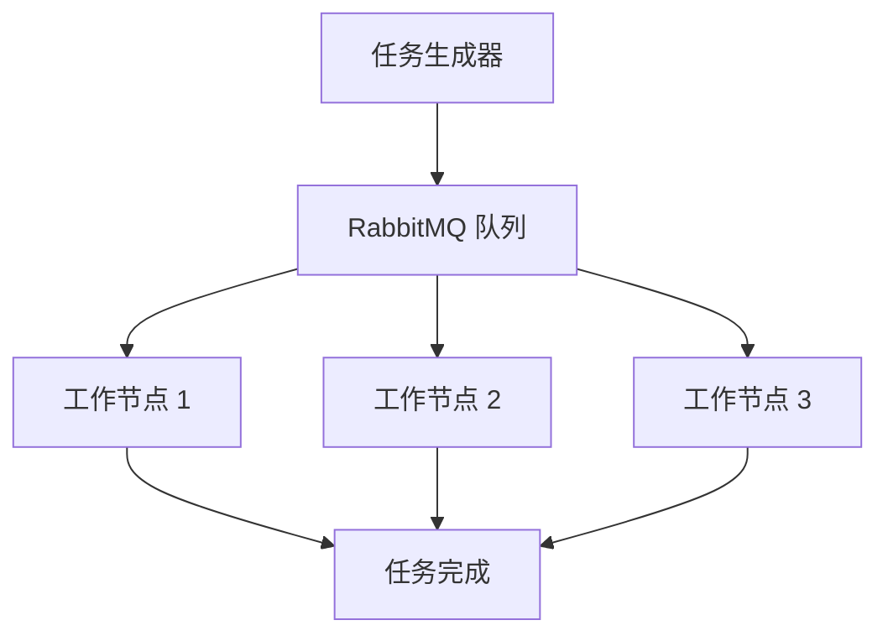

# RabbitMQ 任务调度应用

## 介绍

RabbitMQ 是一个开源的消息代理软件，广泛用于分布式系统中的消息传递和任务调度。任务调度是指将任务分配给不同的工作节点进行处理，以提高系统的效率和可扩展性。RabbitMQ 通过消息队列的方式，能够有效地管理和调度任务。

在本篇内容中，我们将探讨如何使用 RabbitMQ 实现任务调度，并通过代码示例和实际案例帮助你理解这一概念。

## 基本概念

### 消息队列

消息队列是 RabbitMQ 的核心概念之一。它允许生产者（Producer）将消息发送到队列中，消费者（Consumer）从队列中获取消息并进行处理。这种机制使得任务调度变得简单而高效。

### 任务调度

任务调度是指将任务分配给不同的工作节点进行处理。RabbitMQ 通过消息队列的方式，能够有效地管理和调度任务。生产者将任务放入队列，消费者从队列中获取任务并执行。

## 代码示例

### 安装 RabbitMQ

首先，你需要在本地安装 RabbitMQ。可以通过以下命令安装：

```bash
sudo apt-get install rabbitmq-server
```

### 生产者代码

以下是一个简单的生产者代码示例，它将任务发送到 RabbitMQ 队列中：

```python
import pika

# 连接到 RabbitMQ 服务器
connection = pika.BlockingConnection(pika.ConnectionParameters('localhost'))
channel = connection.channel()

# 声明一个队列
channel.queue_declare(queue='task_queue', durable=True)

# 发送任务到队列
message = 'Task 1'
channel.basic_publish(exchange='',
                      routing_key='task_queue',
                      body=message,
                      properties=pika.BasicProperties(
                         delivery_mode = 2, # 使消息持久化
                      ))
print(f" [x] Sent {message}")

# 关闭连接
connection.close()
```

### 消费者代码

以下是一个简单的消费者代码示例，它从 RabbitMQ 队列中获取任务并执行：

```python
import pika
import time

# 连接到 RabbitMQ 服务器
connection = pika.BlockingConnection(pika.ConnectionParameters('localhost'))
channel = connection.channel()

# 声明一个队列
channel.queue_declare(queue='task_queue', durable=True)

# 定义回调函数
def callback(ch, method, properties, body):
    print(f" [x] Received {body}")
    time.sleep(body.count(b'.'))  # 模拟任务处理时间
    print(" [x] Done")
    ch.basic_ack(delivery_tag=method.delivery_tag)

# 设置消费者
channel.basic_qos(prefetch_count=1)
channel.basic_consume(queue='task_queue', on_message_callback=callback)

print(' [*] Waiting for messages. To exit press CTRL+C')
channel.start_consuming()
```

### 运行示例

1. 启动 RabbitMQ 服务器。
2. 运行生产者代码，将任务发送到队列中。
3. 运行消费者代码，从队列中获取任务并执行。

## 实际案例

### 分布式任务调度系统

假设你正在开发一个分布式任务调度系统，需要将任务分配给多个工作节点进行处理。使用 RabbitMQ 可以轻松实现这一需求。

1. **任务生成**：任务生成器（Producer）将任务发送到 RabbitMQ 队列中。
2. **任务分配**：多个工作节点（Consumer）从队列中获取任务并执行。
3. **任务确认**：工作节点完成任务后，向 RabbitMQ 发送确认消息。

### 流程图

以下是一个简单的流程图，展示了任务调度的过程：



## 总结

通过本篇内容，你了解了如何使用 RabbitMQ 实现任务调度。我们从基本概念入手，通过代码示例和实际案例展示了 RabbitMQ 在任务调度中的应用。希望这些内容能够帮助你更好地理解 RabbitMQ 的任务调度功能。

## 附加资源

- [RabbitMQ 官方文档](https://www.rabbitmq.com/documentation.html)
- [RabbitMQ 教程](https://www.rabbitmq.com/getstarted.html)
- [Python RabbitMQ 客户端库](https://pika.readthedocs.io/en/stable/)

## 练习

1. 修改生产者代码，使其能够发送多个任务到队列中。
2. 修改消费者代码，使其能够处理不同类型的任务。
3. 尝试使用 RabbitMQ 实现一个简单的分布式计算系统。

:::tip
在完成练习时，可以参考 RabbitMQ 官方文档和教程，获取更多帮助和灵感。
:::