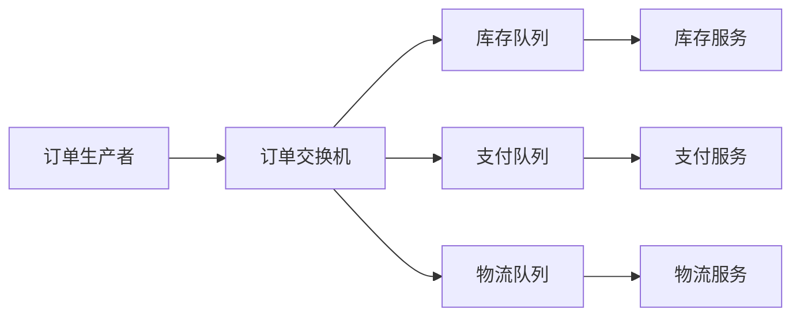

# RabbitMQ 设计原则

RabbitMQ 是一个开源的消息代理软件，广泛用于构建分布式系统中的消息队列。它基于 AMQP（高级消息队列协议）设计，能够高效地处理消息的传递、路由和存储。为了充分发挥 RabbitMQ 的优势，理解其设计原则至关重要。本文将介绍 RabbitMQ 的核心设计原则，并通过实际案例帮助初学者掌握这些原则的应用。

## 1. 消息队列的基本概念

在深入设计原则之前，我们需要了解一些基本概念：

- **消息（Message）**：消息是 RabbitMQ 中传递的基本数据单元，通常包含有效载荷（payload）和元数据（metadata）。
- **队列（Queue）**：队列是消息的存储容器，消息在队列中等待被消费者处理。
- **交换机（Exchange）**：交换机负责接收生产者发送的消息，并根据路由规则将消息分发到相应的队列。
- **绑定（Binding）**：绑定是交换机和队列之间的关联规则，定义了消息如何从交换机路由到队列。

## 2. RabbitMQ 的核心设计原则

### 2.1 消息持久化

消息持久化是确保消息在 RabbitMQ 服务器重启后不会丢失的关键机制。RabbitMQ 允许将消息和队列标记为持久化，这样即使服务器崩溃，消息也不会丢失。

```python
# 创建一个持久化的队列
channel.queue_declare(queue='my_queue', durable=True)

# 发送一条持久化的消息
channel.basic_publish(exchange='',
                      routing_key='my_queue',
                      body='Hello, World!',
                      properties=pika.BasicProperties(
                         delivery_mode=2,  # 使消息持久化
                      ))
```

:::note
**注意**：即使消息和队列都标记为持久化，RabbitMQ 也不能保证消息在极端情况下（如磁盘损坏）不会丢失。因此，在设计系统时，还需要考虑其他容错机制。
:::

### 2.2 消息确认机制

RabbitMQ 提供了消息确认机制（Message Acknowledgment），以确保消息被消费者成功处理。消费者在处理完消息后，必须向 RabbitMQ 发送确认信号，RabbitMQ 才会将消息从队列中删除。

```python
def callback(ch, method, properties, body):
    print(f"Received {body}")
    # 处理消息
    ch.basic_ack(delivery_tag=method.delivery_tag)  # 发送确认信号

channel.basic_consume(queue='my_queue', on_message_callback=callback)
```

:::tip
**提示**：如果消费者在处理消息时崩溃，RabbitMQ 会将未确认的消息重新分发给其他消费者，从而避免消息丢失。
:::

### 2.3 消息路由

RabbitMQ 提供了多种交换机类型，用于实现不同的消息路由策略。常见的交换机类型包括：

- **直连交换机（Direct Exchange）**：根据消息的路由键（routing key）精确匹配队列。
- **主题交换机（Topic Exchange）**：根据路由键的模式匹配队列。
- **扇出交换机（Fanout Exchange）**：将消息广播到所有绑定的队列。

```python
# 创建一个主题交换机
channel.exchange_declare(exchange='my_topic_exchange', exchange_type='topic')

# 绑定队列到交换机
channel.queue_bind(exchange='my_topic_exchange',
                   queue='my_queue',
                   routing_key='my.routing.key')
```

### 2.4 负载均衡

RabbitMQ 通过多个消费者共享一个队列来实现负载均衡。当多个消费者订阅同一个队列时，RabbitMQ 会将消息均匀地分发给这些消费者。

```python
# 设置消费者的预取计数（prefetch count）
channel.basic_qos(prefetch_count=1)

# 启动多个消费者
channel.basic_consume(queue='my_queue', on_message_callback=callback)
```

:::caution
**注意**：如果消费者的处理速度不一致，可能会导致某些消费者过载。可以通过调整预取计数来优化负载均衡。
:::

## 3. 实际案例：订单处理系统

假设我们正在构建一个订单处理系统，订单消息需要被多个服务处理（如库存管理、支付处理、物流跟踪）。我们可以使用 RabbitMQ 来实现消息的可靠传递和负载均衡。



在这个系统中，订单生产者将订单消息发送到订单交换机，交换机根据路由键将消息分发到不同的队列。每个队列由一个或多个消费者处理，从而实现高效的订单处理流程。

## 4. 总结

RabbitMQ 的设计原则包括消息持久化、消息确认机制、消息路由和负载均衡。理解这些原则有助于构建高效、可靠的消息队列系统。通过实际案例，我们可以看到这些原则在分布式系统中的实际应用。

## 5. 附加资源与练习

- **附加资源**：
  - [RabbitMQ 官方文档](https://www.rabbitmq.com/documentation.html)
  - 《RabbitMQ in Action》书籍

- **练习**：
  - 尝试在本地搭建一个 RabbitMQ 实例，并实现一个简单的消息队列系统。
  - 修改消息路由规则，观察消息如何被分发到不同的队列。

通过不断实践和探索，你将能够更好地掌握 RabbitMQ 的设计原则，并在实际项目中应用它们。