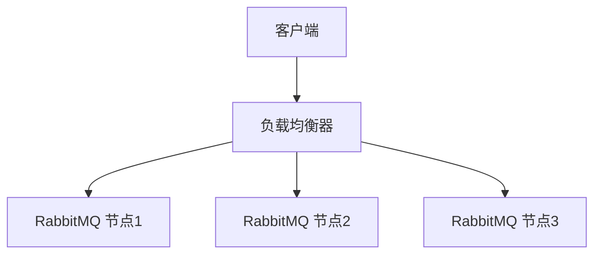

# RabbitMQ 部署清单

RabbitMQ 是一个功能强大的开源消息代理，广泛用于分布式系统中的消息传递。为了确保 RabbitMQ 在生产环境中稳定运行，部署前的规划和准备至关重要。本文将为您提供一个详细的 RabbitMQ 部署清单，帮助您顺利完成部署。

## 1. 环境准备

在部署 RabbitMQ 之前，首先需要确保您的环境满足以下要求：

- **操作系统**：RabbitMQ 支持多种操作系统，包括 Linux、Windows 和 macOS。推荐使用 Linux 系统，因为它通常具有更好的性能和稳定性。
- **Erlang/OTP**：RabbitMQ 是用 Erlang 编写的，因此需要安装 Erlang/OTP。确保安装的版本与 RabbitMQ 兼容。
- **硬件资源**：根据预期的消息负载，确保服务器具有足够的 CPU、内存和磁盘空间。

:::tip
建议在生产环境中使用至少 2 核 CPU 和 4GB 内存的服务器。
:::

## 2. 安装 RabbitMQ

安装 RabbitMQ 的步骤如下：

1. **安装 Erlang/OTP**：
   ```bash
   sudo apt-get install erlang
   ```

2. **安装 RabbitMQ**：
   ```bash
   sudo apt-get install rabbitmq-server
   ```

3. **启动 RabbitMQ 服务**：
   ```bash
   sudo systemctl start rabbitmq-server
   ```

4. **启用 RabbitMQ 管理插件**：
   ```bash
   sudo rabbitmq-plugins enable rabbitmq_management
   ```

5. **访问管理界面**：
   打开浏览器，访问 `http://localhost:15672`，使用默认用户名 `guest` 和密码 `guest` 登录。

## 3. 配置 RabbitMQ

RabbitMQ 的配置文件通常位于 `/etc/rabbitmq/rabbitmq.conf`。以下是一些常见的配置项：

- **节点名称**：每个 RabbitMQ 节点需要一个唯一的名称。
  ```ini
  NODENAME=rabbit@node1
  ```

- **集群配置**：如果您计划部署 RabbitMQ 集群，需要在配置文件中指定集群节点。
  ```ini
  cluster_nodes = {['rabbit@node1', 'rabbit@node2'], disc}
  ```

- **持久化配置**：确保消息和队列的持久化，以防止数据丢失。
  ```ini
  queue_master_locator = min-masters
  ```

:::caution
在修改配置文件后，记得重启 RabbitMQ 服务以使更改生效。
:::

## 4. 高可用性配置

为了确保 RabbitMQ 的高可用性，建议采取以下措施：

- **镜像队列**：通过镜像队列，可以在多个节点上复制队列，以防止单点故障。
  ```bash
  rabbitmqctl set_policy ha-all "^ha\." '{"ha-mode":"all"}'
  ```

- **负载均衡**：使用负载均衡器（如 HAProxy 或 Nginx）来分发客户端连接，避免单点过载。



## 5. 监控与维护

部署完成后，定期监控和维护 RabbitMQ 是确保其稳定运行的关键。

- **监控工具**：使用 RabbitMQ 的管理界面或第三方工具（如 Prometheus 和 Grafana）来监控队列、连接和资源使用情况。
- **日志管理**：定期检查 RabbitMQ 的日志文件，及时发现并解决问题。
- **备份与恢复**：定期备份 RabbitMQ 的数据，并制定恢复计划，以应对可能的故障。

## 6. 实际案例

假设您正在为一个电商平台部署 RabbitMQ，用于处理订单消息。以下是一个简单的部署方案：

1. **环境**：使用 3 台 Linux 服务器，分别作为 RabbitMQ 节点。
2. **配置**：配置镜像队列，确保订单消息在多个节点上复制。
3. **负载均衡**：使用 HAProxy 作为负载均衡器，分发客户端连接。
4. **监控**：使用 Prometheus 和 Grafana 监控 RabbitMQ 的性能指标。

:::note
在实际部署中，您可能需要根据具体的业务需求调整配置。
:::

## 7. 总结

通过本文，您已经了解了 RabbitMQ 的部署清单，包括环境准备、安装、配置、高可用性设置以及监控与维护。希望这些内容能帮助您顺利完成 RabbitMQ 的部署，并确保其稳定运行。

## 8. 附加资源与练习

- **官方文档**：[RabbitMQ 官方文档](https://www.rabbitmq.com/documentation.html) 提供了详细的安装和配置指南。
- **练习**：尝试在本地环境中部署一个 RabbitMQ 集群，并配置镜像队列和负载均衡器。

:::tip
如果您在部署过程中遇到问题，可以参考官方文档或社区论坛寻求帮助。
:::