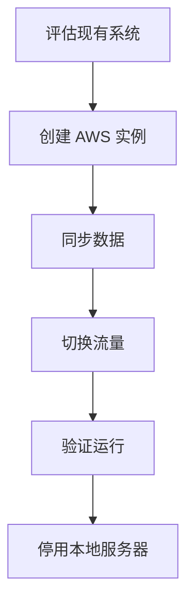

# RabbitMQ 迁移策略

RabbitMQ 是一个广泛使用的消息队列系统，用于在分布式系统中传递消息。随着业务的发展，可能需要对 RabbitMQ 进行迁移，例如升级版本、更换硬件、迁移到云环境或调整集群架构。本文将详细介绍 RabbitMQ 迁移的策略和步骤，帮助初学者理解并实施迁移。

## 什么是 RabbitMQ 迁移？

RabbitMQ 迁移是指将现有的 RabbitMQ 系统从一个环境或配置转移到另一个环境或配置的过程。迁移可能涉及以下场景：

- **版本升级**：从旧版本迁移到新版本。
- **硬件更换**：从旧的服务器迁移到新的服务器。
- **云迁移**：从本地环境迁移到云环境。
- **集群调整**：调整集群的节点数量或架构。

无论哪种场景，迁移的目标都是确保消息队列系统的持续可用性和数据完整性。

## 迁移前的准备工作

在开始迁移之前，必须进行充分的准备工作，以确保迁移过程顺利。

### 1. 评估现有系统

首先，评估当前的 RabbitMQ 系统，包括：

- **版本信息**：当前 RabbitMQ 的版本。
- **配置信息**：配置文件、插件、队列、交换机和绑定的设置。
- **数据量**：消息的数量、大小和持久化情况。
- **依赖关系**：其他系统或服务对 RabbitMQ 的依赖。

### 2. 制定迁移计划

根据评估结果，制定详细的迁移计划，包括：

- **迁移目标**：明确迁移的目标环境或配置。
- **迁移步骤**：列出具体的迁移步骤和时间表。
- **回滚计划**：如果迁移失败，如何回滚到原始状态。

### 3. 备份数据

在迁移之前，务必备份所有重要数据，包括：

- **消息数据**：持久化的消息和队列数据。
- **配置文件**：RabbitMQ 的配置文件。
- **插件和脚本**：自定义插件和脚本。

## 迁移策略

根据不同的迁移场景，可以选择不同的迁移策略。以下是几种常见的迁移策略：

### 1. 版本升级

如果目标是升级 RabbitMQ 版本，可以按照以下步骤进行：

1. **检查兼容性**：确保新版本与现有配置和插件兼容。
2. **备份数据**：备份所有消息和配置。
3. **停止服务**：停止当前的 RabbitMQ 服务。
4. **安装新版本**：安装新版本的 RabbitMQ。
5. **恢复数据**：将备份的数据恢复到新版本中。
6. **启动服务**：启动新版本的 RabbitMQ 服务。

:::note
在升级过程中，建议先在测试环境中进行验证，确保升级不会影响生产环境。
:::

### 2. 硬件更换

如果目标是更换硬件，可以按照以下步骤进行：

1. **准备新硬件**：在新硬件上安装 RabbitMQ，并确保配置与旧硬件一致。
2. **同步数据**：将旧硬件上的消息和配置同步到新硬件。
3. **切换流量**：将客户端连接从旧硬件切换到新硬件。
4. **停用旧硬件**：确认新硬件运行正常后，停用旧硬件。

:::tip
可以使用 RabbitMQ 的镜像队列功能，确保消息在迁移过程中不会丢失。
:::

### 3. 云迁移

如果目标是将 RabbitMQ 迁移到云环境，可以按照以下步骤进行：

1. **选择云服务**：选择合适的云服务提供商，如 AWS、Azure 或 GCP。
2. **创建云实例**：在云环境中创建 RabbitMQ 实例。
3. **同步数据**：将本地环境中的消息和配置同步到云实例。
4. **切换流量**：将客户端连接从本地环境切换到云环境。
5. **停用本地环境**：确认云环境运行正常后，停用本地环境。

:::caution
在云迁移过程中，需要注意网络延迟和安全配置，确保消息传递的可靠性和安全性。
:::

### 4. 集群调整

如果目标是调整 RabbitMQ 集群的节点数量或架构，可以按照以下步骤进行：

1. **添加新节点**：在集群中添加新的 RabbitMQ 节点。
2. **同步数据**：确保新节点与现有节点同步。
3. **移除旧节点**：如果不再需要某些节点，可以将其从集群中移除。

:::warning
在调整集群时，务必确保集群的高可用性，避免单点故障。
:::

## 实际案例

假设我们有一个运行在本地服务器上的 RabbitMQ 集群，现在需要将其迁移到 AWS 云环境。以下是具体的迁移步骤：

1. **评估现有系统**：记录当前的 RabbitMQ 版本、配置和消息数据。
2. **创建 AWS 实例**：在 AWS 上创建与本地环境配置相同的 RabbitMQ 实例。
3. **同步数据**：使用 RabbitMQ 的备份和恢复工具，将本地数据同步到 AWS 实例。
4. **切换流量**：将客户端的连接从本地服务器切换到 AWS 实例。
5. **验证运行**：确认 AWS 实例运行正常后，停用本地服务器。

## 总结

RabbitMQ 迁移是一个复杂的过程，需要充分的准备和详细的计划。通过评估现有系统、制定迁移计划、备份数据和选择合适的迁移策略，可以确保迁移过程的顺利进行。无论是版本升级、硬件更换、云迁移还是集群调整，都需要谨慎操作，确保消息队列系统的高可用性和数据完整性。

## 附加资源

- [RabbitMQ 官方文档](https://www.rabbitmq.com/documentation.html)
- [RabbitMQ 备份与恢复指南](https://www.rabbitmq.com/backup.html)
- [RabbitMQ 集群配置指南](https://www.rabbitmq.com/clustering.html)

## 练习

1. 尝试在本地环境中模拟 RabbitMQ 的版本升级过程，记录每一步的操作和结果。
2. 使用 RabbitMQ 的镜像队列功能，设计一个高可用的集群架构，并测试其容错能力。
3. 研究 AWS 上的 RabbitMQ 托管服务，比较其与本地部署的优缺点。

通过以上练习，您将更深入地理解 RabbitMQ 的迁移策略，并能够在实际项目中应用这些知识。