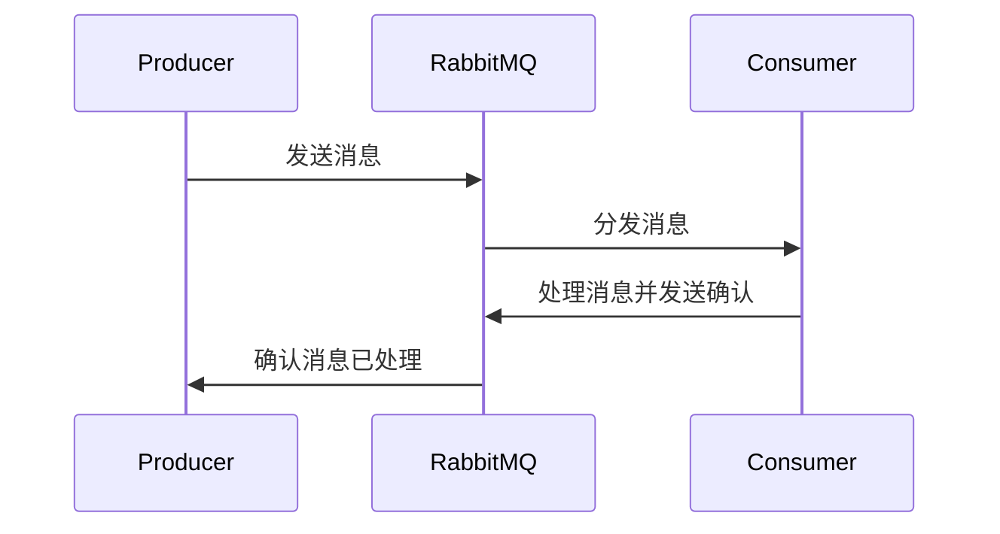
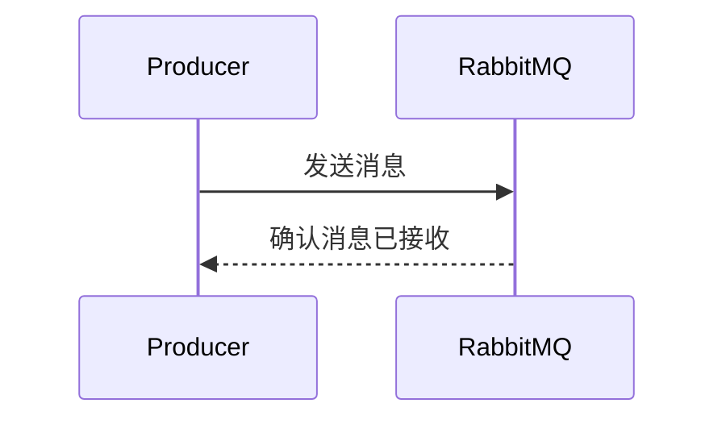

# RabbitMQ 可靠性保障

RabbitMQ 是一个广泛使用的消息队列系统，用于在分布式系统中传递消息。然而，在实际应用中，消息可能会因为网络问题、服务器故障或其他原因丢失或重复处理。为了确保消息的可靠传递，RabbitMQ 提供了多种可靠性保障机制。本文将详细介绍这些机制，并通过实际案例展示如何应用它们。

## 1. 消息确认机制

RabbitMQ 提供了消息确认机制（Message Acknowledgment），确保消费者成功处理消息后，RabbitMQ 才会将消息从队列中删除。如果消费者在处理消息时崩溃或未发送确认，RabbitMQ 会将消息重新放回队列，供其他消费者处理。

### 1.1 启用消息确认

在消费者端，可以通过设置 `autoAck` 参数为 `false` 来启用消息确认机制：

```javascript
channel.consume(queueName, (msg) => {
  try {
    // 处理消息
    console.log(`Received: ${msg.content.toString()}`);
    // 手动发送确认
    channel.ack(msg);
  } catch (error) {
    // 处理失败，拒绝消息并重新入队
    channel.nack(msg, false, true);
  }
}, { noAck: false });
```

### 1.2 消息确认的流程



## 2. 持久化机制

为了防止消息在 RabbitMQ 服务器崩溃时丢失，可以将消息和队列设置为持久化。持久化的消息和队列会被写入磁盘，即使服务器重启，消息也不会丢失。

### 2.1 设置队列持久化

在声明队列时，可以通过设置 `durable` 参数为 `true` 来使队列持久化：

```javascript
channel.assertQueue(queueName, { durable: true });
```

### 2.2 设置消息持久化

在发送消息时，可以通过设置 `persistent` 参数为 `true` 来使消息持久化：

```javascript
channel.sendToQueue(queueName, Buffer.from('Hello, RabbitMQ!'), { persistent: true });
```

:::note
持久化会增加磁盘 I/O 操作，可能会影响性能。因此，在不需要持久化的场景下，可以关闭此功能以提高性能。
:::

## 3. 事务机制

RabbitMQ 支持事务机制，确保一组操作要么全部成功，要么全部失败。事务机制可以用于确保消息的发送和确认操作的原子性。

### 3.1 使用事务

```javascript
channel.txSelect(); // 开启事务
try {
  channel.sendToQueue(queueName, Buffer.from('Transaction Message'));
  channel.txCommit(); // 提交事务
} catch (error) {
  channel.txRollback(); // 回滚事务
}
```

:::caution
事务机制会显著降低性能，因此在大多数情况下，建议使用消息确认机制和持久化机制来保障可靠性。
:::

## 4. 发布确认机制

发布确认机制（Publisher Confirms）是 RabbitMQ 提供的一种异步确认机制，用于确保消息成功到达 RabbitMQ 服务器。与事务机制不同，发布确认机制不会阻塞生产者，因此性能更高。

### 4.1 启用发布确认

```javascript
channel.confirmSelect(); // 启用发布确认
channel.sendToQueue(queueName, Buffer.from('Confirmed Message'), {}, (err, ok) => {
  if (err) {
    console.error('Message not confirmed');
  } else {
    console.log('Message confirmed');
  }
});
```

### 4.2 发布确认的流程



## 5. 实际案例

假设我们有一个订单处理系统，订单消息需要可靠地传递给库存管理系统。我们可以使用 RabbitMQ 的可靠性保障机制来确保订单消息不会丢失或重复处理。

### 5.1 订单处理流程

1. **生产者**：订单系统将订单消息发送到 RabbitMQ。
2. **消费者**：库存管理系统从 RabbitMQ 接收订单消息，处理完成后发送确认。
3. **可靠性保障**：使用消息确认机制、持久化机制和发布确认机制确保消息的可靠传递。

```javascript
// 生产者
channel.sendToQueue('orderQueue', Buffer.from(JSON.stringify(order)), { persistent: true });

// 消费者
channel.consume('orderQueue', (msg) => {
  try {
    const order = JSON.parse(msg.content.toString());
    processOrder(order); // 处理订单
    channel.ack(msg); // 发送确认
  } catch (error) {
    channel.nack(msg, false, true); // 处理失败，重新入队
  }
}, { noAck: false });
```

## 6. 总结

RabbitMQ 提供了多种可靠性保障机制，包括消息确认机制、持久化机制、事务机制和发布确认机制。通过合理使用这些机制，可以确保消息在分布式系统中的可靠传递，避免消息丢失或重复处理。

在实际应用中，应根据具体场景选择合适的机制。例如，在需要高性能的场景下，可以使用发布确认机制代替事务机制；在需要确保消息不丢失的场景下，可以使用持久化机制。

## 7. 附加资源与练习

- **练习**：尝试在一个简单的消息队列应用中实现消息确认机制和持久化机制，观察消息的处理流程。
- **资源**：阅读 [RabbitMQ 官方文档](https://www.rabbitmq.com/documentation.html) 了解更多高级特性和最佳实践。

通过本文的学习，你应该已经掌握了 RabbitMQ 的可靠性保障机制，并能够在实际项目中应用这些机制来确保消息的可靠传递。