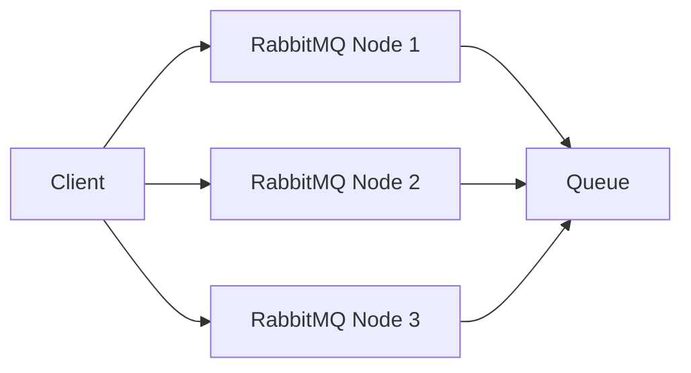

# RabbitMQ 扩展性设计

RabbitMQ 是一个功能强大的消息队列系统，广泛应用于分布式系统中。随着业务规模的扩大，系统的消息负载也会不断增加。为了确保 RabbitMQ 能够高效处理这些负载，扩展性设计变得至关重要。本文将详细介绍如何设计一个可扩展的 RabbitbitMQ 系统，并通过实际案例帮助初学者理解这些概念。

## 什么是扩展性设计？

扩展性设计是指系统能够通过增加资源（如服务器、存储、网络带宽等）来应对不断增长的工作负载。对于 RabbitMQ 来说，扩展性设计主要涉及以下几个方面：

1. **水平扩展**：通过增加更多的节点来分担负载。
2. **垂直扩展**：通过增加单个节点的资源（如 CPU、内存）来提高性能。
3. **分区和分片**：将数据或任务分散到多个节点上，以减少单个节点的压力。

## RabbitMQ 扩展性设计的关键原则

### 1. 集群化

RabbitMQ 支持集群化部署，这意味着你可以将多个 RabbitMQ 节点组成一个集群，共同处理消息。集群中的节点可以共享队列和交换器，从而提高系统的整体吞吐量。



:::note
在集群中，每个节点都可以处理消息的生产和消费。如果某个节点出现故障，其他节点可以继续工作，从而提高系统的可用性。
:::

### 2. 镜像队列

为了确保消息的高可用性，RabbitMQ 提供了镜像队列（Mirrored Queues）功能。镜像队列会将队列的内容复制到多个节点上，即使某个节点宕机，消息也不会丢失。

```bash
# 创建一个镜像队列
rabbitmqctl set_policy ha-all "^ha\." '{"ha-mode":"all"}'
```

:::caution
镜像队列会增加系统的资源消耗，因此在设计时需要权衡可用性和性能。
:::

### 3. 负载均衡

在集群中，负载均衡是确保每个节点都能均匀处理消息的关键。你可以使用负载均衡器（如 HAProxy 或 Nginx）来分发客户端的请求。

```bash
# HAProxy 配置示例
frontend rabbitmq_frontend
    bind *:5672
    default_backend rabbitmq_backend

backend rabbitmq_backend
    balance roundrobin
    server rabbit1 192.168.1.1:5672 check
    server rabbit2 192.168.1.2:5672 check
    server rabbit3 192.168.1.3:5672 check
```

:::tip
负载均衡器不仅可以提高系统的吞吐量，还可以在某个节点出现故障时自动将流量转移到其他节点。
:::

### 4. 分区和分片

对于非常大的消息负载，单一队列可能无法满足需求。此时，你可以将消息分区或分片到多个队列中。例如，可以根据消息的某个属性（如用户 ID）将消息路由到不同的队列。

```python
# Python 示例：根据用户 ID 路由消息
import pika

connection = pika.BlockingConnection(pika.ConnectionParameters('localhost'))
channel = connection.channel()

user_id = "12345"
queue_name = f"user_queue_{hash(user_id) % 10}"
channel.basic_publish(exchange='', routing_key=queue_name, body='Hello World!')
```

:::note
分区和分片可以显著提高系统的并发处理能力，但也会增加系统的复杂性。
:::

## 实际案例：电商平台的订单处理系统

假设你正在为一个电商平台设计订单处理系统。该系统需要处理大量的订单消息，并且需要确保高可用性和高性能。

### 1. 集群化部署

首先，你可以将 RabbitMQ 部署为一个集群，包含多个节点。每个节点都可以处理订单消息的生产和消费。

### 2. 镜像队列

为了确保订单消息不会丢失，你可以为订单队列启用镜像队列功能。这样，即使某个节点宕机，订单消息仍然可以从其他节点获取。

### 3. 负载均衡

使用负载均衡器将订单请求均匀分发到集群中的各个节点。这样可以避免某个节点过载，同时提高系统的整体吞吐量。

### 4. 分区和分片

根据订单的用户 ID 将订单消息路由到不同的队列。例如，用户 ID 为奇数的订单路由到队列 A，用户 ID 为偶数的订单路由到队列 B。这样可以进一步提高系统的并发处理能力。

## 总结

RabbitMQ 的扩展性设计是确保系统能够应对不断增长的消息负载的关键。通过集群化、镜像队列、负载均衡和分区分片等技术，你可以构建一个高效、可靠的 RabbitMQ 系统。

:::tip
在实际应用中，扩展性设计需要根据具体的业务需求进行调整。建议在设计和实施过程中进行充分的测试和优化。
:::

## 附加资源

- [RabbitMQ 官方文档](https://www.rabbitmq.com/documentation.html)
- [RabbitMQ 集群指南](https://www.rabbitmq.com/clustering.html)
- [HAProxy 配置指南](http://www.haproxy.org/#docs)

## 练习

1. 尝试在一个本地环境中部署一个 RabbitMQ 集群，并测试其高可用性。
2. 使用 Python 编写一个简单的消息生产者，将消息路由到不同的队列中。
3. 配置 HAProxy 作为 RabbitMQ 集群的负载均衡器，并观察其效果。

通过以上练习，你将更深入地理解 RabbitMQ 的扩展性设计，并能够在实际项目中应用这些技术。