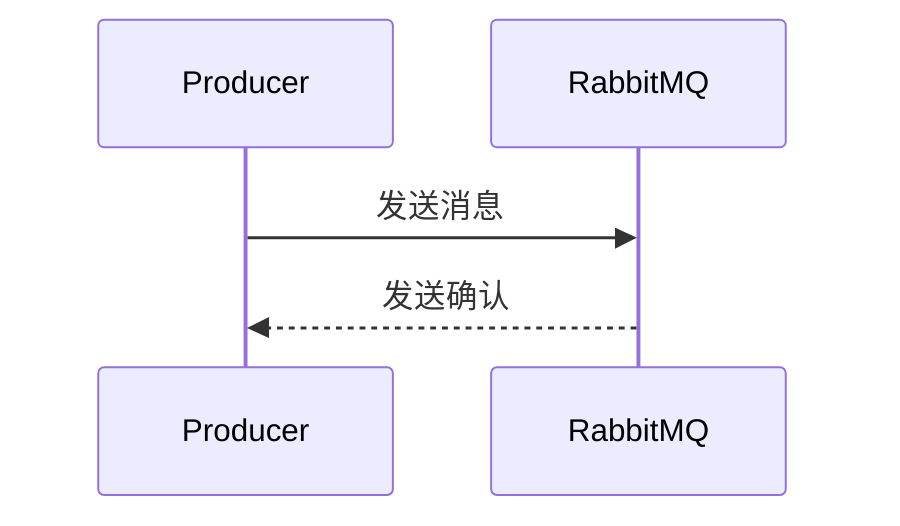

# RabbitMQ 发布确认

在分布式系统中，消息队列（如RabbitMQ）被广泛用于解耦生产者和消费者。然而，仅仅将消息发送到队列中并不能保证消息一定会被成功处理。为了确保消息的可靠传递，RabbitMQ提供了**发布确认**（Publisher Confirms）机制。本文将详细介绍这一机制，并通过代码示例和实际案例帮助你理解其工作原理和应用场景。

## 什么是发布确认？

发布确认是RabbitMQ提供的一种机制，用于确保生产者发送的消息已经成功到达RabbitMQ服务器。通过启用发布确认，生产者可以收到来自RabbitMQ的确认消息，从而知道消息是否已被成功接收和处理。

:::note
发布确认机制与事务（Transactions）不同。事务会带来较大的性能开销，而发布确认则是一种轻量级的机制，适用于高吞吐量的场景。
:::

## 如何启用发布确认？

在RabbitMQ中，发布确认机制默认是关闭的。要启用它，需要在生产者端进行配置。以下是一个使用Python的`pika`库启用发布确认的示例：

```python
import pika

# 连接到RabbitMQ服务器
connection = pika.BlockingConnection(pika.ConnectionParameters('localhost'))
channel = connection.channel()

# 启用发布确认
channel.confirm_delivery()

# 声明一个队列
channel.queue_declare(queue='test_queue')

# 发送消息并等待确认
if channel.basic_publish(exchange='',
                         routing_key='test_queue',
                         body='Hello, RabbitMQ!',
                         properties=pika.BasicProperties(delivery_mode=2)):  # 持久化消息
    print("Message confirmed!")
else:
    print("Message not confirmed!")
```

在这个示例中，`confirm_delivery()`方法启用了发布确认机制。`basic_publish()`方法返回一个布尔值，表示消息是否被成功确认。

## 发布确认的工作原理

发布确认机制的工作原理可以分为以下几个步骤：

1. **生产者发送消息**：生产者将消息发送到RabbitMQ服务器。
2. **RabbitMQ接收消息**：RabbitMQ服务器接收消息并将其存储在队列中。
3. **发送确认**：RabbitMQ服务器向生产者发送一个确认消息，表示消息已被成功接收。
4. **处理确认**：生产者接收到确认消息后，可以继续发送下一条消息或进行其他操作。



## 实际应用场景

发布确认机制在以下场景中非常有用：

1. **金融交易**：在金融交易系统中，确保每笔交易消息的可靠传递至关重要。发布确认可以防止消息丢失，从而避免经济损失。
2. **订单处理**：在电商平台中，订单消息的可靠传递是保证用户体验的关键。发布确认可以确保订单消息被成功处理。
3. **日志收集**：在分布式系统中，日志消息的可靠传递对于系统监控和故障排查非常重要。发布确认可以确保日志消息不会丢失。

## 总结

发布确认是RabbitMQ中确保消息可靠传递的重要机制。通过启用发布确认，生产者可以确保消息已被RabbitMQ成功接收和处理。本文介绍了发布确认的概念、实现方式以及实际应用场景，并通过代码示例帮助你理解其工作原理。

:::tip
如果你对RabbitMQ的其他高级特性感兴趣，可以继续学习**消息持久化**、**死信队列**等内容。
:::

## 附加资源

- [RabbitMQ官方文档](https://www.rabbitmq.com/documentation.html)
- [pika库文档](https://pika.readthedocs.io/en/stable/)

## 练习

1. 修改上述代码示例，使其在消息未被确认时重试发送。
2. 尝试在多个队列中使用发布确认机制，并观察其行为。

通过本文的学习，你应该已经掌握了RabbitMQ发布确认的基本概念和应用。希望你能在实际项目中灵活运用这一机制，确保消息的可靠传递！