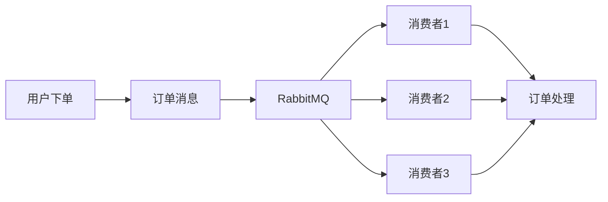
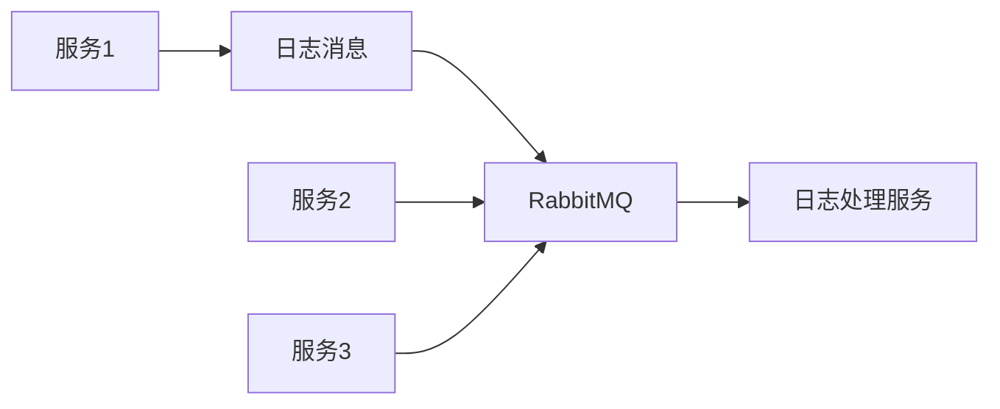

## 介绍

RabbitMQ 是一个开源的消息代理软件，用于在分布式系统中传递消息。它实现了高级消息队列协议（AMQP），并提供了可靠的消息传递机制。对于初学者来说，理解 RabbitMQ 的最佳实践是构建高效、可靠的消息驱动系统的关键。

本文将逐步介绍 RabbitMQ 的最佳实践，包括消息队列的设计、性能优化、错误处理以及实际应用场景。我们还将提供代码示例，帮助你更好地理解这些概念。

## 消息队列设计

### 1. 选择合适的队列类型

RabbitMQ 提供了多种队列类型，包括经典队列、惰性队列和优先级队列。选择合适的队列类型可以提高系统的性能和可靠性。

- **经典队列**：适用于大多数场景，消息存储在内存中，提供较高的吞吐量。
- **惰性队列**：适用于消息量较大的场景，消息存储在磁盘上，减少内存使用。
- **优先级队列**：适用于需要优先处理某些消息的场景，消息根据优先级排序。

```python
# 创建一个经典队列
channel.queue_declare(queue='classic_queue')

# 创建一个惰性队列
channel.queue_declare(queue='lazy_queue', arguments={'x-queue-mode': 'lazy'})

# 创建一个优先级队列
channel.queue_declare(queue='priority_queue', arguments={'x-max-priority': 10})
```

### 2. 使用持久化队列

为了确保消息在 RabbitMQ 重启后不会丢失，建议将队列和消息设置为持久化。

```python
# 创建一个持久化队列
channel.queue_declare(queue='durable_queue', durable=True)

# 发送持久化消息
channel.basic_publish(exchange='',
                      routing_key='durable_queue',
                      body='Hello, World!',
                      properties=pika.BasicProperties(
                         delivery_mode=2,  # 使消息持久化
                      ))
```

## 性能优化

### 1. 批量确认消息

在消费者处理消息时，使用批量确认可以提高性能。批量确认允许消费者在处理完一批消息后，一次性确认所有消息。

```python
# 启用批量确认
channel.basic_qos(prefetch_count=100)  # 每次预取100条消息

def callback(ch, method, properties, body):
    # 处理消息
    print(f"Received {body}")
    # 批量确认消息
    ch.basic_ack(delivery_tag=method.delivery_tag, multiple=True)

channel.basic_consume(queue='queue_name', on_message_callback=callback)
```

### 2. 使用多消费者

为了提高消息处理速度，可以使用多个消费者并行处理消息。

```python
# 启动多个消费者
for i in range(5):  # 启动5个消费者
    channel.basic_consume(queue='queue_name', on_message_callback=callback)
```

## 错误处理

### 1. 处理消息失败

当消费者处理消息失败时，可以将消息重新放回队列或发送到死信队列（DLX）进行处理。

```python
def callback(ch, method, properties, body):
    try:
        # 处理消息
        print(f"Received {body}")
        ch.basic_ack(delivery_tag=method.delivery_tag)
    except Exception as e:
        print(f"Error processing message: {e}")
        ch.basic_nack(delivery_tag=method.delivery_tag, requeue=False)  # 不重新入队，发送到死信队列
```

### 2. 配置死信队列

死信队列用于存储无法处理的消息，以便后续分析或处理。

```python
# 创建死信队列
channel.queue_declare(queue='dlx_queue')

# 绑定死信队列
channel.queue_bind(exchange='dlx_exchange', queue='dlx_queue')

# 配置主队列使用死信队列
channel.queue_declare(queue='main_queue', arguments={
    'x-dead-letter-exchange': 'dlx_exchange',
    'x-dead-letter-routing-key': 'dlx_queue'
})
```

## 实际应用场景

### 1. 订单处理系统

在一个电商平台的订单处理系统中，RabbitMQ 可以用于异步处理订单。当用户下单时，订单消息会被发送到 RabbitMQ，然后由多个消费者并行处理订单。



### 2. 日志收集系统

在一个分布式系统中，RabbitMQ 可以用于收集和存储日志。每个服务将日志消息发送到 RabbitMQ，然后由日志处理服务统一处理。



## 总结

RabbitMQ 是一个强大的消息代理工具，适用于各种分布式系统场景。通过遵循最佳实践，你可以构建高效、可靠的消息驱动系统。本文介绍了消息队列设计、性能优化、错误处理以及实际应用场景，并提供了代码示例和图表帮助你理解这些概念。

## 附加资源与练习

- **官方文档**：[RabbitMQ Documentation](https://www.rabbitmq.com/documentation.html)
- **练习**：尝试在一个简单的订单处理系统中实现 RabbitMQ，并使用本文介绍的最佳实践进行优化。

:::tip
如果你在实践过程中遇到问题，可以参考官方文档或加入 RabbitMQ 社区寻求帮助。
:::