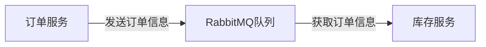

# RabbitMQ Node.js客户端

RabbitMQ是一个开源的消息代理软件，它实现了高级消息队列协议（AMQP）。通过RabbitMQ，你可以轻松地在应用程序之间传递消息，实现解耦和异步处理。本文将介绍如何使用Node.js客户端与RabbitMQ进行交互，适合初学者学习和实践。

## 介绍

RabbitMQ的核心概念包括生产者（Producer）、消费者（Consumer）、队列（Queue）和交换器（Exchange）。生产者发送消息到交换器，交换器根据规则将消息路由到一个或多个队列，消费者从队列中获取消息并进行处理。

Node.js客户端库 `amqplib` 是与RabbitMQ交互的常用工具。它提供了简单易用的API，使得在Node.js中实现消息队列变得非常方便。

## 安装与配置

首先，你需要安装 `amqplib` 库：

```bash
npm install amqplib
```

接下来，你可以通过以下代码连接到RabbitMQ服务器：

```javascript
const amqp = require('amqplib');

async function connect() {
  const connection = await amqp.connect('amqp://localhost');
  const channel = await connection.createChannel();
  return channel;
}
```

## 发送消息

发送消息的过程通常包括以下步骤：

1. 连接到RabbitMQ服务器。
2. 创建一个通道（Channel）。
3. 声明一个队列。
4. 发送消息到队列。

以下是一个简单的示例：

```javascript
async function sendMessage() {
  const channel = await connect();
  const queue = 'hello';
  const msg = 'Hello, RabbitMQ!';

  await channel.assertQueue(queue, { durable: false });
  channel.sendToQueue(queue, Buffer.from(msg));

  console.log(` [x] Sent ${msg}`);
}

sendMessage();
```

## 接收消息

接收消息的过程与发送消息类似，但需要额外定义一个消费者来处理接收到的消息：

```javascript
async function receiveMessage() {
  const channel = await connect();
  const queue = 'hello';

  await channel.assertQueue(queue, { durable: false });

  console.log(` [*] Waiting for messages in ${queue}. To exit press CTRL+C`);

  channel.consume(queue, (msg) => {
    if (msg !== null) {
      console.log(` [x] Received ${msg.content.toString()}`);
      channel.ack(msg);
    }
  }, { noAck: false });
}

receiveMessage();
```

## 实际案例

假设你正在开发一个电商平台，需要处理订单。你可以使用RabbitMQ来解耦订单处理和库存管理。订单服务将订单信息发送到RabbitMQ队列，库存服务从队列中获取订单信息并更新库存。



## 总结

通过本文，你已经学习了如何使用Node.js客户端与RabbitMQ进行交互。我们介绍了如何发送和接收消息，并通过一个实际案例展示了RabbitMQ在解耦和异步处理中的应用。

## 附加资源

- [RabbitMQ官方文档](https://www.rabbitmq.com/documentation.html)
- [amqplib GitHub仓库](https://github.com/amqp-node/amqplib)

## 练习

1. 修改发送消息的代码，使其发送一个包含订单信息的JSON对象。
2. 编写一个消费者，处理包含订单信息的JSON对象，并打印出订单详情。
3. 尝试使用不同的交换器类型（如 `direct`、`topic`、`fanout`）来实现消息的路由。

希望这些内容能帮助你更好地理解和使用RabbitMQ Node.js客户端。Happy coding!