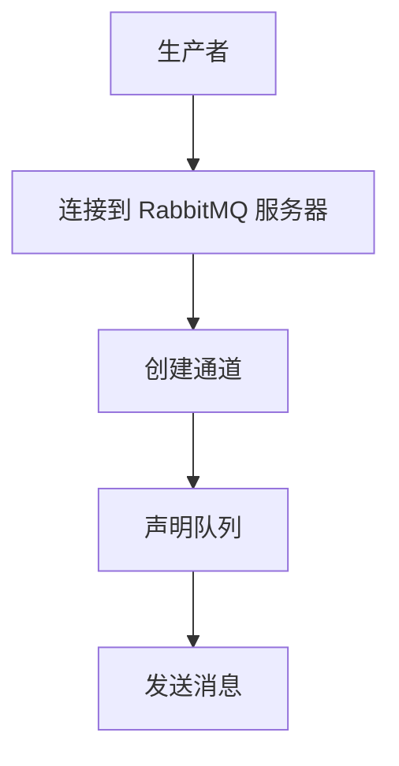

## 介绍

RabbitMQ 是一个开源的消息代理软件，用于在分布式系统中传递消息。它支持多种消息协议，并广泛应用于异步通信、任务队列和事件驱动架构中。在 RabbitMQ 中，**生产者**（Producer）是负责创建和发送消息到队列的应用程序。

本文将带你了解 RabbitMQ 生产者的基本概念，并通过代码示例展示如何编写一个简单的生产者程序。

## RabbitMQ 生产者的基本概念

在 RabbitMQ 中，生产者是消息的发送者。它通过连接到 RabbitMQ 服务器，将消息发布到指定的队列或交换机。生产者不需要知道消息的最终目的地，它只需要将消息发送到 RabbitMQ，由 RabbitMQ 负责将消息路由到正确的队列。

### 生产者的工作流程

1. **连接到 RabbitMQ 服务器**：生产者首先需要与 RabbitMQ 服务器建立连接。
2. **创建通道**：在连接的基础上，生产者会创建一个通道（Channel），用于发送消息。
3. **声明队列**：生产者可以声明一个队列，确保队列存在。如果队列不存在，RabbitMQ 会自动创建它。
4. **发送消息**：生产者通过通道将消息发送到指定的队列或交换机。



## 编写 RabbitMQ 生产者

接下来，我们将通过一个简单的 Python 示例来演示如何编写一个 RabbitMQ 生产者。

### 安装依赖

首先，确保你已经安装了 `pika` 库，这是 RabbitMQ 的 Python 客户端库。

```bash
pip install pika
```

### 编写生产者代码

以下是一个简单的 RabbitMQ 生产者示例代码：

```python
import pika

# 连接到 RabbitMQ 服务器
connection = pika.BlockingConnection(pika.ConnectionParameters('localhost'))
channel = connection.channel()

# 声明一个队列
channel.queue_declare(queue='hello')

# 发送消息
channel.basic_publish(exchange='',
                      routing_key='hello',
                      body='Hello, RabbitMQ!')

print(" [x] Sent 'Hello, RabbitMQ!'")

# 关闭连接
connection.close()
```

### 代码解释

1. **连接到 RabbitMQ 服务器**：我们使用 `pika.BlockingConnection` 连接到本地的 RabbitMQ 服务器。
2. **创建通道**：通过 `connection.channel()` 创建一个通道。
3. **声明队列**：使用 `channel.queue_declare(queue='hello')` 声明一个名为 `hello` 的队列。如果队列不存在，RabbitMQ 会自动创建它。
4. **发送消息**：通过 `channel.basic_publish` 方法将消息发送到 `hello` 队列。`exchange` 参数为空，表示使用默认的直连交换机。`routing_key` 参数指定了消息的路由键，这里我们使用队列名 `hello`。
5. **关闭连接**：最后，我们关闭连接以释放资源。

### 运行生产者

运行上述代码后，你会看到以下输出：

```bash
[x] Sent 'Hello, RabbitMQ!'
```

这表示消息已成功发送到 RabbitMQ 的 `hello` 队列。

## 实际应用场景

RabbitMQ 生产者可以应用于多种场景，例如：

- **任务队列**：将耗时的任务放入队列，由消费者异步处理。
- **日志收集**：将日志消息发送到 RabbitMQ，由日志处理服务消费。
- **事件驱动架构**：在微服务架构中，服务之间通过 RabbitMQ 进行事件通信。

### 示例：任务队列

假设你有一个 Web 应用，用户上传图片后需要进行图像处理。你可以使用 RabbitMQ 生产者将图像处理任务放入队列，由后台的消费者进行处理。

```python
import pika

# 连接到 RabbitMQ 服务器
connection = pika.BlockingConnection(pika.ConnectionParameters('localhost'))
channel = connection.channel()

# 声明一个任务队列
channel.queue_declare(queue='image_processing')

# 发送图像处理任务
task = 'process_image_123.jpg'
channel.basic_publish(exchange='',
                      routing_key='image_processing',
                      body=task)

print(f" [x] Sent '{task}'")

# 关闭连接
connection.close()
```

在这个例子中，生产者将图像处理任务发送到 `image_processing` 队列，消费者可以从队列中获取任务并进行处理。

## 总结

通过本文，你学习了 RabbitMQ 生产者的基本概念，并掌握了如何编写一个简单的生产者程序。我们还探讨了 RabbitMQ 生产者在实际应用中的一些场景。

### 附加资源

- [RabbitMQ 官方文档](https://www.rabbitmq.com/documentation.html)
- [pika 库文档](https://pika.readthedocs.io/en/stable/)

### 练习

1. 修改生产者代码，使其能够发送多条消息到不同的队列。
2. 尝试使用 RabbitMQ 的交换机（Exchange）功能，将消息发送到多个队列。

希望本文能帮助你更好地理解 RabbitMQ 生产者编程，并为你的项目提供实用的指导。