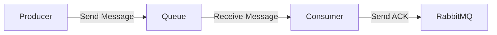

# RabbitMQ 点对点模式

RabbitMQ 是一个功能强大的消息代理工具，支持多种消息传递模式。其中，**点对点模式**（Point-to-Point）是最基础且常用的模式之一。本文将详细介绍点对点模式的概念、工作原理、代码实现以及实际应用场景。

---

## 什么是点对点模式？

点对点模式是一种消息传递模式，其中消息的生产者（Producer）将消息发送到一个特定的队列（Queue），而消费者（Consumer）从该队列中接收并处理消息。这种模式的特点是：

- **一对一通信**：每条消息只能被一个消费者处理。
- **异步通信**：生产者和消费者不需要同时在线，消息可以存储在队列中等待消费者处理。
- **解耦**：生产者和消费者之间没有直接依赖，它们只需要知道队列的名称即可。

点对点模式非常适合需要确保消息被精确处理一次的场景，例如订单处理、任务分发等。

---

## 点对点模式的工作原理

在点对点模式中，消息的传递过程可以分为以下几个步骤：

1. **生产者发送消息**：生产者将消息发送到指定的队列中。
2. **队列存储消息**：消息被存储在队列中，等待消费者处理。
3. **消费者接收消息**：消费者从队列中获取消息并处理。
4. **消息确认**：消费者处理完消息后，向 RabbitMQ 发送确认信号（ACK），RabbitMQ 会从队列中删除该消息。

以下是一个简单的示意图：



---

## 代码示例

下面是一个使用 Python 和 `pika` 库实现点对点模式的示例。

### 生产者代码

```python
import pika

# 连接到 RabbitMQ 服务器
connection = pika.BlockingConnection(pika.ConnectionParameters('localhost'))
channel = connection.channel()

# 声明一个队列
channel.queue_declare(queue='hello')

# 发送消息
channel.basic_publish(exchange='',
                      routing_key='hello',
                      body='Hello, RabbitMQ!')
print(" [x] Sent 'Hello, RabbitMQ!'")

# 关闭连接
connection.close()
```

### 消费者代码

```python
import pika

# 连接到 RabbitMQ 服务器
connection = pika.BlockingConnection(pika.ConnectionParameters('localhost'))
channel = connection.channel()

# 声明一个队列
channel.queue_declare(queue='hello')

# 定义回调函数来处理消息
def callback(ch, method, properties, body):
    print(f" [x] Received {body}")

# 设置消费者
channel.basic_consume(queue='hello',
                      on_message_callback=callback,
                      auto_ack=True)

print(' [*] Waiting for messages. To exit press CTRL+C')
channel.start_consuming()
```

### 运行结果

1. 运行生产者代码后，消息 `Hello, RabbitMQ!` 会被发送到队列 `hello` 中。
2. 运行消费者代码后，消费者会从队列中获取消息并打印：`[x] Received b'Hello, RabbitMQ!'`。

---

## 实际应用场景

点对点模式在许多实际场景中都有广泛应用，例如：

1. **订单处理系统**：生产者将订单消息发送到队列中，消费者从队列中获取订单并处理。
2. **任务分发系统**：生产者将任务分发到队列中，多个消费者从队列中获取任务并执行。
3. **日志处理**：生产者将日志消息发送到队列中，消费者从队列中获取日志并存储或分析。

---

## 总结

点对点模式是 RabbitMQ 中最基础的消息传递模式，适用于需要确保消息被精确处理一次的场景。通过队列的机制，生产者和消费者可以完全解耦，实现异步通信。

:::tip
如果你对 RabbitMQ 的其他消息模式感兴趣，可以继续学习发布/订阅模式、路由模式等。
:::

---

## 附加资源与练习

1. **练习**：尝试修改上述代码，实现多个消费者从同一个队列中获取消息的场景。
2. **深入学习**：阅读 RabbitMQ 官方文档，了解更多关于队列、交换机和绑定的高级用法。
3. **扩展知识**：学习如何使用 RabbitMQ 实现消息的持久化，确保消息在服务器重启后不会丢失。

希望本文能帮助你理解 RabbitMQ 的点对点模式，并为你的编程学习之旅提供帮助！