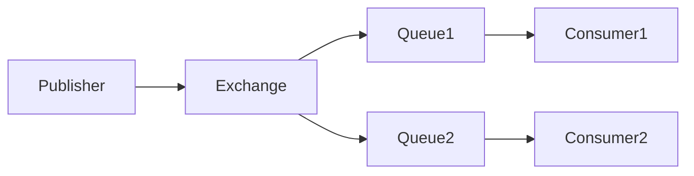

# RabbitMQ 发布订阅模式

RabbitMQ 是一个功能强大的消息队列系统，支持多种消息传递模式。其中，**发布订阅模式**（Publish/Subscribe）是一种常见的消息传递模式，适用于需要将消息广播给多个消费者的场景。本文将详细介绍 RabbitMQ 的发布订阅模式，包括其工作原理、实现方式以及实际应用场景。

## 什么是发布订阅模式？

发布订阅模式是一种消息传递模式，其中消息的发送者（称为**发布者**）将消息发送到一个**交换机**（Exchange），而不是直接发送到队列。交换机将消息广播给所有绑定到它的队列，然后每个队列的消费者都可以接收到相同的消息。这种模式非常适合需要将消息广播给多个消费者的场景，例如日志系统、通知系统等。

### 发布订阅模式的核心组件

1. **发布者（Publisher）**：负责发送消息到交换机。
2. **交换机（Exchange）**：接收发布者发送的消息，并将其广播到所有绑定的队列。
3. **队列（Queue）**：存储消息，供消费者消费。
4. **消费者（Consumer）**：从队列中获取消息并进行处理。

## 发布订阅模式的工作原理

在发布订阅模式中，发布者将消息发送到交换机，交换机根据其类型（通常是 `fanout` 类型）将消息广播到所有绑定的队列。每个队列都会接收到相同的消息，然后消费者从各自的队列中获取消息并进行处理。



:::note
`fanout` 类型的交换机会将消息广播到所有绑定的队列，而不考虑路由键（Routing Key）。
:::

## 实现发布订阅模式

下面我们通过一个简单的代码示例来演示如何使用 RabbitMQ 实现发布订阅模式。

### 1. 创建交换机和队列

首先，我们需要创建一个 `fanout` 类型的交换机，并将队列绑定到该交换机。

```python
import pika

# 连接到 RabbitMQ 服务器
connection = pika.BlockingConnection(pika.ConnectionParameters('localhost'))
channel = connection.channel()

# 创建一个 fanout 类型的交换机
channel.exchange_declare(exchange='logs', exchange_type='fanout')

# 创建两个队列并绑定到交换机
channel.queue_declare(queue='queue1')
channel.queue_declare(queue='queue2')
channel.queue_bind(exchange='logs', queue='queue1')
channel.queue_bind(exchange='logs', queue='queue2')

print("交换机和队列已创建并绑定")
```

### 2. 发布消息

接下来，我们编写发布者代码，将消息发送到 `logs` 交换机。

```python
import pika

# 连接到 RabbitMQ 服务器
connection = pika.BlockingConnection(pika.ConnectionParameters('localhost'))
channel = connection.channel()

# 发布消息到 logs 交换机
message = "Hello, RabbitMQ!"
channel.basic_publish(exchange='logs', routing_key='', body=message)

print(f" [x] Sent '{message}'")

connection.close()
```

### 3. 消费消息

最后，我们编写消费者代码，从各自的队列中获取消息并进行处理。

```python
import pika

# 连接到 RabbitMQ 服务器
connection = pika.BlockingConnection(pika.ConnectionParameters('localhost'))
channel = connection.channel()

# 定义回调函数来处理消息
def callback(ch, method, properties, body):
    print(f" [x] Received {body}")

# 从 queue1 中消费消息
channel.basic_consume(queue='queue1', on_message_callback=callback, auto_ack=True)

print(' [*] Waiting for messages. To exit press CTRL+C')
channel.start_consuming()
```

:::tip
你可以为 `queue2` 编写类似的消费者代码，以验证两个队列都能接收到相同的消息。
:::

## 实际应用场景

发布订阅模式在许多实际场景中都非常有用，以下是一些常见的应用场景：

1. **日志系统**：多个日志处理服务可以同时接收日志消息，并进行不同的处理（如存储、分析、报警等）。
2. **通知系统**：当某个事件发生时，系统可以将通知消息广播给多个用户或服务。
3. **实时数据分发**：在实时数据流处理中，发布订阅模式可以用于将数据广播给多个处理节点。

## 总结

RabbitMQ 的发布订阅模式是一种强大的消息传递模式，适用于需要将消息广播给多个消费者的场景。通过使用 `fanout` 类型的交换机，发布者可以将消息广播到所有绑定的队列，从而实现消息的广播。

在实际应用中，发布订阅模式可以用于构建日志系统、通知系统、实时数据分发等场景。通过本文的代码示例，你可以轻松上手 RabbitMQ 的发布订阅模式，并将其应用到自己的项目中。

## 附加资源与练习

- **练习**：尝试扩展本文的代码示例，添加更多的队列和消费者，观察消息的广播效果。
- **资源**：阅读 [RabbitMQ 官方文档](https://www.rabbitmq.com/documentation.html) 以了解更多关于交换机和消息模式的内容。

希望本文能帮助你更好地理解 RabbitMQ 的发布订阅模式，并在实际项目中灵活运用！