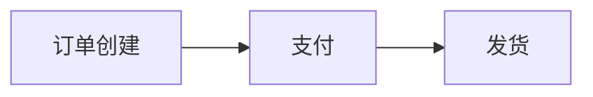

# RabbitMQ 消息分组模式

RabbitMQ是一个功能强大的消息队列系统，广泛应用于分布式系统中。消息分组模式（Message Grouping）是RabbitMQ中的一种高级消息处理机制，它允许你将消息分组，并确保同一组内的消息被同一个消费者处理。这对于需要保证消息顺序或特定消息由特定消费者处理的场景非常有用。

## 什么是消息分组模式？

消息分组模式的核心思想是将消息分配到不同的组中，每个组内的消息由同一个消费者处理。这样可以确保同一组内的消息按顺序处理，同时实现负载均衡。RabbitMQ通过`x-message-group`头字段来实现这一功能。

### 关键概念

- **消息组（Message Group）**：一组具有相同`x-message-group`值的消息。
- **消费者（Consumer）**：处理消息的应用程序或服务。
- **队列（Queue）**：存储消息的缓冲区。

## 如何实现消息分组模式？

### 1. 设置消息组

在发送消息时，你需要为每条消息设置`x-message-group`头字段。这个字段的值决定了消息属于哪个组。

```python
import pika

connection = pika.BlockingConnection(pika.ConnectionParameters('localhost'))
channel = connection.channel()

channel.queue_declare(queue='grouped_queue', arguments={'x-message-group': 'group1'})

properties = pika.BasicProperties(headers={'x-message-group': 'group1'})
channel.basic_publish(exchange='',
                      routing_key='grouped_queue',
                      body='Message for group1',
                      properties=properties)

connection.close()
```

### 2. 消费者绑定

消费者在绑定队列时，RabbitMQ会自动将同一组的消息路由到同一个消费者。这样可以确保同一组内的消息按顺序处理。

```python
import pika

def callback(ch, method, properties, body):
    print(f"Received {body}")

connection = pika.BlockingConnection(pika.ConnectionParameters('localhost'))
channel = connection.channel()

channel.basic_consume(queue='grouped_queue',
                      on_message_callback=callback,
                      auto_ack=True)

print('Waiting for messages...')
channel.start_consuming()
```

### 3. 消息处理

当消费者处理消息时，RabbitMQ会确保同一组内的消息由同一个消费者处理。这样可以保证消息的顺序性。

## 实际应用场景

### 订单处理系统

假设你有一个订单处理系统，每个订单包含多个步骤（如创建订单、支付、发货等）。为了确保每个订单的步骤按顺序处理，你可以将每个订单的所有消息分配到同一个组中。



在这个场景中，每个订单的`x-message-group`可以设置为订单ID，确保同一个订单的所有消息由同一个消费者处理。

### 日志处理系统

在日志处理系统中，你可能希望将来自同一来源的日志消息由同一个消费者处理，以便更好地分析和处理日志数据。

## 总结

RabbitMQ的消息分组模式是一种强大的机制，可以帮助你在分布式系统中实现消息的有序处理和负载均衡。通过设置`x-message-group`头字段，你可以轻松地将消息分组，并确保同一组内的消息由同一个消费者处理。

### 附加资源

- [RabbitMQ官方文档](https://www.rabbitmq.com/documentation.html)
- [RabbitMQ消息分组模式示例](https://www.rabbitmq.com/tutorials/tutorial-six-python.html)

### 练习

1. 尝试在你的本地环境中实现一个简单的消息分组模式。
2. 修改上述代码，使其支持多个消息组，并观察消息的处理顺序。

:::tip
在实际生产环境中，确保你的消费者能够处理消息失败的情况，并实现重试机制。
:::