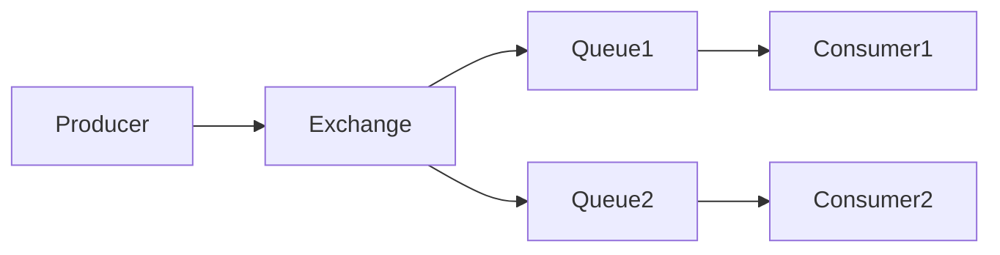

# RabbitMQ 事件驱动模式

## 介绍

事件驱动模式是一种编程范式，其中系统的行为由事件触发和驱动。在分布式系统中，事件驱动模式常用于解耦服务之间的依赖关系，使系统更具弹性和可扩展性。RabbitMQ 是一个流行的消息代理，支持多种消息模式，其中事件驱动模式是其核心应用场景之一。

在事件驱动模式中，生产者（Producer）将事件（消息）发送到消息队列（Queue），消费者（Consumer）从队列中接收并处理这些事件。这种模式允许系统在异步环境中运行，提高了系统的响应性和可维护性。

## 事件驱动模式的工作原理

事件驱动模式的核心是消息的生产和消费。以下是其基本工作流程：

1. **生产者发送消息**：生产者将消息发布到 RabbitMQ 的交换器（Exchange）。
2. **交换器路由消息**：交换器根据预定义的路由规则将消息分发到一个或多个队列。
3. **消费者接收消息**：消费者从队列中获取消息并进行处理。



### 代码示例

以下是一个简单的 Python 示例，展示了如何使用 RabbitMQ 实现事件驱动模式。

#### 生产者代码

```python
import pika

# 连接到 RabbitMQ 服务器
connection = pika.BlockingConnection(pika.ConnectionParameters('localhost'))
channel = connection.channel()

# 声明一个交换器
channel.exchange_declare(exchange='events', exchange_type='fanout')

# 发送消息
message = "Hello, RabbitMQ!"
channel.basic_publish(exchange='events', routing_key='', body=message)
print(f" [x] Sent '{message}'")

# 关闭连接
connection.close()
```

#### 消费者代码

```python
import pika

# 连接到 RabbitMQ 服务器
connection = pika.BlockingConnection(pika.ConnectionParameters('localhost'))
channel = connection.channel()

# 声明一个交换器
channel.exchange_declare(exchange='events', exchange_type='fanout')

# 声明一个临时队列
result = channel.queue_declare(queue='', exclusive=True)
queue_name = result.method.queue

# 将队列绑定到交换器
channel.queue_bind(exchange='events', queue=queue_name)

# 定义回调函数
def callback(ch, method, properties, body):
    print(f" [x] Received {body}")

# 开始消费消息
channel.basic_consume(queue=queue_name, on_message_callback=callback, auto_ack=True)

print(' [*] Waiting for messages. To exit press CTRL+C')
channel.start_consuming()
```

:::note
在以上示例中，生产者将消息发送到名为 `events` 的交换器，消费者从绑定到该交换器的队列中接收消息。交换器类型为 `fanout`，表示消息会被广播到所有绑定的队列。
:::

## 实际应用场景

事件驱动模式在许多实际场景中都有广泛应用，以下是一些常见的例子：

1. **微服务架构**：在微服务架构中，各个服务之间通过事件进行通信。例如，订单服务在创建订单后发布一个事件，库存服务监听该事件并更新库存。

2. **实时通知系统**：在实时通知系统中，用户行为（如点赞、评论）会触发事件，通知服务监听这些事件并发送实时通知给相关用户。

3. **日志收集与分析**：多个应用实例可以将日志作为事件发送到 RabbitMQ，日志分析服务从队列中消费这些日志并进行集中处理和分析。

## 总结

RabbitMQ 的事件驱动模式为构建松耦合、可扩展的分布式系统提供了强大的支持。通过将系统的行为分解为独立的事件，开发者可以更容易地管理和扩展系统。本文介绍了事件驱动模式的基本概念、工作原理，并通过代码示例和实际应用场景展示了其强大的功能。

## 附加资源与练习

- **官方文档**：阅读 [RabbitMQ 官方文档](https://www.rabbitmq.com/documentation.html) 以深入了解其高级功能和配置选项。
- **练习**：尝试修改上述代码示例，使用不同的交换器类型（如 `direct` 或 `topic`）并观察消息的路由行为。
- **扩展阅读**：学习如何在 Kubernetes 中部署 RabbitMQ，并将其用于微服务架构中的事件驱动通信。

:::tip
如果你对 RabbitMQ 的其他消息模式感兴趣，可以继续学习“发布/订阅模式”和“工作队列模式”。
:::