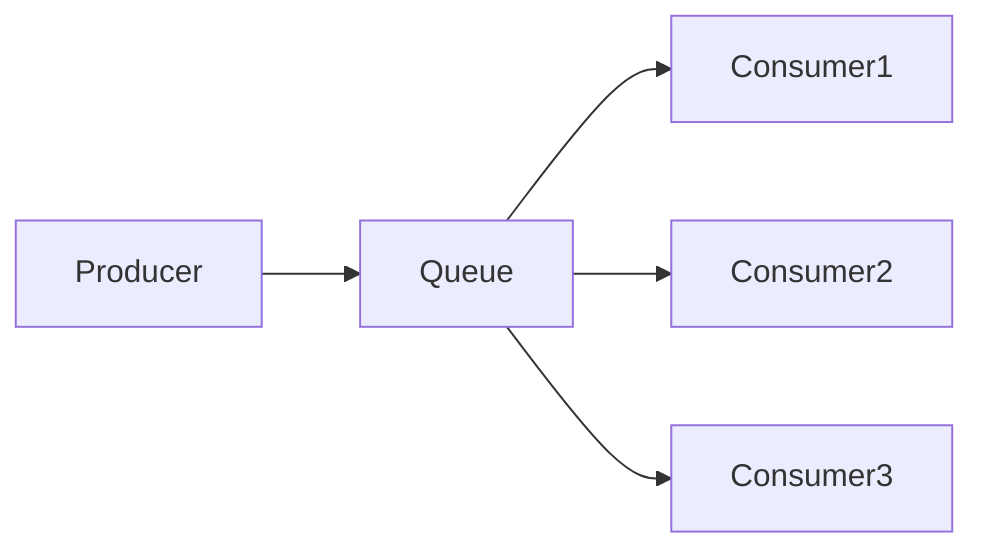

# RabbitMQ 工作队列模式

RabbitMQ 是一个强大的消息代理工具，广泛用于分布式系统中处理异步任务。工作队列模式（Work Queue Pattern）是 RabbitMQ 中最常用的模式之一，它允许我们将耗时的任务分配给多个工作进程（Worker），从而提高系统的性能和可扩展性。

## 什么是工作队列模式？

工作队列模式的核心思想是将任务放入队列中，然后由多个工作进程从队列中取出任务并处理。这种模式特别适合处理那些需要较长时间完成的任务，例如图像处理、文件上传或复杂的计算任务。

通过将任务分发到多个工作进程，我们可以避免单个进程成为系统的瓶颈，同时提高任务处理的效率。

## 工作队列模式的工作原理

在 RabbitMQ 中，工作队列模式通常使用一个队列来存储任务。生产者（Producer）将任务发送到队列中，而消费者（Consumer）则从队列中取出任务并处理。多个消费者可以同时从同一个队列中获取任务，从而实现任务的并行处理。



:::note
**注意**：RabbitMQ 默认采用轮询（Round-robin）的方式将任务分发给消费者。这意味着每个消费者会依次接收到任务，而不会考虑消费者的处理能力。
:::

## 代码示例

下面是一个简单的 Python 示例，展示了如何使用 RabbitMQ 的工作队列模式。

### 生产者代码

```python
import pika

# 连接到 RabbitMQ 服务器
connection = pika.BlockingConnection(pika.ConnectionParameters('localhost'))
channel = connection.channel()

# 声明一个队列
channel.queue_declare(queue='task_queue', durable=True)

# 发送任务到队列
for i in range(10):
    message = f'Task {i}'
    channel.basic_publish(
        exchange='',
        routing_key='task_queue',
        body=message,
        properties=pika.BasicProperties(
            delivery_mode=2,  # 使消息持久化
        ))
    print(f" [x] Sent {message}")

# 关闭连接
connection.close()
```

### 消费者代码

```python
import pika
import time

# 连接到 RabbitMQ 服务器
connection = pika.BlockingConnection(pika.ConnectionParameters('localhost'))
channel = connection.channel()

# 声明一个队列
channel.queue_declare(queue='task_queue', durable=True)

# 定义回调函数来处理任务
def callback(ch, method, properties, body):
    print(f" [x] Received {body.decode()}")
    time.sleep(body.count(b'.'))  # 模拟任务处理时间
    print(" [x] Done")
    ch.basic_ack(delivery_tag=method.delivery_tag)  # 确认任务完成

# 设置公平分发
channel.basic_qos(prefetch_count=1)

# 开始消费任务
channel.basic_consume(queue='task_queue', on_message_callback=callback)

print(' [*] Waiting for messages. To exit press CTRL+C')
channel.start_consuming()
```

:::tip
**提示**：在消费者代码中，我们使用了 `basic_qos` 方法来设置公平分发。这样可以确保每个消费者只有在处理完当前任务后，才会接收新的任务，从而避免某个消费者被过多的任务压垮。
:::

## 实际应用场景

工作队列模式在许多实际场景中都非常有用。以下是一些常见的应用场景：

1. **图像处理**：将用户上传的图像放入队列中，由多个工作进程进行处理（如压缩、裁剪等）。
2. **文件上传**：将大文件上传任务分发到多个工作进程，以提高上传速度。
3. **数据处理**：在数据分析或机器学习任务中，将数据分片并分发到多个工作进程进行并行处理。

## 总结

RabbitMQ 的工作队列模式是一种简单而强大的工具，可以帮助我们高效地处理异步任务。通过将任务分发到多个工作进程，我们可以显著提高系统的性能和可扩展性。

在实际应用中，工作队列模式可以用于处理各种耗时的任务，如图像处理、文件上传和数据分析等。通过合理配置和优化，我们可以确保系统在高负载下依然能够稳定运行。

## 附加资源

- [RabbitMQ 官方文档](https://www.rabbitmq.com/documentation.html)
- [RabbitMQ 教程](https://www.rabbitmq.com/getstarted.html)
- [Python 的 pika 库文档](https://pika.readthedocs.io/en/stable/)

## 练习

1. 修改生产者代码，使其能够发送包含不同处理时间的任务（例如，任务内容中包含不同数量的点 `.`）。
2. 运行多个消费者实例，观察任务是如何被分发的。
3. 尝试禁用 `basic_qos` 方法，观察任务分发的行为有何变化。
