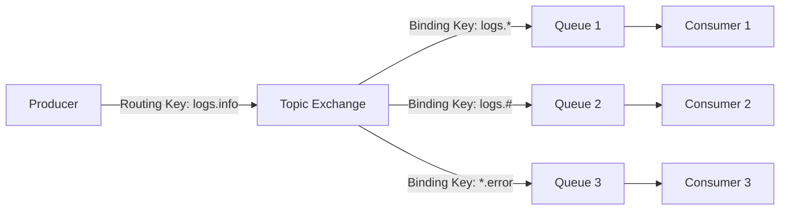

# RabbitMQ 主题模式

RabbitMQ是一个功能强大的消息队列系统，支持多种消息路由模式。其中，**主题模式（Topic Exchange）**是一种非常灵活的消息路由方式，允许生产者根据消息的主题将消息发送到特定的队列。本文将详细介绍主题模式的概念、工作原理、代码实现以及实际应用场景。

## 什么是主题模式？

主题模式是RabbitMQ中的一种消息路由机制，它允许生产者根据消息的**路由键（Routing Key）**和**绑定键（Binding Key）**将消息发送到匹配的队列。与直接模式（Direct Exchange）和扇出模式（Fanout Exchange）不同，主题模式支持使用通配符进行更灵活的路由。

### 路由键与绑定键

- **路由键（Routing Key）**：生产者发送消息时指定的键，用于描述消息的主题。
- **绑定键（Binding Key）**：消费者在绑定队列到交换机时指定的键，用于匹配路由键。

主题模式支持两种通配符：
- `*`：匹配一个单词（例如，`logs.*` 可以匹配 `logs.info` 但不能匹配 `logs.info.error`）。
- `#`：匹配零个或多个单词（例如，`logs.#` 可以匹配 `logs.info` 和 `logs.info.error`）。

## 主题模式的工作原理

主题模式的核心是**主题交换机（Topic Exchange）**。当生产者发送消息时，消息会携带一个路由键。交换机根据路由键和绑定键的匹配规则，将消息路由到一个或多个队列。



在上图中，生产者发送了一条路由键为 `logs.info` 的消息。交换机根据绑定键的匹配规则，将消息路由到 `Queue 1` 和 `Queue 2`。

## 代码示例

以下是一个使用Python和`pika`库实现RabbitMQ主题模式的示例。

### 生产者代码

```python
import pika

# 连接到RabbitMQ服务器
connection = pika.BlockingConnection(pika.ConnectionParameters('localhost'))
channel = connection.channel()

# 声明主题交换机
channel.exchange_declare(exchange='topic_logs', exchange_type='topic')

# 发送消息
routing_key = 'logs.info'
message = 'This is an info log'
channel.basic_publish(exchange='topic_logs', routing_key=routing_key, body=message)

print(f" [x] Sent {routing_key}:{message}")
connection.close()
```

### 消费者代码

```python
import pika

# 连接到RabbitMQ服务器
connection = pika.BlockingConnection(pika.ConnectionParameters('localhost'))
channel = connection.channel()

# 声明主题交换机
channel.exchange_declare(exchange='topic_logs', exchange_type='topic')

# 声明队列
result = channel.queue_declare(queue='', exclusive=True)
queue_name = result.method.queue

# 绑定队列到交换机
binding_key = 'logs.*'
channel.queue_bind(exchange='topic_logs', queue=queue_name, routing_key=binding_key)

print(' [*] Waiting for logs. To exit press CTRL+C')

# 定义回调函数
def callback(ch, method, properties, body):
    print(f" [x] {method.routing_key}:{body}")

# 开始消费消息
channel.basic_consume(queue=queue_name, on_message_callback=callback, auto_ack=True)
channel.start_consuming()
```

### 运行结果

假设生产者发送了一条路由键为 `logs.info` 的消息，消费者绑定了 `logs.*` 的绑定键，那么消费者将收到以下输出：

```
 [*] Waiting for logs. To exit press CTRL+C
 [x] logs.info:This is an info log
```

## 实际应用场景

主题模式在以下场景中非常有用：

1. **日志系统**：根据日志的级别（如 `info`、`error`）将日志消息路由到不同的队列进行处理。
2. **通知系统**：根据用户订阅的主题（如 `news.sports`、`news.technology`）将通知发送给特定的用户。
3. **多租户系统**：根据租户ID和事件类型（如 `tenant1.order.created`、`tenant2.order.cancelled`）将事件路由到不同的处理模块。

## 总结

RabbitMQ的主题模式提供了一种灵活的消息路由机制，允许生产者根据消息的主题将消息发送到特定的队列。通过使用通配符，主题模式可以满足复杂的消息路由需求。本文介绍了主题模式的工作原理、代码实现以及实际应用场景，希望对你理解和使用RabbitMQ主题模式有所帮助。

## 附加资源与练习

- **练习**：尝试修改生产者和消费者代码，使用不同的路由键和绑定键，观察消息的路由行为。
- **进一步学习**：阅读RabbitMQ官方文档，了解更多关于交换机和队列的高级配置选项。
