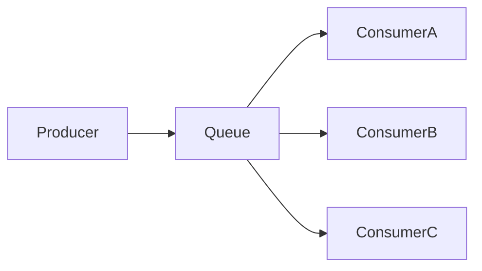

# RabbitMQ 负载均衡模式

在现代分布式系统中，负载均衡是一个关键概念，它帮助系统有效地分配任务，避免单点过载。RabbitMQ作为一款流行的消息队列中间件，提供了多种消息模式来支持负载均衡。本文将详细介绍RabbitMQ中的负载均衡模式，并通过实际案例帮助你理解其工作原理和应用场景。

## 什么是负载均衡模式？

负载均衡模式是一种通过将任务均匀分配到多个消费者（Consumer）来提高系统性能和可靠性的机制。在RabbitMQ中，负载均衡模式通常与**工作队列（Work Queue）**模式结合使用。当生产者（Producer）发送消息到队列时，RabbitMQ会将消息分发给多个消费者，确保每个消费者都能处理一部分任务，从而避免单个消费者过载。

:::note
负载均衡模式的核心思想是**任务分发**，而不是消息广播。每个消息只会被一个消费者处理。
:::

## 负载均衡模式的工作原理

在RabbitMQ中，负载均衡模式依赖于**轮询（Round-Robin）**算法。当多个消费者订阅同一个队列时，RabbitMQ会按照顺序将消息依次分发给每个消费者。例如，如果有两个消费者A和B，RabbitMQ会将第一条消息发送给A，第二条消息发送给B，第三条消息再发送给A，以此类推。



### 代码示例

以下是一个简单的Python示例，展示了如何使用RabbitMQ实现负载均衡模式。

#### 生产者代码

```python
import pika

# 连接到RabbitMQ服务器
connection = pika.BlockingConnection(pika.ConnectionParameters('localhost'))
channel = connection.channel()

# 声明一个队列
channel.queue_declare(queue='task_queue', durable=True)

# 发送消息
for i in range(10):
    message = f'Task {i}'
    channel.basic_publish(
        exchange='',
        routing_key='task_queue',
        body=message,
        properties=pika.BasicProperties(
            delivery_mode=2,  # 使消息持久化
        ))
    print(f" [x] Sent {message}")

# 关闭连接
connection.close()
```

#### 消费者代码

```python
import pika
import time

# 连接到RabbitMQ服务器
connection = pika.BlockingConnection(pika.ConnectionParameters('localhost'))
channel = connection.channel()

# 声明一个队列
channel.queue_declare(queue='task_queue', durable=True)

# 定义回调函数
def callback(ch, method, properties, body):
    print(f" [x] Received {body.decode()}")
    time.sleep(body.count(b'.'))  # 模拟任务处理时间
    print(" [x] Done")
    ch.basic_ack(delivery_tag=method.delivery_tag)  # 手动确认消息

# 设置消费者
channel.basic_qos(prefetch_count=1)  # 确保每个消费者一次只处理一个任务
channel.basic_consume(queue='task_queue', on_message_callback=callback)

print(' [*] Waiting for messages. To exit press CTRL+C')
channel.start_consuming()
```

:::tip
在消费者代码中，`basic_qos(prefetch_count=1)` 用于限制每个消费者一次只能处理一个任务，确保任务能够均匀分配。
:::

## 实际应用场景

### 1. 任务分发系统

假设你有一个需要处理大量任务的系统，例如图像处理或数据分析。通过使用RabbitMQ的负载均衡模式，你可以将任务分发给多个工作节点，确保每个节点都能高效地处理任务，而不会因为任务过多而导致性能下降。

### 2. 微服务架构中的任务调度

在微服务架构中，不同的服务可能需要处理不同类型的任务。通过RabbitMQ的负载均衡模式，你可以将任务分发给多个服务实例，确保每个实例都能处理一部分任务，从而提高系统的整体性能和可靠性。

## 总结

RabbitMQ的负载均衡模式是一种强大的工具，能够帮助你在分布式系统中高效地分配任务。通过轮询算法和消息队列的结合，RabbitMQ确保了每个消费者都能公平地处理任务，避免了单点过载的问题。

:::caution
在实际应用中，确保消费者的处理能力与任务量相匹配，避免某些消费者处理速度过慢而导致任务堆积。
:::

## 附加资源与练习

- **练习**：尝试在本地环境中运行上述代码示例，并观察消息是如何被分发给多个消费者的。
- **进一步学习**：了解RabbitMQ的其他消息模式，如发布/订阅模式、路由模式等，以便更好地应用于不同的场景。

希望本文能帮助你理解RabbitMQ的负载均衡模式，并为你的分布式系统设计提供灵感！